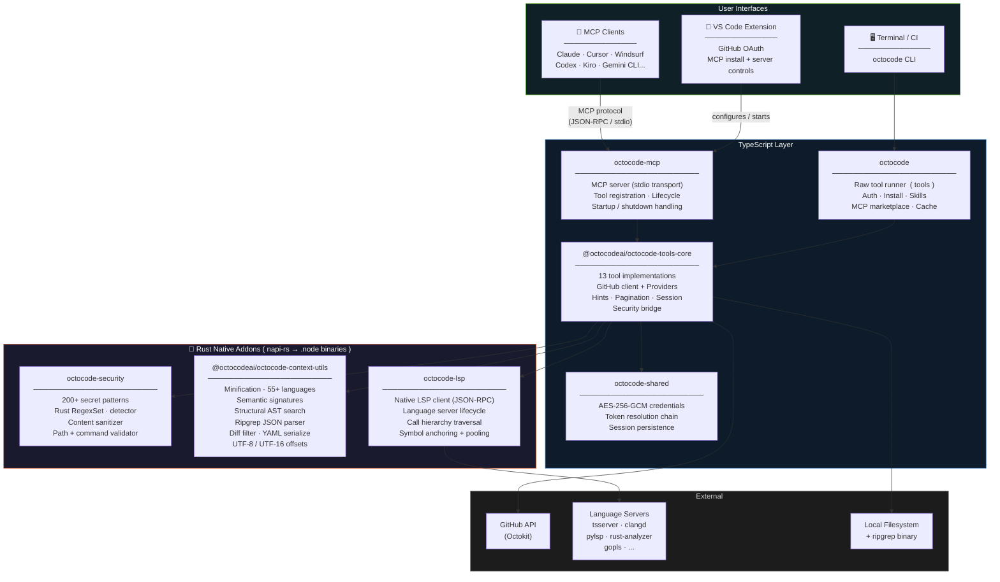
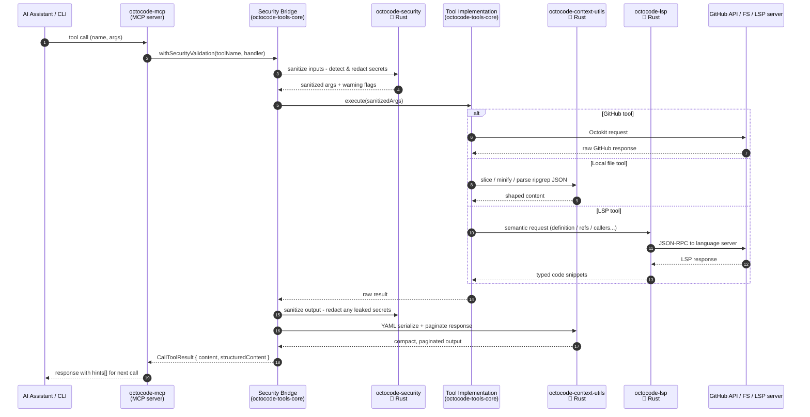

# Research Driven Development for AI

<div align="center">
  

  <h3>The context research Swiss Army knife for AI agents and developers.</h3>
  <p><strong>Stop guessing.</strong> Octocode is an evidence-first research platform for understanding code across <strong>external sources and local workspaces</strong>. Search GitHub repositories, pull requests, and npm packages alongside your local codebase with ripgrep, AST structural search, repository structure browsing, smart content fetching, binary inspection, and LSP semantic navigation.</p>
  <p>Use it as a <strong>CLI</strong> or <strong>MCP server</strong> to combine agent-friendly TypeScript workflows with <strong>Rust-backed performance</strong> for fast, evidence-based research across cross-repo systems and mega-repos.</p>
  <p>Created for <strong>agents and humans</strong> who need fast, reliable context before changing, reviewing, or explaining code.</p>

</div>

---


## Table of Contents

- [Quickstart](#quickstart)
- [Platform](#platform)
- [MCP](#mcp)
- [CLI](#cli)
- [Tools](#tools)
- [Security](#security)
- [Development](#development)
- [Architecture](#architecture)
- [Skills](#skills)
- [Documentation](#documentation)
- [Contributing](#contributing)

## Quickstart

Pick the path that matches where you want Octocode to show up.

### Add Octocode to an AI Assistant

```bash
# Interactive installer for Cursor, Claude Code, Windsurf, Codex, and more.
npx octocode install

# Non-interactive install for a specific client.
npx octocode install --ide cursor
```

Then authenticate GitHub access:

```bash
npx octocode login
npx octocode status
```

If you installed the CLI globally or with Homebrew, use `octocode` instead of `npx octocode`.

### Use Octocode From the Terminal

```bash
# macOS / Linux
brew install bgauryy/octocode/octocode

# npm
npm install -g octocode

# See the tools, then read a tool's schema before calling it
octocode tools
octocode tools localViewStructure --scheme

# First useful local loop - orient, then search, then read the exact slice
octocode tools localViewStructure --queries '{"path":"."}'
octocode tools localSearchCode --queries '{"path":".","keywords":"TODO"}'
octocode tools localGetFileContent --queries '{"path":"README.md","minify":"symbols"}'
```

For GitHub research, login once and then point tools at `owner/repo`:

```bash
octocode login
octocode tools ghViewRepoStructure --queries '{"owner":"facebook","repo":"react","path":""}'
octocode tools ghSearchCode --queries '{"keywords":["useState"],"owner":"facebook","repo":"react"}'
octocode tools ghHistoryResearch --queries '{"owner":"vercel","repo":"next.js","type":"prs","concise":true}'
```

### Add Agent Skills

```bash
# Search, preview, and install packaged research/review workflows.
octocode skills
```

Or browse the catalog at [skills.sh/bgauryy/octocode-mcp](https://www.skills.sh/bgauryy/octocode-mcp). See the [full list below](#skills).

### Common Workflows

Every command is `octocode tools <toolName> --queries '<json>'`. Always read the schema first with `octocode tools <toolName> --scheme`.

| Goal | Orient | Then |
|------|--------|------|
| Understand a local codebase | `localViewStructure '{"path":"."}'` | `localSearchCode '{"path":".","keywords":"<symbol>"}'` -> `localGetFileContent '{"path":"<file>","minify":"symbols"}'` -> `lspGetSemantics '{"uri":"<file>","type":"references","symbolName":"<sym>","lineHint":<n>}'` |
| Research a GitHub repo | `ghViewRepoStructure '{"owner":"<o>","repo":"<r>","path":""}'` | `ghSearchCode '{"keywords":["<term>"],"owner":"<o>","repo":"<r>"}'` -> `ghGetFileContent '{"owner":"<o>","repo":"<r>","path":"<file>"}'` |
| Inspect a pull request | `ghHistoryResearch '{"owner":"<o>","repo":"<r>","type":"prs","concise":true}'` | Re-call with `"prNumber":<N>` for files, patches, comments, reviews, commits. |
| Code-shape query (AST) | `localSearchCode '{"path":".","mode":"structural","pattern":"<shape>"}'` | Use `pattern` (e.g. `import $$$ from $MOD`) or a YAML `rule` for relational matches. |
| Share an agent setup | `octocode context` | Add `--full` when an agent needs complete tool descriptions; read schemas with `tools <name> --scheme`. |

## Platform

Octocode is not a chat prompt or a loose wrapper around `grep`. It is a tool runtime with a shared core: every surface calls the same tool catalog, the same security layer, the same response shaping, and the same Rust-backed hot paths. Pick the surface that fits where you work.

| Surface | Best for | Install | What you get |
|---------|----------|---------|--------------|
| **MCP server** | Claude Code, Cursor, Claude Desktop, Windsurf, Codex, and other MCP clients | `npx octocode install` | 13 research tools (12 enabled by default) exposed directly to your AI assistant |
| **CLI** | Terminal research, scripts, CI, quick lookups, debugging tool calls | `brew install bgauryy/octocode/octocode` or `npm install -g octocode` | Agent-first runner for the same 13 tools (`octocode tools <name> --queries`) plus auth, install, and skills management |
| **Agent Skills** | Packaged workflows for research, planning, review, and output | `octocode skills` or [skills.sh](https://www.skills.sh/bgauryy/octocode-mcp) | 20 ready-made skills that orchestrate the tools - see [Skills](#skills) |

The normal research loop is:

```text
discover shape -> search narrowly -> read exact slices -> trace semantics -> cite evidence
```

GitHub-backed tools require authentication. Run `octocode login`, or see [Authentication Setup](https://github.com/bgauryy/octocode/blob/main/docs/mcp/AUTHENTICATION.md).

---

## MCP

The MCP server exposes all 13 tools directly to your AI assistant over stdio. Install once - the assistant calls tools automatically.

### Install

```bash
# Interactive - detects your installed clients
npx octocode install

# Non-interactive
octocode install --ide cursor
octocode install --ide claude-code
```

<details>
<summary>One-Click Install (Cursor)</summary>

[](https://cursor.com/en/install-mcp?name=octocode&config=eyJjb21tYW5kIjoibnB4IiwiYXJncyI6WyJvY3RvY29kZS1tY3BAbGF0ZXN0Il19)

</details>

<details>
<summary>Manual Configuration</summary>

Add to your MCP client config file:

```json
{
  "mcpServers": {
    "octocode": {
      "command": "npx",
      "args": ["octocode-mcp@latest"]
    }
  }
}
```

With a GitHub token:

```json
{
  "mcpServers": {
    "octocode": {
      "command": "npx",
      "args": ["octocode-mcp@latest"],
      "env": {
        "GITHUB_TOKEN": "<your-token>"
      }
    }
  }
}
```

</details>

https://github.com/user-attachments/assets/de8d14c0-2ead-46ed-895e-09144c9b5071

### Supported Clients

| Client | `--ide` target |
|--------|----------------|
| Cursor | `cursor` |
| Claude Code | `claude-code` |
| Claude Desktop | `claude-desktop` |
| Windsurf | `windsurf` |
| Zed | `zed` |
| VS Code Cline | `vscode-cline` |
| VS Code Roo | `vscode-roo` |
| VS Code Continue | `vscode-continue` |
| Opencode | `opencode` |
| Trae | `trae` |
| Antigravity | `antigravity` |
| Codex | `codex` |
| Gemini CLI | `gemini-cli` |
| Goose | `goose` |
| Kiro | `kiro` |

### Configuration

Keep README setup minimal. Full environment variables, path restrictions, GitHub Enterprise setup, clone/cache behavior, and output tuning live in the [MCP Configuration Reference](https://github.com/bgauryy/octocode/blob/main/docs/mcp/CONFIGURATION.md).

---

## CLI

The CLI exposes the same research engine without an MCP client. Use quick commands for humans, or call raw tools from scripts and CI.

### Install

```bash
brew install bgauryy/octocode/octocode
# or
npm install -g octocode
```

```bash
octocode login
octocode status
```

### Research Commands

Auto-route local paths to local tools and `owner/repo[/path]` targets to GitHub tools.

| Command | Use it for |
|---------|------------|
| `octocode ls <path\|owner/repo>` | Browse local or GitHub structure |
| `octocode cat <path\|owner/repo/path>` | Read a file, symbol skeleton, line range, or matched slice |
| `octocode grep <term> <path\|owner/repo>` | Search local code with ripgrep or external GitHub code |
| `octocode ast <pattern> [path]` | Run local AST structural search |
| `octocode find <query> [path\|owner/repo]` | Find files by name, path, metadata, or content |
| `octocode symbols <file\|path>` | Get a semantic symbol outline |
| `octocode lsp <file> --type <type>` | Trace definitions, references, callers, callees, hover, and types |
| `octocode pr <owner/repo[#N]\|PR-URL>` | Search or deep-read pull requests |
| `octocode history <owner/repo[/path]>` | Inspect commit history for a repo, directory, or file |
| `octocode repo <keywords...>` | Discover GitHub repositories |
| `octocode pkg <package\|keywords>` | Search npm and hand off to source repositories |
| `octocode binary <file>` | Inspect archives, compressed files, and native binaries |
| `octocode clone <owner/repo[/path]>` | Clone a repo or subtree for local/LSP analysis |

### Management Commands

| Command | Use it for |
|---------|------------|
| `octocode install` | Configure Octocode in MCP clients |
| `octocode auth` / `login` / `logout` | Manage GitHub authentication |
| `octocode token` | Show the resolved token source, masked by default |
| `octocode status` | Check auth, MCP installs, and cache state |
| `octocode skills` | Search, read, install, remove, list, and sync Agent Skills |
| `octocode tools` | Run any MCP tool directly from the terminal |
| `octocode context` | Print agent-facing tool context |

### Raw Tool Runner

```bash
octocode tools                         # list tools
octocode tools <name> --scheme         # read the schema
octocode tools <name> --queries '<json>'
octocode tools <name> --queries '<json>' --json
```

Full command syntax, flags, examples, and exit codes live in the [CLI Reference](https://github.com/bgauryy/octocode/blob/main/docs/cli/REFERENCE.md).

---

## Tools

13 tools are available. `ghCloneRepo` is opt-in (`ENABLE_CLONE=true`). Local tools require `ENABLE_LOCAL` (default: on). All flags: [Configuration Reference](https://github.com/bgauryy/octocode/blob/main/docs/mcp/CONFIGURATION.md).

The same tool implementations run over MCP and CLI.

**Token knobs** - `concise:true` returns path/title-only lists. `minify` controls file read density: `symbols` = skeleton with line numbers, `standard` = comments/blanks stripped (default), `none` = exact bytes.

### GitHub Tools

| Tool | What it does | Knob |
|------|--------------|------|
| `ghSearchCode` | Code and path search across GitHub - owner, repo, path, filename, extension, match filters. Accepts 1-5 parallel queries. | `concise` |
| `ghGetFileContent` | Read a GitHub file or region - full file, line range, match slice, or paginated chars. | `minify` |
| `ghViewRepoStructure` | Browse a GitHub repository's directory tree before reading files. | - |
| `ghSearchRepos` | Discover repositories by keywords, owner, topic, language, stars, forks, size, dates, license, visibility. | `concise` |
| `ghHistoryResearch` | Search PR history, or deep-read one PR: files, patches, comments, reviews, commits. | `concise` |
| `ghCloneRepo` | Clone a repo or sparse subtree into the local cache for local/LSP analysis. **Opt-in** (`ENABLE_CLONE=true`). | `sparsePath` |

### Local Tools

| Tool | What it does | Knob |
|------|--------------|------|
| `localSearchCode` | Local code/text search returning file + line anchors. `mode:"structural"` runs ast-grep AST shape queries (`pattern` or `rule`). | `mode` |
| `localViewStructure` | Browse a local directory tree - depth, filters, pagination, metadata. | `concise` |
| `localFindFiles` | Find local files and directories by name, path, regex, extension, size, time, permissions, type. | - |
| `localGetFileContent` | Read a local file or region - exact slice, match string, line range, or paginated chars. | `minify` |
| `localBinaryInspect` | Inspect archives, compressed streams, and native binaries - identify, list, extract, decompress, strings. | - |

### Package Search

| Tool | What it does | Knob |
|------|--------------|------|
| `npmSearch` | npm package lookup and keyword search - returns metadata and source repository for GitHub handoff. | `concise` |

### LSP

| Tool | What it does |
|------|--------------|
| `lspGetSemantics` | Typed semantic navigation. Raw tools support `definition`, `references`, `callers`, `callees`, `callHierarchy`, `hover`, `documentSymbols`, `typeDefinition`, and `implementation`. The CLI `lsp` shortcut is for symbol-anchored queries only; use `symbols` for `documentSymbols`. Supports semantic navigation through installed language servers — see the [LSP Tools Reference](https://github.com/bgauryy/octocode/blob/main/docs/mcp/tools/LSP_TOOLS.md). |

**References**
- [GitHub Tools Reference](https://github.com/bgauryy/octocode/blob/main/docs/mcp/tools/GITHUB_TOOLS.md)
- [Local Tools Reference](https://github.com/bgauryy/octocode/blob/main/docs/mcp/tools/LOCAL_TOOLS.md)
- [LSP Tools Reference](https://github.com/bgauryy/octocode/blob/main/docs/mcp/tools/LSP_TOOLS.md)
- [Tool Behavior Guide](https://github.com/bgauryy/octocode/blob/main/docs/mcp/tools/TOOL_BEHAVIOR.md)

---

## Security

Octocode is designed for agent workflows where context can contain secrets and untrusted paths.

- Schema validation runs before tool execution.
- Local filesystem access is bounded by workspace/path controls.
- Sensitive files and directories are blocked by default.
- Secrets are detected and redacted in inputs, outputs, logs, errors, and fetched content.
- Local execution is allowlisted; tools do not pass arbitrary shell strings through.
- GitHub auth uses environment tokens, encrypted Octocode credentials, or `gh` CLI credentials.

Details: [Authentication](https://github.com/bgauryy/octocode/blob/main/docs/mcp/AUTHENTICATION.md) · [Configuration](https://github.com/bgauryy/octocode/blob/main/docs/mcp/CONFIGURATION.md) · [Credentials](https://github.com/bgauryy/octocode/blob/main/docs/mcp/CREDENTIALS.md)

### Efficiency

Octocode combines TypeScript orchestration with Rust-backed hot paths for fast local scanning, minification, secret detection, structural search, diff shaping, and LSP runtime work. The result is simple: search broadly, read narrowly, trace semantically, and return compact evidence.

---

## Development

Run these from the repository root unless a package doc says otherwise.

```bash
yarn install
yarn build
yarn test:quiet
yarn lint
```

| Task | Command |
|------|---------|
| Install dependencies | `yarn install` |
| Build every package | `yarn build` |
| Run the quieter test lane | `yarn test:quiet` |
| Run full coverage | `yarn test` |
| Lint all packages | `yarn lint` |
| Fix lint/format issues where possible | `yarn lint:fix` |
| Validate MCP package contracts | `yarn mcp:contracts` |
| Run the MCP package gate | `yarn mcp:package` |
| Validate CLI registries | `cd packages/octocode && yarn validate:mcp && yarn validate:skills` |

Useful editing rules for this repo:

- Documentation links in `docs/` and package READMEs use absolute GitHub URLs.
- MCP behavior changes usually need tests under `packages/octocode-mcp/tests/` or the owning package's `tests/` directory.
- Tool descriptions and schemas come from the shared tool catalog, so update the shared source instead of patching generated output.
- Generated folders such as `dist/`, `out/`, `coverage/`, and `node_modules/` are not source.

For the full workflow, see the [Development Guide](https://github.com/bgauryy/octocode/blob/main/docs/DEVELOPMENT_GUIDE.md).

### Troubleshooting Fast

| Symptom | Try |
|---------|-----|
| GitHub queries fail or return less than expected | Run `octocode login`, then `octocode status` to confirm the token source. |
| An MCP client does not show Octocode tools | Run `octocode status --sync`, then restart the client so it reloads MCP config. |
| Local tools cannot see the files you expect | Check `WORKSPACE_ROOT` and `ALLOWED_PATHS` in the [Configuration Reference](https://github.com/bgauryy/octocode/blob/main/docs/mcp/CONFIGURATION.md). |
| Output is too large | Search first (`localSearchCode`), then read with `minify:"symbols"`, a `matchString`, or a line range instead of whole files. |
| LSP results are hard to target | Run `localSearchCode` to get a `uri` + line, then pass them as `lspGetSemantics` `uri` + `lineHint`. |
| A `tools` call is rejected | Read the schema first: `octocode tools <name> --scheme`. Field names differ per tool (e.g. local `keywords` is a string, GitHub `keywords` is an array). |

---

## Architecture

This is a yarn-workspaces monorepo. Runtime code is split so the MCP server and CLI share one tool core instead of reimplementing research behavior, while the VS Code extension manages OAuth and MCP installation. Setup/reference docs live in [`docs/`](https://github.com/bgauryy/octocode/tree/main/docs), and AI-agent guidance lives in [`AGENTS.md`](https://github.com/bgauryy/octocode/blob/main/AGENTS.md).

### Package Graph

Octocode is a layered system: the MCP server and CLI share one TypeScript tool core, the VS Code extension configures and starts MCP, and the tool core delegates hot paths to three Rust native addons compiled via [napi-rs](https://napi.rs) into platform-specific `.node` binaries.



### Request Flow

Every tool call - whether it arrives over MCP or directly from the CLI - follows the same security-first pipeline:



### Why Rust

Each Rust package solves a specific bottleneck that JavaScript cannot handle cheaply at agent workload scale:

| Package | What Rust buys here |
|---------|---------------------|
| **octocode-security** | `RegexSet` compiles 200+ secret patterns into a single linear-time automaton. Matching a 500 KB chunk costs ~10 ms regardless of pattern count; a JS loop over 200 regexes would take 10-50×. |
| **octocode-context-utils** | Zero-copy comment stripping and minification across 55 languages runs on every file read. Async napi `Task` keeps the Node.js event loop unblocked while multi-MB files are processed. Structural (AST) search and UTF-8↔UTF-16 offset conversion are similarly allocation-heavy. |
| **octocode-lsp** | The LSP client owns a long-lived child process (the language server) and a bidirectional async stdio pipe. Tokio drives the I/O concurrently, retries `ContentModified` errors, and drains stderr into a ring buffer - none of which map cleanly onto a single-threaded JS runtime. |

All three ship as pre-built `.node` binaries (darwin-arm64, darwin-x64, linux-arm64, linux-x64, linux-x64-musl, win32-x64). No Rust toolchain is needed at runtime.

### Packages

| Directory | npm package | Purpose |
|-----------|-------------|---------|
| [`packages/octocode-mcp`](https://github.com/bgauryy/octocode/tree/main/packages/octocode-mcp) | `octocode-mcp` | MCP server that registers the Octocode tool catalog for AI assistants. |
| [`packages/octocode`](https://github.com/bgauryy/octocode/tree/main/packages/octocode) | `octocode` | Agent-first terminal interface: raw tool runner (`tools`), `context`, auth, install, status, token, and skills workflows. |
| [`packages/octocode-tools-core`](https://github.com/bgauryy/octocode/tree/main/packages/octocode-tools-core) | `@octocodeai/octocode-tools-core` | Shared tool catalog and implementations for GitHub, local filesystem, package search, and LSP flows. |
| [`packages/octocode-context-utils`](https://github.com/bgauryy/octocode/tree/main/packages/octocode-context-utils) | `@octocodeai/octocode-context-utils` | Rust-backed context engine for minification, signatures, pagination offsets, ripgrep parsing, diff filtering, and YAML output. |
| [`packages/octocode-security`](https://github.com/bgauryy/octocode/tree/main/packages/octocode-security) | `octocode-security` | Rust-backed secret detection plus TypeScript path, command, input, and tool security utilities. |
| [`packages/octocode-lsp`](https://github.com/bgauryy/octocode/tree/main/packages/octocode-lsp) | `octocode-lsp` | Rust-native LSP runtime for language detection, server config, JSON-RPC, symbol anchoring, pooled clients, and semantic navigation. |
| [`packages/octocode-shared`](https://github.com/bgauryy/octocode/tree/main/packages/octocode-shared) | `octocode-shared` | Shared credentials, token resolution, session persistence, and platform utilities. |
| [`packages/octocode-vscode`](https://github.com/bgauryy/octocode/tree/main/packages/octocode-vscode) | `octocode-mcp-vscode` | VS Code extension for GitHub OAuth and multi-editor MCP installation. |

---

## Skills

> [Agent Skills](https://agentskills.io/what-are-skills) are a lightweight, open format for extending AI agent capabilities.
> Browse and install on [**skills.sh/bgauryy/octocode-mcp**](https://www.skills.sh/bgauryy/octocode-mcp) · Skills index: [skills/README.md](https://github.com/bgauryy/octocode/blob/main/skills/README.md)

**Research & Code Analysis**

| Skill | What it does |
|-------|--------------|
| [**Researcher**](https://github.com/bgauryy/octocode/tree/main/skills/octocode-researcher) | Code search & exploration: local LSP + external (GitHub, npm) |
| [**Research**](https://github.com/bgauryy/octocode/tree/main/skills/octocode-research) | Multi-phase research with sessions, checkpoints, state persistence |
| [**Engineer**](https://github.com/bgauryy/octocode/tree/main/skills/octocode-engineer) | Understand, write, analyze, audit code: AST + LSP + dependency graph |
| [**Brainstorming**](https://github.com/bgauryy/octocode/tree/main/skills/octocode-brainstorming) | Idea validation grounded in evidence: GitHub, npm, web in parallel |
| [**News**](https://github.com/bgauryy/octocode/tree/main/skills/octocode-news) | What's new in AI, dev tools, web platform, security, notable repos |

**Planning & Writing**

| Skill | What it does |
|-------|--------------|
| [**Plan**](https://github.com/bgauryy/octocode/tree/main/skills/octocode-plan) | Evidence-based planning: Understand > Research > Plan > Implement |
| [**RFC Generator**](https://github.com/bgauryy/octocode/tree/main/skills/octocode-rfc-generator) | Formal technical decisions with alternatives, trade-offs, and recommendations |
| [**Doc Writer**](https://github.com/bgauryy/octocode/tree/main/skills/octocode-documentation-writer) | 6-phase pipeline producing 16+ validated docs |
| [**Prompt Optimizer**](https://github.com/bgauryy/octocode/tree/main/skills/octocode-prompt-optimizer) | Turn weak prompts into enforceable agent protocols |
| [**Agentic Flow**](https://github.com/bgauryy/octocode/tree/main/skills/agentic-flow-best-practices) | Thinking framework for designing/reviewing MCP & multi-agent workflows |

**Review & Critique**

| Skill | What it does |
|-------|--------------|
| [**PR Reviewer**](https://github.com/bgauryy/octocode/tree/main/skills/octocode-pull-request-reviewer) | PR & local code review across 7 domains with LSP flow tracing |
| [**Roast**](https://github.com/bgauryy/octocode/tree/main/skills/octocode-roast) | Brutal code critique with file:line citations and severity levels |

**Build & Output**

| Skill | What it does |
|-------|--------------|
| [**Slides**](https://github.com/bgauryy/octocode/tree/main/skills/octocode-slides) | Polished multi-file HTML presentations via 6-phase design flow |
| [**Design**](https://github.com/bgauryy/octocode/tree/main/skills/octocode-design) | Dynamic DESIGN.md generator covering visual language, components, a11y |
| [**Chrome DevTools**](https://github.com/bgauryy/octocode/tree/main/skills/octocode-chrome-devtools) | CDP-level browser debugging: network, console, perf, DOM, screenshots |

**Tooling & Setup**

| Skill | What it does |
|-------|--------------|
| [**Install**](https://github.com/bgauryy/octocode/tree/main/skills/octocode-install) | Interactive step-by-step Octocode installer for macOS and Windows |
| [**CLI**](https://github.com/bgauryy/octocode/tree/main/skills/octocode) | Run Octocode MCP tools from the terminal without wiring MCP |
| [**Search Skill**](https://github.com/bgauryy/octocode/tree/main/skills/octocode-search-skill) | Find, evaluate, install, refactor Agent Skills (SKILL.md format) |
| [**Stats**](https://github.com/bgauryy/octocode/tree/main/skills/octocode-stats) | Local HTML dashboard from Octocode MCP usage stats |
| [**Harness Status**](https://github.com/bgauryy/octocode/tree/main/skills/octocode-harness-status) | Interactive dashboard of all skills, MCPs, CLIs, and tokens installed on this machine |

https://github.com/user-attachments/assets/5b630763-2dee-4c2d-b5c1-6335396723ec

---

## Documentation

Website: **[octocode.ai](https://octocode.ai)** · Full docs: **[github.com/bgauryy/octocode/tree/main/docs](https://github.com/bgauryy/octocode/tree/main/docs)** · Index: **[docs/README.md](https://github.com/bgauryy/octocode/blob/main/docs/README.md)**. All monorepo documentation lives in [`docs/`](https://github.com/bgauryy/octocode/tree/main/docs) (no per-package `docs/`).

**Docs map**
- [`docs/mcp/`](https://github.com/bgauryy/octocode/tree/main/docs/mcp): MCP server - configuration, authentication, tools, workflows, architecture
- [`docs/cli/`](https://github.com/bgauryy/octocode/tree/main/docs/cli): CLI - commands, flags, benchmarks
- [`docs/`](https://github.com/bgauryy/octocode/tree/main/docs): guides - development, skills, Pi setup

**Setup**
- [Authentication Setup](https://github.com/bgauryy/octocode/blob/main/docs/mcp/AUTHENTICATION.md)
- [Configuration Reference](https://github.com/bgauryy/octocode/blob/main/docs/mcp/CONFIGURATION.md)
- [Using octocode-mcp with Pi](https://github.com/bgauryy/octocode/blob/main/docs/PI_SETUP_GUIDE.md)

**Tool References**
- [GitHub Tools](https://github.com/bgauryy/octocode/blob/main/docs/mcp/tools/GITHUB_TOOLS.md)
- [Local Tools](https://github.com/bgauryy/octocode/blob/main/docs/mcp/tools/LOCAL_TOOLS.md)
- [LSP Tools](https://github.com/bgauryy/octocode/blob/main/docs/mcp/tools/LSP_TOOLS.md)
- [Clone & Local Workflow](https://github.com/bgauryy/octocode/blob/main/docs/mcp/CLONE_WORKFLOW.md)

**CLI & Skills**
- [CLI Reference](https://github.com/bgauryy/octocode/blob/main/docs/cli/REFERENCE.md)
- [Skills Guide](https://github.com/bgauryy/octocode/blob/main/docs/SKILLS_GUIDE.md) · [Skills Index](https://github.com/bgauryy/octocode/blob/main/skills/README.md)

**Shared Internals**
- [Credentials Architecture](https://github.com/bgauryy/octocode/blob/main/docs/mcp/CREDENTIALS.md) · [Session Persistence](https://github.com/bgauryy/octocode/blob/main/docs/mcp/SESSION.md)

**Operations**
- [Development Guide](https://github.com/bgauryy/octocode/blob/main/docs/DEVELOPMENT_GUIDE.md) · [Agent Guidance (AGENTS.md)](https://github.com/bgauryy/octocode/blob/main/AGENTS.md)

### The Manifest

**"Code is Truth, but Context is the Map."** Read the [Manifest for Research Driven Development](https://github.com/bgauryy/octocode/blob/main/MANIFEST.md) to understand the philosophy behind Octocode.

---

### Contributing

See the [Development Guide](https://github.com/bgauryy/octocode/blob/main/docs/DEVELOPMENT_GUIDE.md) for monorepo setup, testing, and contribution guidelines.

---

<div align="center">
  <sub>Built with care for the AI Engineering Community</sub>
</div>
