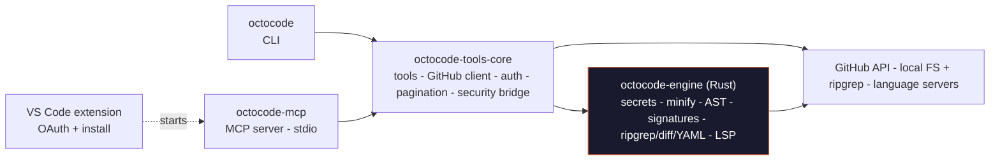

# Agentic Research Platform

<div align="center">
  

  <h3>Agentic research platform for AI agents and developers.</h3>
  <p><strong>Stop guessing.</strong> Octocode is an evidence-first agentic research platform for understanding code across <strong>external sources and local workspaces</strong>. Search GitHub repositories, pull requests, and npm packages alongside your local codebase with ripgrep, AST structural search, repository structure browsing, smart content fetching, binary inspection, and LSP semantic navigation.</p>
  <p>Use it as a <strong>CLI</strong> or <strong>MCP server</strong> to combine agent-ready TypeScript workflows with <strong>Rust-backed performance</strong> for fast, evidence-based research across cross-repo systems and mega-repos.</p>
  <p>Created for <strong>agents and humans</strong> who need fast, reliable context before changing, reviewing, or explaining code.</p>

  [](https://github.com/modelcontextprotocol/servers)
  [](https://deepwiki.com/bgauryy/octocode)

  <a href="https://octocode.ai"></a>
  <a href="https://www.youtube.com/@Octocode-ai"></a>

</div>

---

## Table of Contents

- [Quickstart](#quickstart)
- [Tools](#tools)
- [MCP](#mcp)
- [CLI](#cli)
- [Skills](#skills)
- [Authentication Methods](#authentication-methods)
- [Language Support](#language-support)
- [Security](#security)
- [Architecture](#architecture)
- [Documentation](#documentation)
- [Contributing](#contributing)

---

## Quickstart

Pick the path that matches where you want Octocode to show up.

### Add Octocode to an AI Assistant

```bash
# Interactive installer for Cursor, Claude Code, Windsurf, Codex, and more.
npx octocode install

# Non-interactive install for a specific client.
npx octocode install --ide cursor
```

Then authenticate GitHub access:

```bash
npx octocode login
npx octocode status
```

If you installed the CLI globally or with Homebrew, use `octocode` instead of `npx octocode`.

---

## Tools

Octocode ships **13 research tools** - the same implementations run identically over [MCP](#mcp) and the [CLI](#cli). `ghCloneRepo` is opt-in (`ENABLE_CLONE=true`); local tools require `ENABLE_LOCAL` (default: on). All flags: [Configuration Reference](https://github.com/bgauryy/octocode/blob/main/docs/mcp/CONFIGURATION.md).

**Token knobs** - `concise:true` returns path/title-only lists. `minify` controls file read density: `symbols` = skeleton with line numbers, `standard` = comments/blanks stripped (default), `none` = exact bytes.

### GitHub Tools

| Tool | What it does | Knob |
|------|--------------|------|
| `ghSearchCode` | Code and path search across GitHub - owner, repo, path, filename, extension, match filters. Accepts 1-5 parallel queries. | `concise` |
| `ghGetFileContent` | Read a GitHub file or region - full file, line range, match slice, or paginated chars. | `minify` |
| `ghViewRepoStructure` | Browse a GitHub repository's directory tree before reading files. | - |
| `ghSearchRepos` | Discover repositories by keywords, owner, topic, language, stars, forks, size, dates, license, visibility. | `concise` |
| `ghHistoryResearch` | Search PR history, or deep-read one PR: files, patches, comments, reviews, commits. | `concise` |
| `ghCloneRepo` | Clone a repo or sparse subtree into the local cache for local/LSP analysis. **Opt-in** (`ENABLE_CLONE=true`). | `sparsePath` |

### Local Tools

| Tool | What it does | Knob |
|------|--------------|------|
| `localSearchCode` | Local code/text search returning file + line anchors. `mode:"structural"` runs Octocode AST shape queries (`pattern` or `rule`). | `mode` |
| `localViewStructure` | Browse a local directory tree - depth, filters, pagination, metadata. | `concise` |
| `localFindFiles` | Find local files and directories by name, path, regex, extension, size, time, permissions, type. | - |
| `localGetFileContent` | Read a local file or region - exact slice, match string, line range, or paginated chars. | `minify` |
| `localBinaryInspect` | Inspect archives, compressed streams, and native binaries - identify, list, extract, decompress, strings. | - |

### Package Search

| Tool | What it does | Knob |
|------|--------------|------|
| `npmSearch` | npm package lookup and keyword search - returns metadata and source repository for GitHub handoff. | `concise` |

### LSP

| Tool | What it does |
|------|--------------|
| `lspGetSemantics` | Typed semantic navigation. Raw tools support `definition`, `references`, `callers`, `callees`, `callHierarchy`, `hover`, `documentSymbols`, `typeDefinition`, and `implementation`. The CLI `lsp` shortcut is for symbol-anchored queries only; use `ls --symbols` for `documentSymbols`. Supports semantic navigation through installed language servers — see the [LSP Tools Reference](https://github.com/bgauryy/octocode/blob/main/docs/mcp/tools/LSP_TOOLS.md). |

**Per-tool references** (full schemas, fields, and examples) live in **[`docs/mcp`](https://github.com/bgauryy/octocode/tree/main/docs/mcp)**:
- [GitHub Tools](https://github.com/bgauryy/octocode/blob/main/docs/mcp/tools/GITHUB_TOOLS.md)
- [Local Tools](https://github.com/bgauryy/octocode/blob/main/docs/mcp/tools/LOCAL_TOOLS.md)
- [Binary Tools](https://github.com/bgauryy/octocode/blob/main/docs/mcp/tools/BINARY_TOOLS.md)
- [LSP Tools](https://github.com/bgauryy/octocode/blob/main/docs/mcp/tools/LSP_TOOLS.md)
- [Tool Behavior Guide](https://github.com/bgauryy/octocode/blob/main/docs/mcp/tools/TOOL_BEHAVIOR.md)

---

## MCP

The MCP server exposes all 13 tools directly to your AI assistant over stdio. Install once - the assistant calls tools automatically.

### Install

**Fast install:**

[](https://cursor.com/en/install-mcp?name=octocode&config=eyJjb21tYW5kIjoibnB4IiwiYXJncyI6WyJvY3RvY29kZS1tY3BAbGF0ZXN0Il19) [](https://insiders.vscode.dev/redirect?url=vscode%3Amcp%2Finstall%3F%257B%2522name%2522%253A%2522octocode%2522%252C%2522command%2522%253A%2522npx%2522%252C%2522args%2522%253A%255B%2522octocode-mcp%2540latest%255D%257D) [](https://insiders.vscode.dev/redirect?url=vscode-insiders%3Amcp%2Finstall%3F%257B%2522name%2522%253A%2522octocode%2522%252C%2522command%2522%253A%2522npx%2522%252C%2522args%2522%253A%255B%2522octocode-mcp%2540latest%255D%257D)

**Or use the installer (detects your installed clients):**

```bash
# Interactive - detects your installed clients
npx octocode install

# Non-interactive
octocode install --ide cursor
octocode install --ide claude-code
```

https://github.com/user-attachments/assets/de8d14c0-2ead-46ed-895e-09144c9b5071

### Manual Configuration

Add to your MCP client config file:

```json
{
  "mcpServers": {
    "octocode": {
      "command": "npx",
      "args": ["octocode-mcp@latest"]
    }
  }
}
```

For GitHub auth, add a token under `env` - see [Authentication Methods](#authentication-methods).

### Configuration

All settings are optional - Octocode runs with sensible defaults. Set them as `env` entries in your MCP client config, or in `<octocode-home>/.octocoderc`.

| Setting | Default | What it does |
|---------|---------|--------------|
| `OCTOCODE_TOKEN` / `GH_TOKEN` / `GITHUB_TOKEN` | unset | GitHub token, in priority order. See [Authentication](#authentication-methods). |
| `GITHUB_API_URL` | `https://api.github.com` | GitHub API endpoint; use `/api/v3` for GitHub Enterprise. |
| `ENABLE_LOCAL` | `true` | Enable local filesystem and LSP tools. |
| `ENABLE_CLONE` | `false` | Enable `ghCloneRepo` and directory fetch (needs local enabled). |
| `WORKSPACE_ROOT` | `cwd` | Absolute root for relative local paths and project context. |
| `ALLOWED_PATHS` | `[]` | Comma-separated allowlist; empty means unrestricted after validation. |
| `TOOLS_TO_RUN` / `ENABLE_TOOLS` / `DISABLE_TOOLS` | unset | Whitelist, add to, or remove from the default tool set. |
| `REQUEST_TIMEOUT` | `30000` | Request timeout in ms (clamped `5000..300000`). |
| `MAX_RETRIES` | `3` | Retry attempts (clamped `0..10`). |
| `OCTOCODE_OUTPUT_FORMAT` | `yaml` | Response format: `yaml` or `json`. |
| `OCTOCODE_HOME` | platform default | Base dir for config, credentials, sessions, stats, and clone cache. |

Full reference - every env var, `.octocoderc` schema, clone/cache tuning, Enterprise setup, and precedence - lives in the [MCP Configuration Reference](https://github.com/bgauryy/octocode/blob/main/docs/mcp/CONFIGURATION.md). Supported clients and their `--ide` targets are listed in the [CLI Reference](https://github.com/bgauryy/octocode/blob/main/docs/cli/REFERENCE.md#install).

---

## CLI

The CLI exposes the same research engine without an MCP client. Use quick commands for humans, or call raw tools from scripts and CI.

### Install

```bash
brew install bgauryy/octocode/octocode
# or
npm install -g octocode
```

```bash
octocode login
octocode status
```

### All Commands

Auto-route local paths to local tools and `owner/repo[/path]` targets to GitHub tools.

| Command | Use it for |
|---------|------------|
| `octocode ls <path\|owner/repo>` | Browse local or GitHub structure; a file or `--symbols` shows a symbol outline |
| `octocode cat <path\|owner/repo/path>` | Read a file, symbol skeleton (`--mode symbols`), line range, or matched slice |
| `octocode grep <term> <path\|owner/repo>` | Text/regex search, or AST structural search with `--pattern` / `--rule` (local). `--type` accepts extensions and language aliases such as `ts`, `rust`, `typescript`, and `*.rs`. |
| `octocode find <query> [path\|owner/repo]` | Find files by name, path, metadata, or content |
| `octocode lsp <file> --type <type> --symbol <name> --line <n>` | Trace `definition`, `references`, `callers`, `callees`, `callHierarchy`, `hover`, `typeDefinition`, and `implementation`; use `ls --symbols` for file outlines |
| `octocode pr <owner/repo[#N]\|PR-URL>` | Search or deep-read pull requests |
| `octocode history <owner/repo[/path]>` | Inspect commit history for a repo, directory, or file |
| `octocode repo <keywords...>` | Discover GitHub repositories |
| `octocode pkg <package\|keywords>` | Search npm and hand off to source repositories |
| `octocode binary <file>` | Inspect archives, compressed files, and native binaries |
| `octocode unzip <archive>` | Unpack an archive to `<octocode-home>/unzip/<name>-<timestamp>/`, then use local `ls`, `grep`, `cat`, and `lsp` |
| `octocode clone <owner/repo[/path][@branch]>` | Clone a repo or subtree to the Octocode home repo cache for local/LSP analysis (`ENABLE_CLONE=true`) |
| `octocode tools` | List tools, read schemas, or run any MCP tool directly from the terminal |
| `octocode context` | Print agent-facing protocol, system prompt, tool descriptions, and schemas |
| `octocode install` | Configure Octocode in MCP clients |
| `octocode auth` | Manage GitHub authentication with `login`, `logout`, or `refresh` |
| `octocode login` / `octocode logout` | Sign in or clear stored GitHub credentials |
| `octocode status` | Check token presence, auth identity, MCP installs, sync state, and cache paths |

### Raw Tool Runner

```bash
octocode tools                         # list tools
octocode tools <name> --scheme         # read the schema
octocode tools <name> --queries '<json>'
octocode tools <name> --queries '<json>' --json
```

Full command syntax, flags, examples, and exit codes live in the [CLI Reference](https://github.com/bgauryy/octocode/blob/main/docs/cli/REFERENCE.md).

---

## Skills

> [Agent Skills](https://agentskills.io/what-are-skills) are a lightweight, open format for extending AI agent capabilities.
> Browse and install on [**skills.sh/bgauryy/octocode-mcp**](https://www.skills.sh/bgauryy/octocode-mcp) · Skills index: [skills/README.md](https://github.com/bgauryy/octocode/blob/main/skills/README.md)

⭐ **[Engineer](https://www.skills.sh/bgauryy/octocode-mcp/octocode-engineer)** is the recommended starting skill.

| Skill | What it does |
|-------|--------------|
| ⭐ [**Engineer**](https://www.skills.sh/bgauryy/octocode-mcp/octocode-engineer) | Codebase understanding, implementation, bug investigation, refactors, PR review, and RFC validation with AST + LSP evidence |
| [**Research**](https://www.skills.sh/bgauryy/octocode-mcp/octocode-research) | Deep code exploration with HTTP-based tool orchestration: trace flow, find usages, understand a codebase |
| [**Brainstorming**](https://www.skills.sh/bgauryy/octocode-mcp/octocode-brainstorming) | Validate ideas against GitHub, npm, and web evidence; produces a decision-ready brief |
| [**RFC Generator**](https://www.skills.sh/bgauryy/octocode-mcp/octocode-rfc-generator) | Evidence-backed RFCs, design docs, migration and implementation plans before coding |
| [**Roast**](https://www.skills.sh/bgauryy/octocode-mcp/octocode-roast) | Brutally honest, severity-ranked code critique with file:line citations and fixes |
| [**Chrome DevTools**](https://www.skills.sh/bgauryy/octocode-mcp/octocode-chrome-devtools) | CDP-level browser debugging: network, console, performance, DOM, screenshots |
| [**Install**](https://www.skills.sh/bgauryy/octocode-mcp/octocode-install) | Interactive step-by-step Octocode installer for macOS and Windows |
| [**Search Skill**](https://www.skills.sh/bgauryy/octocode-mcp/octocode-search-skill) | Find, evaluate, install, rate, and refactor Agent Skills (SKILL.md format) |
| [**Stats**](https://www.skills.sh/bgauryy/octocode-mcp/octocode-stats) | Render an Octocode MCP usage dashboard from stats.json (tokens saved, cache hits, errors) |

---

## Authentication Methods

GitHub-backed tools require authentication. Pick whichever method fits your setup - any one is enough. Full details: [Authentication Setup](https://github.com/bgauryy/octocode/blob/main/docs/mcp/AUTHENTICATION.md).

### Option 1: Octocode CLI (Recommended)

The simplest setup. Octocode stores OAuth credentials encrypted on disk.

```bash
npx octocode auth login   # or: octocode login
npx octocode status       # verify the active token source
```

### Option 2: GitHub CLI

Use your existing `gh` credentials - automatic token management, works with 2FA and SSO.

```bash
# Install GitHub CLI
brew install gh                          # macOS
winget install --id GitHub.cli           # Windows
# Linux: https://github.com/cli/cli/blob/trunk/docs/install_linux.md

gh auth login
```

No `GITHUB_TOKEN` is needed - Octocode reads the `gh` token automatically.

### Option 3: Personal Access Token

Best for CI/CD, automation, MCP client configs, or GitHub Enterprise.

1. Create a token at [github.com/settings/tokens](https://github.com/settings/tokens)
2. Select scopes: `repo`, `read:user`, `read:org`
3. Provide it via `OCTOCODE_TOKEN`, `GH_TOKEN`, or `GITHUB_TOKEN` (in your shell or MCP client `env`):

```json
{
  "mcpServers": {
    "octocode": {
      "command": "npx",
      "args": ["octocode-mcp@latest"],
      "env": {
        "GITHUB_TOKEN": "<your-token>"
      }
    }
  }
}
```

> **Security tip**: Never commit tokens to version control. Use environment variables or secure secret management.

---

## Language Support

Four code-intelligence axes — three native to the Rust engine, no external tooling:

| Axis | What it does | How to use it |
|------|--------------|---------------|
| **Structural AST** | Tree-sitter shape queries (`pattern` or YAML `rule`) across 19 grammars. | `localSearchCode mode:"structural"` · CLI `grep --pattern`/`--rule` |
| **Signature outline** | Body-free skeleton with line numbers — real tree-sitter parsing, no heuristics. An anti-growth guard returns the real file when a skeleton wouldn't be smaller. | `minify:"symbols"` · CLI `cat --mode symbols` |
| **Content minification** | Comment/whitespace stripping for 70+ languages and config formats; HTML/Vue/Svelte also minify embedded `<style>`/`<script>`. | `minify:"standard"` (default) |
| **LSP navigation** | definition, references, callers/callees, callHierarchy, hover, typeDefinition, implementation, documentSymbols — via an installed language server; JS/TS also have a native, no-server path. | `lspGetSemantics` · CLI `lsp` / `ls --symbols` |

📋 **Full support matrix** — every extension with its exact AST / signature / LSP / minify capability — is machine-generated from the shipped binary and lives in **[`benchmark/SUPPORT.md`](https://github.com/bgauryy/octocode/blob/main/packages/octocode-engine/benchmark/SUPPORT.md)**: 143 extensions (38 AST · 25 signature · 33 LSP · 105 minify-only). Regenerate or verify with `yarn matrix:check`.

---

## Security

Octocode is designed for agent workflows where context can contain secrets and untrusted paths.

- Schema validation runs before tool execution.
- Local filesystem access is bounded by workspace/path controls.
- Sensitive files and directories are blocked by default.
- Secrets are detected and redacted in inputs, outputs, logs, errors, and fetched content.
- Local execution is allowlisted; tools do not pass arbitrary shell strings through.
- GitHub auth uses environment tokens, encrypted Octocode credentials, or `gh` CLI credentials.

Details: [Authentication](https://github.com/bgauryy/octocode/blob/main/docs/mcp/AUTHENTICATION.md) · [Configuration](https://github.com/bgauryy/octocode/blob/main/docs/mcp/CONFIGURATION.md) · [Credentials](https://github.com/bgauryy/octocode/blob/main/docs/mcp/CREDENTIALS.md)

### Efficiency

Octocode combines TypeScript orchestration with Rust-backed hot paths for fast local scanning, minification, secret detection, structural search, diff shaping, and LSP runtime work. The result is simple: search broadly, read narrowly, trace semantically, and return compact evidence.

---

## Architecture

A yarn-workspaces monorepo. The **MCP server** and the **CLI** are thin front-ends over one shared TypeScript tool core, which delegates every CPU-heavy path to a single **Rust engine** (compiled via [napi-rs](https://napi.rs) to prebuilt `.node` binaries). One tool catalog, one security layer, one response shaper - reached two ways.



**Request flow** is identical whether a call arrives over MCP or the CLI:

```text
client -> sanitize inputs (Rust) -> run tool (GitHub / FS / LSP) -> sanitize + YAML-serialize + paginate (Rust) -> result + next-step hints
```

**One Rust engine** owns secret detection, sanitization, path/command validation, minification (70+ languages), signature extraction, structural AST search, ripgrep parsing, diff filtering, YAML serialization, and LSP - so the Node event loop stays unblocked and there is no duplicate native loader. It ships prebuilt for darwin (arm64/x64), linux (arm64/x64, gnu + musl), and win32-x64; no Rust toolchain is needed at runtime.

### Packages

| Directory | npm package | Role |
|-----------|-------------|------|
| [`packages/octocode`](https://github.com/bgauryy/octocode/tree/main/packages/octocode) | `octocode` | CLI: quick commands, raw tool runner, auth/login/logout, install, status, context. |
| [`packages/octocode-mcp`](https://github.com/bgauryy/octocode/tree/main/packages/octocode-mcp) | `octocode-mcp` | MCP server (stdio) that registers the tool catalog for AI assistants. |
| [`packages/octocode-tools-core`](https://github.com/bgauryy/octocode/tree/main/packages/octocode-tools-core) | `@octocodeai/octocode-tools-core` | Shared tool core: implementations, GitHub client, credentials + token resolution, session, pagination, security bridge. |
| [`packages/octocode-engine`](https://github.com/bgauryy/octocode/tree/main/packages/octocode-engine) | `@octocodeai/octocode-engine` | Rust/napi native engine: security scanning, minification, signatures, structural AST, ripgrep/diff/YAML, LSP. |
| [`packages/octocode-vscode`](https://github.com/bgauryy/octocode/tree/main/packages/octocode-vscode) | `octocode-mcp-vscode` | VS Code extension: GitHub OAuth + multi-editor MCP install. |

---

## Documentation

Website: **[octocode.ai](https://octocode.ai)** · Full docs: **[github.com/bgauryy/octocode/tree/main/docs](https://github.com/bgauryy/octocode/tree/main/docs)** · Index: **[docs/README.md](https://github.com/bgauryy/octocode/blob/main/docs/README.md)**. All monorepo documentation lives in [`docs/`](https://github.com/bgauryy/octocode/tree/main/docs) (no per-package `docs/`).

**Docs map**
- [`docs/mcp/`](https://github.com/bgauryy/octocode/tree/main/docs/mcp): MCP server - configuration, authentication, tools, workflows, architecture
- [`docs/cli/`](https://github.com/bgauryy/octocode/tree/main/docs/cli): CLI - commands, flags, benchmarks
- [`docs/`](https://github.com/bgauryy/octocode/tree/main/docs): guides - development, skills, Pi setup

**Setup**
- [Authentication Setup](https://github.com/bgauryy/octocode/blob/main/docs/mcp/AUTHENTICATION.md)
- [Configuration Reference](https://github.com/bgauryy/octocode/blob/main/docs/mcp/CONFIGURATION.md)
- [Using octocode-mcp with Pi](https://github.com/bgauryy/octocode/blob/main/docs/PI_SETUP_GUIDE.md)

**Tool References**
- [GitHub Tools](https://github.com/bgauryy/octocode/blob/main/docs/mcp/tools/GITHUB_TOOLS.md)
- [Local Tools](https://github.com/bgauryy/octocode/blob/main/docs/mcp/tools/LOCAL_TOOLS.md)
- [LSP Tools](https://github.com/bgauryy/octocode/blob/main/docs/mcp/tools/LSP_TOOLS.md)
- [Clone & Local Workflow](https://github.com/bgauryy/octocode/blob/main/docs/mcp/CLONE_WORKFLOW.md)

**CLI & Skills**
- [CLI Reference](https://github.com/bgauryy/octocode/blob/main/docs/cli/REFERENCE.md)
- [Skills Guide](https://github.com/bgauryy/octocode/blob/main/docs/SKILLS_GUIDE.md) · [Skills Index](https://github.com/bgauryy/octocode/blob/main/skills/README.md)

**Shared Internals**
- [Credentials Architecture](https://github.com/bgauryy/octocode/blob/main/docs/mcp/CREDENTIALS.md) · [Session Persistence](https://github.com/bgauryy/octocode/blob/main/docs/mcp/SESSION.md)

**Operations**
- [Development Guide](https://github.com/bgauryy/octocode/blob/main/docs/DEVELOPMENT_GUIDE.md) · [Agent Guidance (AGENTS.md)](https://github.com/bgauryy/octocode/blob/main/AGENTS.md)

### The Manifest

**"Code is Truth, but Context is the Map."** Read the [Manifest of Octocode for Research Driven Development](https://github.com/bgauryy/octocode/blob/main/MANIFEST.md) to understand the philosophy behind Octocode.

---

### Contributing

See the [Development Guide](https://github.com/bgauryy/octocode/blob/main/docs/DEVELOPMENT_GUIDE.md) for monorepo setup, testing, and contribution guidelines.

---

<div align="center">
  <sub>Built with care for the AI Engineering Community</sub>
</div>
