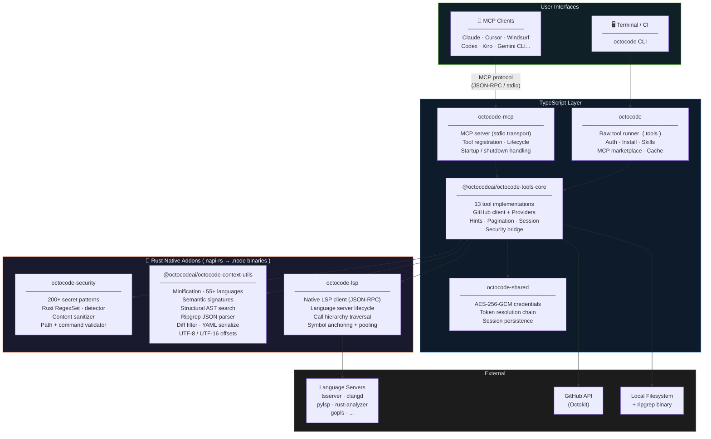
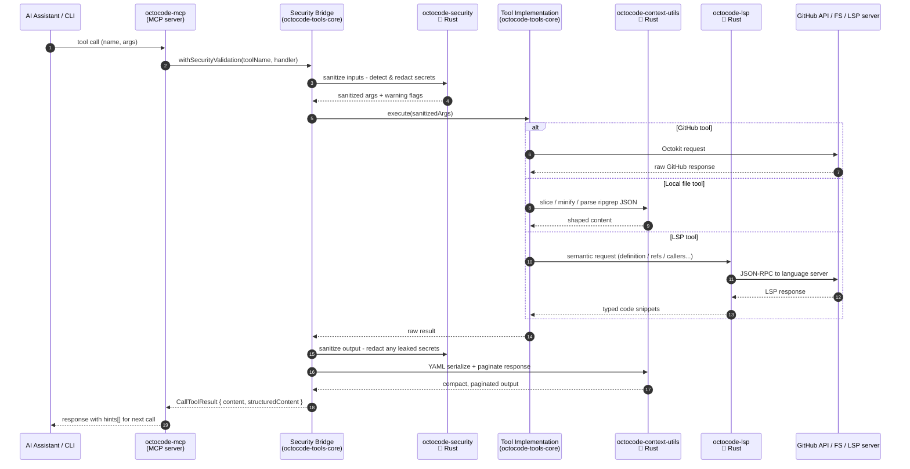

# Research Driven Development for AI

<div align="center">
  

  <h3>The context research Swiss knife for AI agents.<br/>Local and external evidence, in seconds.</h3>
  <p><strong>Stop guessing.</strong> Octocode is a platform for <strong>agentic context research across local and external code and content</strong> - one evidence-first engine combining local workspace analysis, GitHub repositories, pull requests, npm packages, binaries, and LSP semantic navigation.</p>
  <p>Use it <strong>three ways</strong>: an <strong>MCP server</strong> for AI assistants, a <strong>CLI</strong> for terminals, scripts, and CI, and a library of <strong>Agent Skills</strong> that turn the tools into ready-made research and review workflows.</p>

  <p>
    <a href="https://octocode.ai"><strong>octocode.ai</strong></a>
    &nbsp;·&nbsp;
    <a href="#quickstart">Quickstart</a>
    &nbsp;·&nbsp;
    <a href="#platform">Platform</a>
    &nbsp;·&nbsp;
    <a href="#mcp">MCP</a>
    &nbsp;·&nbsp;
    <a href="#cli">CLI</a>
    &nbsp;·&nbsp;
    <a href="#tools">Tools</a>
    &nbsp;·&nbsp;
    <a href="#skills">Skills</a>
    &nbsp;·&nbsp;
    <a href="#security">Security</a>
    &nbsp;·&nbsp;
    <a href="#architecture">Architecture</a>
    &nbsp;·&nbsp;
    <a href="#development">Development</a>
  </p>
</div>

---

## Quickstart

Pick the path that matches where you want Octocode to show up.

### Add Octocode to an AI Assistant

```bash
# Interactive installer for Cursor, Claude Code, Windsurf, Codex, and more.
npx octocode install

# Non-interactive install for a specific client.
npx octocode install --ide cursor
```

Then authenticate GitHub access:

```bash
npx octocode login
npx octocode status
```

If you installed the CLI globally or with Homebrew, use `octocode` instead of `npx octocode`.

### Use Octocode From the Terminal

```bash
# macOS / Linux
brew install bgauryy/octocode/octocode

# npm
npm install -g octocode

# See the tools, then read a tool's schema before calling it
octocode tools
octocode tools localViewStructure --scheme

# First useful local loop - orient, then search, then read the exact slice
octocode tools localViewStructure --queries '{"path":"."}'
octocode tools localSearchCode --queries '{"path":".","keywords":"TODO"}'
octocode tools localGetFileContent --queries '{"path":"README.md","minify":"symbols"}'
```

For GitHub research, login once and then point tools at `owner/repo`:

```bash
octocode login
octocode tools ghViewRepoStructure --queries '{"owner":"facebook","repo":"react","path":""}'
octocode tools ghSearchCode --queries '{"keywords":["useState"],"owner":"facebook","repo":"react"}'
octocode tools ghHistoryResearch --queries '{"owner":"vercel","repo":"next.js","type":"prs","concise":true}'
```

### Add Agent Skills

```bash
# Search, preview, and install packaged research/review workflows.
octocode skills
```

Or browse the catalog at [skills.sh/bgauryy/octocode-mcp](https://www.skills.sh/bgauryy/octocode-mcp). See the [full list below](#skills).

### Common Workflows

Every command is `octocode tools <toolName> --queries '<json>'`. Always read the schema first with `octocode tools <toolName> --scheme`.

| Goal | Orient | Then |
|------|--------|------|
| Understand a local codebase | `localViewStructure '{"path":"."}'` | `localSearchCode '{"path":".","keywords":"<symbol>"}'` -> `localGetFileContent '{"path":"<file>","minify":"symbols"}'` -> `lspGetSemantics '{"uri":"<file>","type":"references","symbolName":"<sym>","lineHint":<n>}'` |
| Research a GitHub repo | `ghViewRepoStructure '{"owner":"<o>","repo":"<r>","path":""}'` | `ghSearchCode '{"keywords":["<term>"],"owner":"<o>","repo":"<r>"}'` -> `ghGetFileContent '{"owner":"<o>","repo":"<r>","path":"<file>"}'` |
| Inspect a pull request | `ghHistoryResearch '{"owner":"<o>","repo":"<r>","type":"prs","concise":true}'` | Re-call with `"prNumber":<N>` for files, patches, comments, reviews, commits. |
| Code-shape query (AST) | `localSearchCode '{"path":".","mode":"structural","pattern":"<shape>"}'` | Use `pattern` (e.g. `import $$$ from $MOD`) or a YAML `rule` for relational matches. |
| Share an agent setup | `octocode context` | Add `--full` when an agent needs complete tool descriptions; read schemas with `tools <name> --scheme`. |

## Platform

Octocode is not a chat prompt or a loose wrapper around `grep`. It is a tool runtime with a shared core: every surface calls the same tool catalog, the same security layer, the same response shaping, and the same Rust-backed hot paths. Pick the surface that fits where you work.

| Surface | Best for | Install | What you get |
|---------|----------|---------|--------------|
| **MCP server** | Claude Code, Cursor, Claude Desktop, Windsurf, Codex, and other MCP clients | `npx octocode install` | 13 research tools (12 enabled by default) exposed directly to your AI assistant |
| **CLI** | Terminal research, scripts, CI, quick lookups, debugging tool calls | `brew install bgauryy/octocode/octocode` or `npm install -g octocode` | Agent-first runner for the same 13 tools (`octocode tools <name> --queries`) plus auth, install, and skills management |
| **Agent Skills** | Packaged workflows for research, planning, review, and output | `octocode skills` or [skills.sh](https://www.skills.sh/bgauryy/octocode-mcp) | 20 ready-made skills that orchestrate the tools - see [Skills](#skills) |

The normal research loop is:

```text
discover shape -> search narrowly -> read exact slices -> trace semantics -> cite evidence
```

GitHub-backed tools require authentication. Run `octocode login`, or see [Authentication Setup](https://github.com/bgauryy/octocode-mcp/blob/main/docs/mcp/AUTHENTICATION.md).

---

## MCP

The MCP server exposes all 13 tools directly to your AI assistant over stdio. Install once - the assistant calls tools automatically.

### Install

```bash
# Interactive - detects your installed clients
npx octocode install

# Non-interactive
octocode install --ide cursor
octocode install --ide claude-code
```

<details>
<summary>One-Click Install (Cursor)</summary>

[](https://cursor.com/en/install-mcp?name=octocode&config=eyJjb21tYW5kIjoibnB4IiwiYXJncyI6WyJvY3RvY29kZS1tY3BAbGF0ZXN0Il19)

</details>

<details>
<summary>Manual Configuration</summary>

Add to your MCP client config file:

```json
{
  "mcpServers": {
    "octocode": {
      "command": "npx",
      "args": ["octocode-mcp@latest"]
    }
  }
}
```

With a GitHub token:

```json
{
  "mcpServers": {
    "octocode": {
      "command": "npx",
      "args": ["octocode-mcp@latest"],
      "env": {
        "GITHUB_TOKEN": "<your-token>"
      }
    }
  }
}
```

</details>

https://github.com/user-attachments/assets/de8d14c0-2ead-46ed-895e-09144c9b5071

### Supported Clients

| Client | `--ide` target |
|--------|----------------|
| Cursor | `cursor` |
| Claude Code | `claude-code` |
| Claude Desktop | `claude-desktop` |
| Windsurf | `windsurf` |
| Zed | `zed` |
| VS Code Cline | `vscode-cline` |
| VS Code Roo | `vscode-roo` |
| VS Code Continue | `vscode-continue` |
| Opencode | `opencode` |
| Trae | `trae` |
| Antigravity | `antigravity` |
| Codex | `codex` |
| Gemini CLI | `gemini-cli` |
| Goose | `goose` |
| Kiro | `kiro` |

### Configuration

Set via `env` in the MCP config block, or in the shell environment.

| Variable | Description | Default |
|----------|-------------|---------|
| `OCTOCODE_TOKEN` / `GH_TOKEN` / `GITHUB_TOKEN` | GitHub token - resolution order: OCTOCODE → GH → GITHUB → encrypted store → `gh` CLI | - |
| `GITHUB_API_URL` | GitHub API base URL (GitHub Enterprise) | `https://api.github.com` |
| `ENABLE_LOCAL` | Enable local filesystem tools | `true` |
| `ENABLE_CLONE` | Enable `ghCloneRepo` and directory fetch mode (requires `ENABLE_LOCAL`) | `false` |
| `WORKSPACE_ROOT` | Root for resolving relative local paths | `process.cwd()` |
| `ALLOWED_PATHS` | Restrict local tools to these paths, comma-separated; empty = all | all |
| `TOOLS_TO_RUN` | Run only these tools, comma-separated | all |
| `ENABLE_TOOLS` / `DISABLE_TOOLS` | Add or remove specific tools, comma-separated | - |
| `OCTOCODE_OUTPUT_FORMAT` | Response format: `yaml` or `json` | `yaml` |
| `OCTOCODE_DEFAULT_MINIFY` | Default minify mode: `none`, `standard`, `symbols` | `standard` |
| `OCTOCODE_OUTPUT_DEFAULT_CHAR_LENGTH` | Default output page size in characters | `2000` |
| `REQUEST_TIMEOUT` | API request timeout in milliseconds | `30000` |
| `MAX_RETRIES` | Maximum API retry attempts | `3` |
| `OCTOCODE_CACHE_TTL_MS` | Clone cache TTL in milliseconds | `86400000` |
| `LOG` | Enable session logging | `true` |

---

## CLI

The CLI is the terminal interface to the same engine. Every MCP tool is available via `octocode tools <name>`. Quick commands are Unix-style shortcuts with automatic local-or-GitHub routing.

### Install

```bash
# Homebrew (macOS / Linux)
brew install bgauryy/octocode/octocode

# npm
npm install -g octocode

# no global install needed
npx octocode install
```

```bash
octocode --version
octocode login
octocode status
```

### Quick Commands

Auto-route based on target: a local path routes to local tools; `owner/repo[/path]` routes to GitHub. All commands support `--json`.

| Command | Routes to | What it does |
|---------|-----------|------|
| `cat <path\|owner/repo/path>` | `localGetFileContent` / `ghGetFileContent` | Read and minify file content |
| `ls <path\|owner/repo>` | `localViewStructure` / `ghViewRepoStructure` | Directory structure |
| `grep <keywords> <path\|owner/repo>` | `localSearchCode` / `ghSearchCode` | Text or regex search |
| `find <query> [path\|owner/repo]` | `localFindFiles` / `localSearchCode` / `ghSearchCode` | Find files by name, path, or content |
| `ast <pattern> [path]` | `localSearchCode` (structural) | AST shape search via ast-grep (local only) |
| `clone <owner/repo[/path][@branch]>` | `ghCloneRepo` | Clone a repo or subtree to `~/.octocode/repos/` |
| `pr <owner/repo[#N]\|PR-URL>` | `ghHistoryResearch` | List or deep-dive pull requests |
| `history <owner/repo[/path]>` | `ghHistoryResearch` (commits) | Commit history for a repo, dir, or file (→ `#PR` deep-read) |
| `repo <keywords...>` | `ghSearchRepos` | Discover GitHub repositories |
| `pkg <package>` | `npmSearch` | npm package metadata + source repo |
| `symbols <file\|path>` | `lspGetSemantics` (documentSymbols) | Semantic symbol outline |
| `lsp <file> --type <type>` | `lspGetSemantics` | Definitions, references, callers, hover, ... |
| `binary <file>` | `localBinaryInspect` | Archives, compressed files, native binaries |
| `unzip <archive>` | `localBinaryInspect` (unpack) | Unpack an archive to a cached directory |

#### cat

```
cat <path|owner/repo/path>
    --mode  none|standard|symbols    minification (default: standard)
    --branch <ref>                   branch for GitHub paths
    --match-string <s>               return only sections containing this string
    --match-regex                    treat --match-string as a regex
    --match-case-sensitive
    --start-line <n>                 first line (1-based)
    --end-line <n>
    --context-lines <n>              context lines around --match-string hits
    --page-size <n>                  characters per page
    --page <n>
    --char-offset <n>                character offset for continuation
    --char-length <n>
    --full-content                   return the whole file
    --content-type file|directory    GitHub content type
    --force-refresh                  bypass GitHub cache
    --json
```

#### ls

```
ls <path|owner/repo>
    --depth <n>                       recursion depth
    --branch <ref>                    branch for GitHub paths
    --pattern <glob>                  name filter, e.g. "*.ts" (local only)
    --ext <list>                      comma-separated extension whitelist (local only)
    --sort name|size|time|extension   (local only, default: name)
    --reverse                         reverse sort (local only)
    --files-only                      list files only (local only)
    --dirs-only                       list directories only (local only)
    --hidden                          include dot-files (local only)
    --limit <n>                       cap entries before pagination
    --page <n>
    --page-size <n>                   entries per page
    --json
```

#### grep

```
grep <keywords> <path|owner/repo>
    --type <ext>          filter by language or extension (ts, py, go, rs)
    --mode paginated|discovery|detailed   (local only, default: paginated)
    --concise             paths only - cheapest orientation
    --include <glob>      include globs (local only)
    --exclude <glob>      exclude globs (local only)
    --context-lines <n>   context around each match (local only)
    --max-matches <n>     max matches per file (local only)
    --branch <ref>        branch for GitHub paths
    --limit <n>           max files in output
    --page <n>
    --page-size <n>
    --json
```

For AST/structural search use `ast` instead.

#### ast

AST shape search via [ast-grep](https://ast-grep.github.io). Structure-aware - comments and strings never false-match. **Local only** - for text/regex or GitHub use `grep`.

**Supported languages** (Rust-native, Tree-sitter grammars compiled in):

`ts` `tsx` `js` `jsx` `mjs` `cjs` `py` `go` `rs` `java` `c` `h` `cpp` `cc` `cxx` `hpp` `cs` `sh` `bash` `zsh`

```
ast <pattern> [path]
ast [path] --rule <yaml>
    --pattern <ast>    AST shape (alternative to positional). Metavars: $X = one node, $$$ARGS = a list.
                       e.g. 'eval($X)', 'console.log($$$)', 'useState($X)'
    --rule <yaml>      Relational YAML rule - not/inside/has/all/any.
                       Relational sub-rules need 'stopBy: end'.
                       Mutually exclusive with a pattern.
    --type <ext>       filter by language or extension (ts, py, go)
    --context-lines <n>   context around each match (default: 0)
    --max-matches <n>  max matches per file
    --limit <n>        max files in output (default: 10)
    --page <n>
    --page-size <n>
    --json
```

#### find

```
find <query> [path|owner/repo]
    --source auto|local|github      routing (default: auto)
    --search path|content|both      search mode (default: path)
    --ext <list>                    comma-separated extensions
    --path <subpath>                local root or GitHub repo subpath
    --owner <owner>                 GitHub owner
    --repo <repo>                   GitHub repository
    --filename <name>               GitHub filename filter
    --verbose                       verbose GitHub search results
    --concise                       GitHub flat "owner/repo:path" list — cheapest orientation
    --limit <n>
    --page <n>
    --page-size <n>

    Local path filters:
    --name <glob>                   basename glob(s)
    --path-pattern <glob>           full path glob (e.g. src/**/*.ts)
    --regex <pattern>               basename regex
    --entry f|d                     file (f) or directory (d)
    --min-depth <n>
    --max-depth <n>
    --modified-within <window>      e.g. 7d, 2h, 1w
    --modified-before <window>
    --accessed-within <window>
    --size-greater <size>           e.g. 100k, 1m
    --size-less <size>
    --permissions <perm>            e.g. 755, -u+x
    --executable / --readable / --writable
    --empty
    --exclude-dir <list>            directory names to skip
    --sort modified|name|path|size
    --details                       add size and permissions per entry
    --show-modified                 add modification timestamps

    Local content filters (when --search content|both):
    --mode paginated|discovery|detailed
    --include <glob>
    --exclude <glob>
    --case-insensitive / --case-sensitive / --whole-word
    --fixed-string / --perl-regex
    --invert-match
    --hidden                        search hidden files
    --no-ignore                     skip .gitignore rules
    --context-lines <n>
    --max-matches-per-file <n>
    --max-files <n>                 cap matched files
    --match-length <n>              cap match snippet length
    --match-page <n>                page within one file's matches
    --multiline                     let match span lines
    --multiline-dotall              let . cross newlines (requires --multiline)
    --sort path|modified|accessed|created
    --sort-reverse
    --count-lines / --count-matches
    --files-only / --files-without-match
    --json
```

#### pr

```
pr <owner/repo[#N]|PR-URL>
    --pr <n>                         PR number (alternative to #N syntax)
    --state open|closed|merged
    --query <keywords>               keyword filter in list mode
    --author <user>
    --label <label>
    --base <branch>
    --sort created|updated|best-match|comments|reactions
    --order asc|desc                 (default: desc)
    --draft                          show only draft PRs
    --created <range>                e.g. >2024-01-01
    --merged-at <range>              e.g. >2024-06-01
    --concise                        flat "#number title" list - cheapest triage
    --limit <n>
    --page <n>
    --page-size <n>
    --patches                        include unified diffs
    --file <path>                    diff for one file only
    --comments                       include comments
    --commits                        include commits
    --deep                           patches + comments + commits + reviews
    --match-string <s>               narrow returned content
    --char-length <n>                cap body/diff size in chars
    --char-offset <n>                continue from char offset
    --json
```

#### repo

```
repo <keywords...>
    --topic <list>                    comma-separated GitHub topics
    --language <lang>
    --owner <owner>                   owner or organization
    --stars <range>                   e.g. >100, 50..500
    --forks <range>
    --good-first-issues <range>
    --license <spdx>                  e.g. mit, apache-2.0
    --created <range>                 e.g. >2023-01-01
    --updated <range>
    --size <range>                    repository size in KB
    --match name,description,readme
    --sort stars|forks|help-wanted-issues|updated|best-match
    --archived true|false
    --visibility public|private
    --limit <n>
    --page <n>
    --verbose                         structured repository objects
    --json
```

#### pkg

```
pkg <package|keywords>
    --mode lean|full    lean (default, token-efficient) or full metadata
    --page <n>          result page for keyword searches
    --json
```

#### symbols

```
symbols <file|path>
    --ext <list>      comma-separated extensions for directory mode
    --kind <kind>     filter by symbol kind: function, class, method, variable, ...
    --limit <n>       max files in directory mode (default: 10)
    --depth <n>       directory discovery depth (default: 4)
    --page-size <n>   symbols per file from LSP (default: 40)
    --json
```

Directory mode discovers files matching extensions (defaults: `ts tsx js jsx mjs cjs py go rs java kt swift cs cpp c h hpp php rb lua dart`). LSP coverage depends on server availability - see the `lsp` section for per-language support.

#### lsp

```
lsp <file> --type <type> --symbol <name> --line <n>
    --type   definition|references|callers|callees|callHierarchy
             hover|typeDefinition|implementation   (required)
    --symbol <name>             required
    --line <n>                  required
    --workspace-root <path>
    --format structured|compact
    --context-lines <n>
    --depth <n>                 call hierarchy depth
    --page <n>
    --page-size <n>
    --json
```

Run `grep` or `symbols` first to get a real `--line` value. Never guess `--line`.

**Supported languages** (Rust-native, no server install required for symbol detection; LSP ops need the listed server on PATH):

| Language | Extensions | Default server |
|----------|------------|----------------|
| TypeScript | `.ts` `.mts` `.cts` | `typescript-language-server` |
| TSX | `.tsx` | `typescript-language-server` |
| JavaScript | `.js` `.mjs` `.cjs` | `typescript-language-server` |
| JSX | `.jsx` | `typescript-language-server` |
| Python | `.py` `.pyi` | `pylsp` |
| Go | `.go` | `gopls` |
| Rust | `.rs` | `rust-analyzer` |
| Java | `.java` | `jdtls` |
| C | `.c` `.h` | `clangd` |
| C++ | `.cpp` `.cc` `.cxx` `.hpp` | `clangd` |
| C# | `.cs` | `csharp-ls` |
| Shell | `.sh` `.bash` `.zsh` | `bash-language-server` |
| JSON / JSONC | `.json` `.jsonc` | `vscode-json-language-server` |
| YAML | `.yaml` `.yml` | `yaml-language-server` |
| TOML | `.toml` | `taplo` |
| HTML | `.html` `.htm` | `vscode-html-language-server` |
| CSS | `.css` | `vscode-css-language-server` |
| SCSS | `.scss` | `vscode-css-language-server` |
| Less | `.less` | `vscode-css-language-server` |

Custom server: add `~/.octocode/lsp-servers.json` or `<workspace>/.octocode/lsp-servers.json`.

**Operation tiers** (what `--type` values each language supports):

| Tier | Languages | Available operations |
|------|-----------|----------------------|
| **1 - Full** | TypeScript, TSX, JavaScript, JSX, Go, Rust | All 8: `definition` `references` `callers` `callees` `callHierarchy` `hover` `typeDefinition` `implementation` |
| **2 - No call hierarchy** | Python, C++ | All except `callHierarchy` |
| **3 - Basic** | Shell, JSON, YAML, TOML, HTML, CSS, SCSS, Less | `documentSymbols` `hover` `definition` only |
| **Varies** | Java, C, C# | Depends on server - `definition` `references` `hover` `documentSymbols` confirmed |

#### binary

```
binary <file>
    (no flags)           auto-detect mode from extension
    --list               list archive entries
    --extract <entry>    extract one archive member (exact path from --list)
    --strings            readable strings from a native binary
    --decompress         decompress a single-stream file
    --identify           file type and magic bytes only
    --match <s>          filter extracted/decompressed lines
    --min-length <n>     strings: shortest run to keep (default 8)
    --max-entries <n>    list: cap entries
    --format <fmt>       decompress: force compression format
    --verbose            list: include size and mtime
    --offsets            strings: prefix each with hex byte offset
    --page <n>
    --json
```

Always run `--identify` or no flags first. Use `--list` before `--extract` - do not guess entry names.

**Auto-detected formats:**

| Mode | Extensions |
|------|------------|
| **list / extract** (archives) | `.zip` `.jar` `.war` `.ear` `.7z` `.deb` `.dmg` `.rpm` `.apk` `.nupkg` `.whl` `.gem` `.ar` `.a` `.tar` `.tar.gz` `.tar.bz2` `.tar.xz` `.tar.zst` `.tar.zstd` `.tar.lz4` `.tar.br` `.tar.lzfse` `.tgz` `.tbz` `.tbz2` `.txz` `.tzst` |
| **decompress** (single-stream) | `.gz` `.bz2` `.xz` `.lzma` `.zst` `.zstd` `.lz4` `.br` `.lzfse` |
| **strings** (native binaries) | `.so` `.dylib` `.node` `.exe` `.dll` `.wasm` `.o` `.bin` `.out` `.so.N` |

#### clone

Clone a GitHub repo or subtree locally. Clones land at `~/.octocode/repos/<owner>/<repo>/<branch>/` with a 24-hour cache. Requires `ENABLE_CLONE=true`.

```
clone <owner/repo[/path][@branch]|url>
    --branch <ref>      override branch (also parsed from @branch syntax)
    --force-refresh     bypass 24-hour cache and re-clone
    --json
```

| Input | Effect |
|-------|--------|
| `owner/repo` | Full clone of default branch |
| `owner/repo/packages/core` | Sparse checkout of `packages/core` subtree |
| `owner/repo@main` | Full clone at branch `main` |
| `owner/repo@main/src` | Sparse checkout of `src` at `main` |
| GitHub URL with `/tree/` | Parsed automatically |

```bash
octocode clone facebook/react
octocode clone facebook/react/packages/react
octocode clone facebook/react@18.2.0/packages/react
octocode clone https://github.com/vercel/next.js/tree/main/packages/next
```

After cloning, use local tools against the returned path:

```bash
octocode ls ~/.octocode/repos/facebook/react/main
octocode grep "useState" ~/.octocode/repos/facebook/react/main
```

### Management Commands

#### install

```
install --ide <client> [--method npx] [--force] [--check] [--rollback] [--backup-path <path>] [--json]
```

Configures the MCP server for an IDE. `--check` does a pre-flight only. `--rollback` restores the most recent backup.

Supported `--ide` values: `cursor`, `claude-desktop`, `claude-code`, `windsurf`, `zed`, `vscode-cline`, `vscode-roo`, `vscode-continue`, `opencode`, `trae`, `antigravity`, `codex`, `gemini-cli`, `goose`, `kiro`

#### auth

```
auth [login|logout|status|token|refresh] [--hostname <host>] [--json]

login   [--hostname <host>] [--git-protocol ssh|https] [--force] [--json]
logout  [--hostname <host>] [--yes] [--json]
```

GitHub OAuth authentication. `login` opens the device flow. `logout` removes encrypted credentials. `--hostname` targets GitHub Enterprise.

#### token

```
token [--type auto|octocode|gh] [--hostname <host>] [--source] [--validate] [--reveal] [--json]
```

Prints the resolved GitHub token (masked by default). Resolution order: `OCTOCODE_TOKEN` → `GH_TOKEN` → `GITHUB_TOKEN` → encrypted store → `gh auth token`.

- `--source` - show token origin and authenticated username
- `--validate` - ping the GitHub API; shows rate-limit info
- `--reveal` - print the full token (default: masked on terminal, raw when piped)

#### status

```
status [--hostname <host>] [--sync] [--json]
```

Shows auth state, MCP client install health, and cache info. `--sync` adds cross-client token sync analysis.

#### skills

```
skills [search|read|install|remove|list|sync]
    --skill <name>            bundled skill name
    --local <path>            path to a local skill folder
    --targets <list>          comma-separated install targets
    --target <target>         filter list to one target
    --mode copy|symlink       install mode (default: copy)
    --force                   overwrite existing skills
    --dry-run                 show plan without writing
    --limit <n>               max search results (default: 20)
    --full                    show full SKILL.md without truncation (read only)
    --direct                  search skills.sh and show results
    --install                 install the top search result (with search --direct)
    --json
```

### Raw Tool Runner

Every MCP tool runs via `tools`. Read the schema before calling - field names vary per tool.

```bash
octocode tools                                         # list all available tools
octocode tools <name> --scheme                         # full JSON schema
octocode tools <name> --queries '<json>'               # run (YAML by default)
octocode tools <name> --queries '<json>' --json        # raw response envelope
octocode tools <name> --queries '<json>' --compact     # leanest output
octocode context                                       # agent protocol + system prompt
octocode context --full                                # complete tool descriptions; schemas stay on demand
```

`--queries` accepts one object or an array of up to 5 independent queries. Legacy `--input` is not supported; unsupported tool flags are rejected before execution.

### Playbook

```
orient:   ls <path>                                 flat tree, no file bodies
          grep <term> <path> --mode discovery        file paths only
search:   grep <keywords> <path>                    file + line anchors
read:     cat <file> --mode symbols                 skeleton map
          cat <file> --match-string <anchor>         exact slice
prove:    lsp <file> --type references              blast radius
          --symbol <name> --line <n>                anchor from grep
```

`ast --pattern`/`--rule` answers shape (AST).  
`lsp` answers identity — always anchor on a real line from `grep` or `symbols`.

### Flags and Exit Codes

```
Global flags:
    --json      raw response envelope
    --compact   leanest output
    --no-color  disable ANSI color

Unknown command flags are rejected with command-specific valid flags and near-miss suggestions.

Exit codes:
    0   ok
    2   bad input
    3   not found
    4   auth error
    5   tool error
    7   rate limited
```

---

## Tools

13 tools are available. `ghCloneRepo` is opt-in (`ENABLE_CLONE=true`). Local tools require `ENABLE_LOCAL` (default: on). All flags: [Configuration Reference](https://github.com/bgauryy/octocode-mcp/blob/main/docs/mcp/CONFIGURATION.md).

The same tool implementations run over MCP and CLI.

**Token knobs** - `concise:true` returns path/title-only lists. `minify` controls file read density: `symbols` = skeleton with line numbers, `standard` = comments/blanks stripped (default), `none` = exact bytes.

### GitHub Tools

| Tool | What it does | Knob |
|------|--------------|------|
| `ghSearchCode` | Code and path search across GitHub - owner, repo, path, filename, extension, match filters. Accepts 1-5 parallel queries. | `concise` |
| `ghGetFileContent` | Read a GitHub file or region - full file, line range, match slice, or paginated chars. | `minify` |
| `ghViewRepoStructure` | Browse a GitHub repository's directory tree before reading files. | - |
| `ghSearchRepos` | Discover repositories by keywords, owner, topic, language, stars, forks, size, dates, license, visibility. | `concise` |
| `ghHistoryResearch` | Search PR history, or deep-read one PR: files, patches, comments, reviews, commits. | `concise` |
| `ghCloneRepo` | Clone a repo or sparse subtree into the local cache for local/LSP analysis. **Opt-in** (`ENABLE_CLONE=true`). | `sparsePath` |

### Local Tools

| Tool | What it does | Knob |
|------|--------------|------|
| `localSearchCode` | Local code/text search returning file + line anchors. `mode:"structural"` runs ast-grep AST shape queries (`pattern` or `rule`). | `mode` |
| `localViewStructure` | Browse a local directory tree - depth, filters, pagination, metadata. | `concise` |
| `localFindFiles` | Find local files and directories by name, path, regex, extension, size, time, permissions, type. | - |
| `localGetFileContent` | Read a local file or region - exact slice, match string, line range, or paginated chars. | `minify` |
| `localBinaryInspect` | Inspect archives, compressed streams, and native binaries - identify, list, extract, decompress, strings. | - |

### Package Search

| Tool | What it does | Knob |
|------|--------------|------|
| `npmSearch` | npm package lookup and keyword search - returns metadata and source repository for GitHub handoff. | `concise` |

### LSP

| Tool | What it does |
|------|--------------|
| `lspGetSemantics` | Typed semantic navigation. Raw tools support `definition`, `references`, `callers`, `callees`, `callHierarchy`, `hover`, `documentSymbols`, `typeDefinition`, and `implementation`. The CLI `lsp` shortcut is for symbol-anchored queries only; use `symbols` for `documentSymbols`. Supports 19 languages via installed language servers — see the `lsp` command section for the full list and operation tiers. |

**References**
- [GitHub Tools Reference](https://github.com/bgauryy/octocode-mcp/blob/main/docs/mcp/tools/GITHUB_TOOLS.md)
- [Local Tools Reference](https://github.com/bgauryy/octocode-mcp/blob/main/docs/mcp/tools/LOCAL_TOOLS.md)
- [LSP Tools Reference](https://github.com/bgauryy/octocode-mcp/blob/main/docs/mcp/tools/LSP_TOOLS.md)
- [Tool Behavior Guide](https://github.com/bgauryy/octocode-mcp/blob/main/docs/mcp/tools/TOOL_BEHAVIOR.md)

---

## Security

Octocode is built for AI-agent workflows where the expensive part is not just execution time - it is irrelevant context, secret leakage, and untrusted inputs.

### Input Validation & Secrets

- Inputs pass through schema validation and security wrappers before execution.
- Secrets are detected and redacted in tool inputs, outputs, errors, logs, and returned content.
- Local paths are canonicalized, checked against workspace/allowed roots, and rejected when they escape allowed directories or hit ignored paths.
- Local command execution is allowlisted. Tools use controlled builders for commands such as `rg`, `find`, `ls`, and `git`; arguments are not passed through a free-form shell.
- GitHub token resolution is explicit: `OCTOCODE_TOKEN`, `GH_TOKEN`, `GITHUB_TOKEN`, encrypted Octocode credentials, then `gh auth token`.
- Clone-backed workflows require local/clone enablement and materialize into managed cache locations.

### Token Efficiency

Every file-reading tool exposes a `minify` mode so an agent spends tokens on evidence, not boilerplate:

| `minify` | Returns | Use it to |
|----------|---------|-----------|
| `symbols` | Structural skeleton with line numbers (no bodies) | Map an unknown file before reading anything |
| `standard` | Comments and blank-line noise removed, readable shape kept (default) | Read code without the dead weight |
| `none` | Exact bytes | Quote precisely or diff |

On top of minification:

- `concise:true` (search/discovery tools) returns path/title-only lists - the cheapest way to orient before reading.
- Match-based and line-based reads keep the model on the exact slice instead of whole files.
- Bulk tools paginate results and large payloads; agents continue from `page`, `charOffset`, or response pagination fields.
- Responses default to compact, structured YAML because it is easier for an agent to scan than raw JSON (`--json`/`--compact` available).

### Rust-Backed Hot Paths

Octocode uses Rust where it changes the feel of the product, not as a vanity rewrite:

- `octocode-security` runs high-volume secret detection and masking through Rust's linear-time regex engine.
- `@octocodeai/octocode-context-utils` handles agent-readable minification, semantic signatures, UTF-8/UTF-16 offsets, ripgrep JSON parsing, diff filtering, and YAML serialization.
- `octocode-lsp` owns native LSP runtime pieces: language detection, server command resolution, stdio JSON-RPC, symbol anchoring, pooled clients, and semantic requests.

That combination keeps flows fast and predictable: search broadly, read narrowly, trace semantically, return compact evidence.

---

## Development

Run these from the repository root unless a package doc says otherwise.

```bash
yarn install
yarn build
yarn test:quiet
yarn lint
```

| Task | Command |
|------|---------|
| Install dependencies | `yarn install` |
| Build every package | `yarn build` |
| Run the quieter test lane | `yarn test:quiet` |
| Run full coverage | `yarn test` |
| Lint all packages | `yarn lint` |
| Fix lint/format issues where possible | `yarn lint:fix` |
| Validate MCP package contracts | `yarn mcp:contracts` |
| Run the MCP package gate | `yarn mcp:package` |
| Validate CLI registries | `cd packages/octocode && yarn validate:mcp && yarn validate:skills` |

Useful editing rules for this repo:

- Documentation links in `docs/` and package READMEs use absolute GitHub URLs.
- MCP behavior changes usually need tests under `packages/octocode-mcp/tests/` or the owning package's `tests/` directory.
- Tool descriptions and schemas come from the shared tool catalog, so update the shared source instead of patching generated output.
- Generated folders such as `dist/`, `out/`, `coverage/`, and `node_modules/` are not source.

For the full workflow, see the [Development Guide](https://github.com/bgauryy/octocode-mcp/blob/main/docs/DEVELOPMENT_GUIDE.md).

### Troubleshooting Fast

| Symptom | Try |
|---------|-----|
| GitHub queries fail or return less than expected | Run `octocode login`, then `octocode status` to confirm the token source. |
| An MCP client does not show Octocode tools | Run `octocode status --sync`, then restart the client so it reloads MCP config. |
| Local tools cannot see the files you expect | Check `WORKSPACE_ROOT` and `ALLOWED_PATHS` in the [Configuration Reference](https://github.com/bgauryy/octocode-mcp/blob/main/docs/mcp/CONFIGURATION.md). |
| Output is too large | Search first (`localSearchCode`), then read with `minify:"symbols"`, a `matchString`, or a line range instead of whole files. |
| LSP results are hard to target | Run `localSearchCode` to get a `uri` + line, then pass them as `lspGetSemantics` `uri` + `lineHint`. |
| A `tools` call is rejected | Read the schema first: `octocode tools <name> --scheme`. Field names differ per tool (e.g. local `keywords` is a string, GitHub `keywords` is an array). |

---

## Architecture

This is a yarn-workspaces monorepo. Runtime code is split so the MCP server, CLI, and extension share one tool core instead of each reimplementing research behavior. Setup/reference docs live in [`docs/`](https://github.com/bgauryy/octocode-mcp/tree/main/docs), and AI-agent guidance lives in [`AGENTS.md`](https://github.com/bgauryy/octocode-mcp/blob/main/AGENTS.md).

### Package Graph

Octocode is a layered system: two TypeScript entry-points (MCP server and CLI) share one TypeScript tool core, which delegates hot paths to three Rust native addons compiled via [napi-rs](https://napi.rs) into platform-specific `.node` binaries.



### Request Flow

Every tool call - whether it arrives over MCP or directly from the CLI - follows the same security-first pipeline:



### Why Rust

Each Rust package solves a specific bottleneck that JavaScript cannot handle cheaply at agent workload scale:

| Package | What Rust buys here |
|---------|---------------------|
| **octocode-security** | `RegexSet` compiles 200+ secret patterns into a single linear-time automaton. Matching a 500 KB chunk costs ~10 ms regardless of pattern count; a JS loop over 200 regexes would take 10-50×. |
| **octocode-context-utils** | Zero-copy comment stripping and minification across 55 languages runs on every file read. Async napi `Task` keeps the Node.js event loop unblocked while multi-MB files are processed. Structural (AST) search and UTF-8↔UTF-16 offset conversion are similarly allocation-heavy. |
| **octocode-lsp** | The LSP client owns a long-lived child process (the language server) and a bidirectional async stdio pipe. Tokio drives the I/O concurrently, retries `ContentModified` errors, and drains stderr into a ring buffer - none of which map cleanly onto a single-threaded JS runtime. |

All three ship as pre-built `.node` binaries (darwin-arm64, darwin-x64, linux-arm64, linux-x64, linux-x64-musl, win32-x64). No Rust toolchain is needed at runtime.

### Packages

| Directory | npm package | Purpose |
|-----------|-------------|---------|
| [`packages/octocode-mcp`](https://github.com/bgauryy/octocode-mcp/tree/main/packages/octocode-mcp) | `octocode-mcp` | MCP server that registers the Octocode tool catalog for AI assistants. |
| [`packages/octocode`](https://github.com/bgauryy/octocode-mcp/tree/main/packages/octocode) | `octocode` | Agent-first terminal interface: raw tool runner (`tools`), `context`, auth, install, status, token, and skills workflows. |
| [`packages/octocode-tools-core`](https://github.com/bgauryy/octocode-mcp/tree/main/packages/octocode-tools-core) | `@octocodeai/octocode-tools-core` | Shared tool catalog and implementations for GitHub, local filesystem, package search, and LSP flows. |
| [`packages/octocode-context-utils`](https://github.com/bgauryy/octocode-mcp/tree/main/packages/octocode-context-utils) | `@octocodeai/octocode-context-utils` | Rust-backed context engine for minification, signatures, pagination offsets, ripgrep parsing, diff filtering, and YAML output. |
| [`packages/octocode-security`](https://github.com/bgauryy/octocode-mcp/tree/main/packages/octocode-security) | `octocode-security` | Rust-backed secret detection plus TypeScript path, command, input, and tool security utilities. |
| [`packages/octocode-lsp`](https://github.com/bgauryy/octocode-mcp/tree/main/packages/octocode-lsp) | `octocode-lsp` | Rust-native LSP runtime for language detection, server config, JSON-RPC, symbol anchoring, pooled clients, and semantic navigation. |
| [`packages/octocode-shared`](https://github.com/bgauryy/octocode-mcp/tree/main/packages/octocode-shared) | `octocode-shared` | Shared credentials, token resolution, session persistence, and platform utilities. |
| [`packages/octocode-vscode`](https://github.com/bgauryy/octocode-mcp/tree/main/packages/octocode-vscode) | `octocode-mcp-vscode` | VS Code extension for GitHub OAuth and multi-editor MCP installation. |

---

## Skills

> [Agent Skills](https://agentskills.io/what-are-skills) are a lightweight, open format for extending AI agent capabilities.
> Browse and install on [**skills.sh/bgauryy/octocode-mcp**](https://www.skills.sh/bgauryy/octocode-mcp) · Skills index: [skills/README.md](https://github.com/bgauryy/octocode-mcp/blob/main/skills/README.md)

**Research & Code Analysis**

| Skill | What it does |
|-------|--------------|
| [**Researcher**](https://github.com/bgauryy/octocode-mcp/tree/main/skills/octocode-researcher) | Code search & exploration: local LSP + external (GitHub, npm) |
| [**Research**](https://github.com/bgauryy/octocode-mcp/tree/main/skills/octocode-research) | Multi-phase research with sessions, checkpoints, state persistence |
| [**Engineer**](https://github.com/bgauryy/octocode-mcp/tree/main/skills/octocode-engineer) | Understand, write, analyze, audit code: AST + LSP + dependency graph |
| [**Brainstorming**](https://github.com/bgauryy/octocode-mcp/tree/main/skills/octocode-brainstorming) | Idea validation grounded in evidence: GitHub, npm, web in parallel |
| [**News**](https://github.com/bgauryy/octocode-mcp/tree/main/skills/octocode-news) | What's new in AI, dev tools, web platform, security, notable repos |

**Planning & Writing**

| Skill | What it does |
|-------|--------------|
| [**Plan**](https://github.com/bgauryy/octocode-mcp/tree/main/skills/octocode-plan) | Evidence-based planning: Understand > Research > Plan > Implement |
| [**RFC Generator**](https://github.com/bgauryy/octocode-mcp/tree/main/skills/octocode-rfc-generator) | Formal technical decisions with alternatives, trade-offs, and recommendations |
| [**Doc Writer**](https://github.com/bgauryy/octocode-mcp/tree/main/skills/octocode-documentation-writer) | 6-phase pipeline producing 16+ validated docs |
| [**Prompt Optimizer**](https://github.com/bgauryy/octocode-mcp/tree/main/skills/octocode-prompt-optimizer) | Turn weak prompts into enforceable agent protocols |
| [**Agentic Flow**](https://github.com/bgauryy/octocode-mcp/tree/main/skills/agentic-flow-best-practices) | Thinking framework for designing/reviewing MCP & multi-agent workflows |

**Review & Critique**

| Skill | What it does |
|-------|--------------|
| [**PR Reviewer**](https://github.com/bgauryy/octocode-mcp/tree/main/skills/octocode-pull-request-reviewer) | PR & local code review across 7 domains with LSP flow tracing |
| [**Roast**](https://github.com/bgauryy/octocode-mcp/tree/main/skills/octocode-roast) | Brutal code critique with file:line citations and severity levels |

**Build & Output**

| Skill | What it does |
|-------|--------------|
| [**Slides**](https://github.com/bgauryy/octocode-mcp/tree/main/skills/octocode-slides) | Polished multi-file HTML presentations via 6-phase design flow |
| [**Design**](https://github.com/bgauryy/octocode-mcp/tree/main/skills/octocode-design) | Dynamic DESIGN.md generator covering visual language, components, a11y |
| [**Chrome DevTools**](https://github.com/bgauryy/octocode-mcp/tree/main/skills/octocode-chrome-devtools) | CDP-level browser debugging: network, console, perf, DOM, screenshots |

**Tooling & Setup**

| Skill | What it does |
|-------|--------------|
| [**Install**](https://github.com/bgauryy/octocode-mcp/tree/main/skills/octocode-install) | Interactive step-by-step Octocode installer for macOS and Windows |
| [**CLI**](https://github.com/bgauryy/octocode-mcp/tree/main/skills/octocode) | Run Octocode MCP tools from the terminal without wiring MCP |
| [**Search Skill**](https://github.com/bgauryy/octocode-mcp/tree/main/skills/octocode-search-skill) | Find, evaluate, install, refactor Agent Skills (SKILL.md format) |
| [**Stats**](https://github.com/bgauryy/octocode-mcp/tree/main/skills/octocode-stats) | Local HTML dashboard from Octocode MCP usage stats |
| [**Harness Status**](https://github.com/bgauryy/octocode-mcp/tree/main/skills/octocode-harness-status) | Interactive dashboard of all skills, MCPs, CLIs, and tokens installed on this machine |

https://github.com/user-attachments/assets/5b630763-2dee-4c2d-b5c1-6335396723ec

---

## Documentation

Website: **[octocode.ai](https://octocode.ai)** · Full docs: **[github.com/bgauryy/octocode-mcp/tree/main/docs](https://github.com/bgauryy/octocode-mcp/tree/main/docs)** · Index: **[docs/README.md](https://github.com/bgauryy/octocode-mcp/blob/main/docs/README.md)**. All monorepo documentation lives in [`docs/`](https://github.com/bgauryy/octocode-mcp/tree/main/docs) (no per-package `docs/`).

**Docs map**
- [`docs/mcp/`](https://github.com/bgauryy/octocode-mcp/tree/main/docs/mcp): MCP server - configuration, authentication, tools, workflows, architecture
- [`docs/cli/`](https://github.com/bgauryy/octocode-mcp/tree/main/docs/cli): CLI - commands, flags, benchmarks
- [`docs/`](https://github.com/bgauryy/octocode-mcp/tree/main/docs): guides - development, skills, Pi setup

**Setup**
- [Authentication Setup](https://github.com/bgauryy/octocode-mcp/blob/main/docs/mcp/AUTHENTICATION.md)
- [Configuration Reference](https://github.com/bgauryy/octocode-mcp/blob/main/docs/mcp/CONFIGURATION.md)
- [Using octocode-mcp with Pi](https://github.com/bgauryy/octocode-mcp/blob/main/docs/PI_SETUP_GUIDE.md)

**Tool References**
- [GitHub Tools](https://github.com/bgauryy/octocode-mcp/blob/main/docs/mcp/tools/GITHUB_TOOLS.md)
- [Local Tools](https://github.com/bgauryy/octocode-mcp/blob/main/docs/mcp/tools/LOCAL_TOOLS.md)
- [LSP Tools](https://github.com/bgauryy/octocode-mcp/blob/main/docs/mcp/tools/LSP_TOOLS.md)
- [Clone & Local Workflow](https://github.com/bgauryy/octocode-mcp/blob/main/docs/mcp/CLONE_WORKFLOW.md)

**CLI & Skills**
- [CLI Reference](https://github.com/bgauryy/octocode-mcp/blob/main/docs/cli/REFERENCE.md)
- [Skills Guide](https://github.com/bgauryy/octocode-mcp/blob/main/docs/SKILLS_GUIDE.md) · [Skills Index](https://github.com/bgauryy/octocode-mcp/blob/main/skills/README.md)

**Shared Internals**
- [Credentials Architecture](https://github.com/bgauryy/octocode-mcp/blob/main/docs/mcp/CREDENTIALS.md) · [Session Persistence](https://github.com/bgauryy/octocode-mcp/blob/main/docs/mcp/SESSION.md)

**Operations**
- [Development Guide](https://github.com/bgauryy/octocode-mcp/blob/main/docs/DEVELOPMENT_GUIDE.md) · [Agent Guidance (AGENTS.md)](https://github.com/bgauryy/octocode-mcp/blob/main/AGENTS.md)

### The Manifest

**"Code is Truth, but Context is the Map."** Read the [Manifest for Research Driven Development](https://github.com/bgauryy/octocode-mcp/blob/main/MANIFEST.md) to understand the philosophy behind Octocode.

---

### Contributing

See the [Development Guide](https://github.com/bgauryy/octocode-mcp/blob/main/docs/DEVELOPMENT_GUIDE.md) for monorepo setup, testing, and contribution guidelines.

---

<div align="center">
  <sub>Built with care for the AI Engineering Community</sub>
</div>
