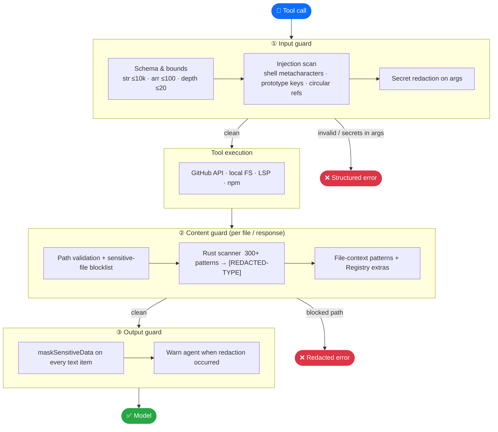
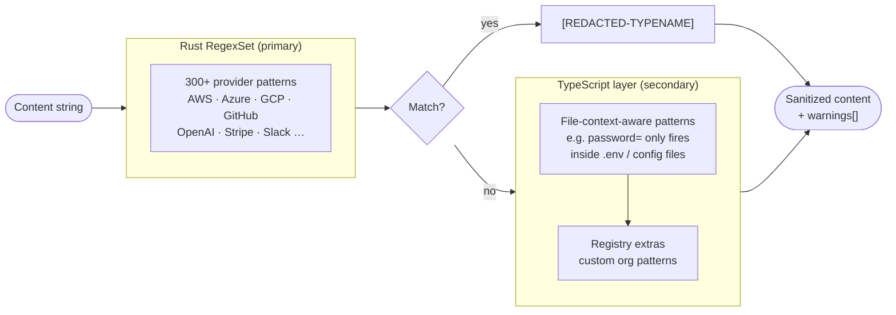
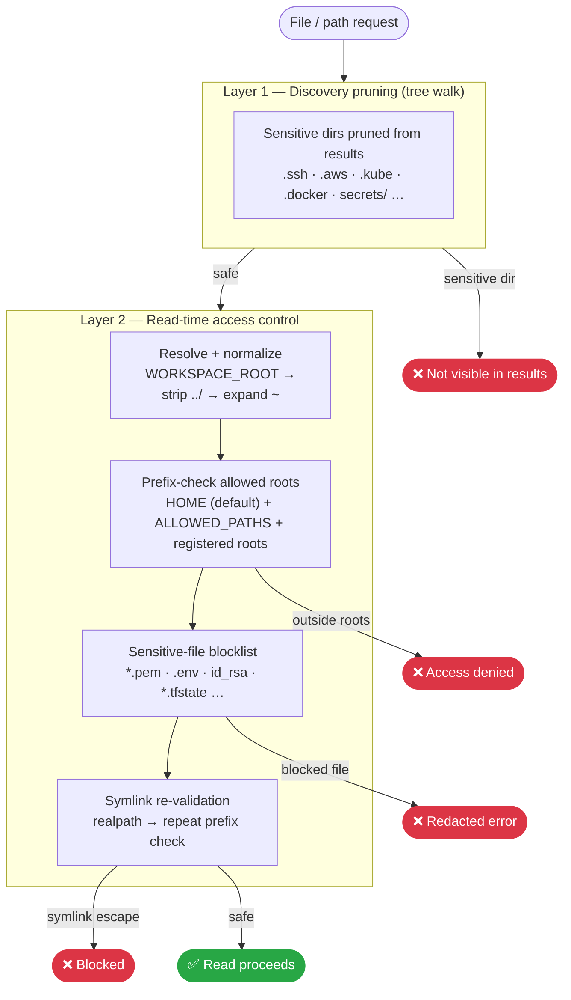
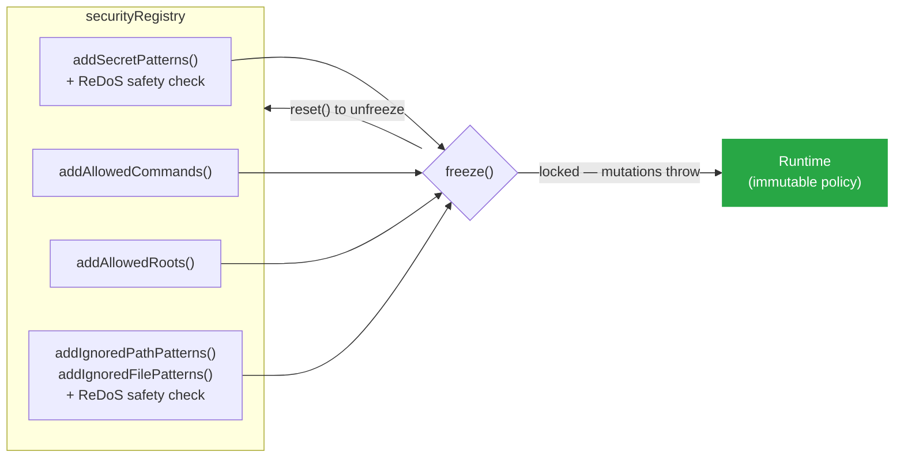

# Security

## Why it matters

When an AI agent browses your codebase it **will** encounter `.env` files, `~/.aws/credentials`, private keys, and CI tokens. Without active protection, those secrets flow straight into the LLM context window — where they can be logged, leaked via tool call results, or exfiltrated through prompt injection.

Octocode enforces a hard boundary between untrusted content and the model:

> **Every byte is scanned and redacted before it reaches the LLM.** Secrets are stripped on the way *in* (inputs) and on the way *out* (results) — zero configuration required.

You get this by default, for every tool call, over both MCP and CLI.

---

## The pipeline

Three independent redaction stages guard every tool call:



**What the agent sees after redaction:**

| Situation | Output |
|-----------|--------|
| Secret in file content | `[REDACTED-AWSACCESSKEYID]`, `[REDACTED-GITHUBPAT]`, … |
| Secret reaching output boundary | `A*I*S*A*4*1*X*…` (every-other-char masked) |
| Content too large | `[CONTENT-REDACTED-SIZE-LIMIT]` |
| Path blocked | Structured error — path never echoed |

---

## Secret detection

The Rust-native `RegexSet` scanner (with a TypeScript fallback from the same pattern list) covers **300+ patterns** across every major cloud, SaaS, and dev-tool credential format.



**Coverage categories:**

| Category | Examples |
|----------|---------|
| Cloud | AWS (key ID, secret, session token, ARN), Azure (AD, storage, Cosmos), GCP, Alibaba |
| AI providers | OpenAI, Anthropic, Azure OpenAI, Bedrock, AI21, AssemblyAI |
| SaaS / dev tools | GitHub (PAT, fine-grained, OAuth, app), Slack, Stripe, npm, Atlassian, Auth0, Adyen |
| Generic / structural | JWTs, PEM/SSH keys, bearer tokens, passwords in URLs, DB connection strings, high-entropy strings |

**File-context-aware patterns** avoid false positives in source code: `password =` only fires when the file path matches `.env`, `config`, or `secrets`; Spring Boot credential patterns only apply to `application.yml` / `application.properties`.

---

## Path validation

Local filesystem access uses two independent layers so secrets can never be reached even if one layer is bypassed.



**Blocked categories** (matched on file name and directory path):

| Category | Examples |
|----------|---------|
| Keys & certs | `*.pem`, `*.key`, `*.p12`, `id_rsa`, `id_ed25519`, `.ssh/` |
| Credentials | `.env`, `.env.*`, `.netrc`, `.npmrc`, `.git-credentials`, `*_token`, `client_secret*.json` |
| Cloud & infra | `.aws/credentials`, `.kube/`, `*.tfstate`, `*.tfvars`, `.s3cfg` |
| Secret stores | `.password-store/`, `*.kdbx`, OS keychains, browser login DBs |
| Shell & history | `.bash_history`, `.zsh_history`, `.*_history` |
| Crypto wallets | `wallet.dat`, `.bitcoin/`, `.ethereum/` |
| App secrets | `wp-config.php`, `google-services.json`, `secrets.yml`, `master.key` |

Canonical sources: `src/security/filePatterns.ts` · `src/security/pathPatterns.ts`.

`ALLOWED_PATHS` adds roots on top of the HOME default. Disable local tools entirely with `ENABLE_LOCAL=false`.

---

## Command execution

External commands run via `child_process.spawn()` with an argument array — **never** `exec` — and shell metacharacters are rejected before execution.

| Command | Hardening |
|---------|-----------|
| `rg` | Explicit flag allowlist; `--pre`/`--pre-glob` blocked (arbitrary binary exec). Combined short flags validated char-by-char. |
| `git` | Only `clone` + `sparse-checkout`. `file://`, `git://`, `http://` URLs blocked (HTTPS only). `-c` keys allowlisted to safe config (`advice.detachedHead`, `core.autocrlf`, `http.extraHeader`, …). |
| `find` | `-exec`, `-execdir`, `-ok`, `-delete`, `-printf` and all exec/write operators blocked. |
| `grep` | Shared dangerous-pattern scan (`;&|$()` etc.) applied to all arguments. |

---

## Credentials & tokens

| | |
|---|---|
| **Resolution order** | `OCTOCODE_TOKEN` → `GH_TOKEN` → `GITHUB_TOKEN` → encrypted on-disk OAuth → `gh` CLI token |
| **On-disk storage** | AES-256-GCM encrypted under `OCTOCODE_HOME` |
| **Output masking** | Tokens are subject to output masking — never echoed in results |

See [Configuration](./CONFIGURATION.md) for token setup and credential architecture.

---

## Input limits & injection guards

| Check | Limit / action |
|-------|---------------|
| String length | ≤ 10,000 chars |
| Array length | ≤ 100 items |
| Object nesting | ≤ 20 levels |
| Prototype pollution | `__proto__`, `constructor`, `prototype` keys → rejected |
| Circular references | WeakSet ancestor tracking → rejected |
| Numeric ranges | depth / context-lines / limits / offsets clamped at schema layer |

---

## Tool timeout & cancellation

Every tool call runs under a 60-second timeout. MCP clients can cancel via `AbortSignal`. Both timeout and cancellation return a structured error — no partial data leaks through.

```
configureSecurity({ defaultTimeoutMs: 30_000 })   // process-wide override
withSecurityValidation(name, handler, { timeoutMs: 10_000 })  // per-tool override
```

---

## Extension API

The `securityRegistry` singleton lets you extend security policy before boot — useful for org-specific secrets or multi-tenant deployments.



```ts
import { securityRegistry } from '@octocodeai/octocode-engine/security';

securityRegistry.addSecretPatterns([
  { name: 'my-service-token', regex: /mst_[A-Za-z0-9]{32}/ }
]);
securityRegistry.addAllowedCommands(['my-search-tool']);
securityRegistry.addAllowedRoots(['/mnt/shared-workspace']);
securityRegistry.addIgnoredPathPatterns([/\/internal-vault\//]);
securityRegistry.addIgnoredFilePatterns([/\.company-secret$/]);

securityRegistry.freeze(); // lock — throws on any further mutation
```

**Guards on custom patterns:**
- All `regex` values are checked against a **ReDoS timing heuristic** (50 ms on a 100-char input) — patterns that fail are rejected before registration.
- Duplicate names/sources are silently deduplicated.
- `securityRegistry.version` increments on every mutation — use it for cache invalidation.

---

## Scope & disclosure

Octocode protects the **agent context boundary** — what flows between untrusted content and the model. It does not replace repository secret-scanning, OS-level sandboxing, or network egress controls; run those alongside it.

To report a vulnerability, open a private advisory on the [repository](https://github.com/bgauryy/octocode-mcp) rather than a public issue.
