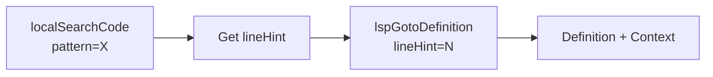
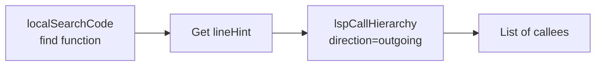
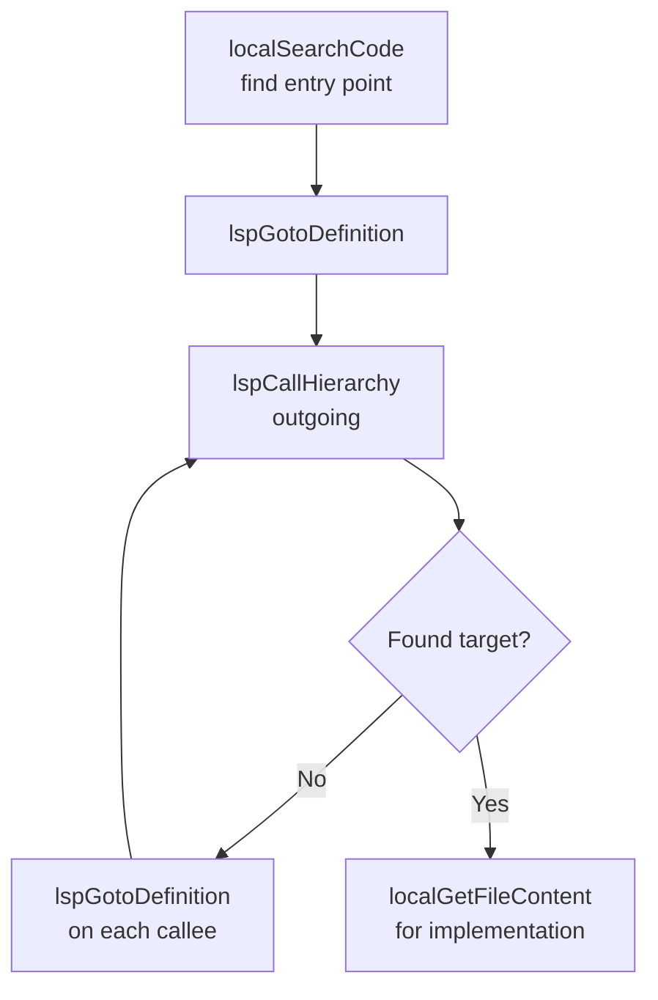
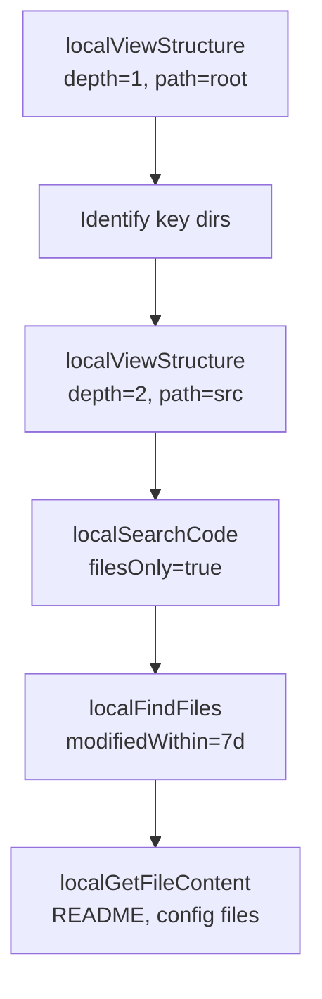
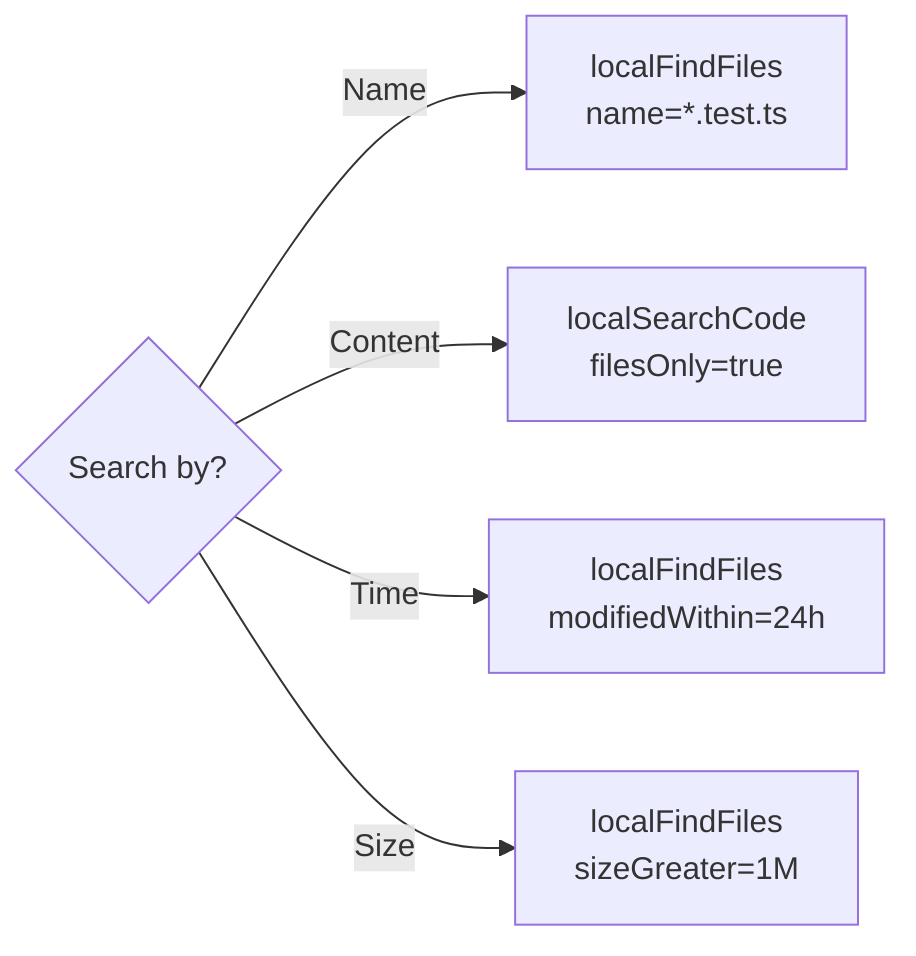
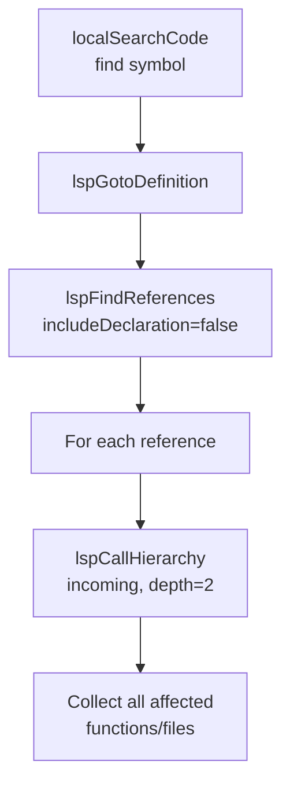

# Local & LSP Tools Reference

> Complete reference for Octocode MCP local tools — File system exploration, code search, content reading, and LSP semantic analysis.

---

## Configuration

Local and LSP tools must be enabled before use:

```
ENABLE_LOCAL=true
```

Or via config: `local.enabled=true`

### LSP Supported Languages

| Status | Languages |
|--------|-----------|
| **Bundled** | TypeScript (`.ts`, `.tsx`), JavaScript (`.js`, `.jsx`, `.mjs`, `.cjs`) |
| **Requires Install** | Python, Go, Rust, Java, Kotlin, C/C++, C#, Ruby, PHP, Swift, Dart, Lua, Zig, Elixir, Scala, Haskell, OCaml, Clojure, Vue, Svelte, YAML, TOML, JSON, HTML, CSS, Bash, SQL, GraphQL, Terraform |

For TypeScript/JavaScript, Octocode first tries its bundled `typescript-language-server` setup. If your environment does not include that bundled server, install `typescript-language-server` + `typescript` on `PATH`, or point `OCTOCODE_TS_SERVER_PATH` at the server binary explicitly.

### LSP Environment Variables

Override language server paths:

| Variable | Language |
|----------|----------|
| `OCTOCODE_TS_SERVER_PATH` | TypeScript/JavaScript |
| `OCTOCODE_PYTHON_SERVER_PATH` | Python |
| `OCTOCODE_GO_SERVER_PATH` | Go |
| `OCTOCODE_RUST_SERVER_PATH` | Rust |
| `OCTOCODE_JAVA_SERVER_PATH` | Java |
| `OCTOCODE_CLANGD_SERVER_PATH` | C/C++ |

### LSP Custom Configuration

Config files loaded in priority order (optional — if unset, workspace/home fallbacks are used):

1. `OCTOCODE_LSP_CONFIG=/path/to/config.json` (env var)
2. `.octocode/lsp-servers.json` (workspace)
3. `${OCTOCODE_HOME:-~/.octocode}/lsp-servers.json` (user)

```json
{
  "languageServers": {
    ".py": {
      "command": "pylsp",
      "args": [],
      "languageId": "python"
    }
  }
}
```

If a language server is not installed, the tool returns a helpful error with installation instructions. No crashes — other tools continue working. Works on macOS, Linux, and Windows.

---

## Platform Support

Octocode ships its own ripgrep binary via `@vscode/ripgrep`, so `localSearchCode`
works the same on macOS, Linux, and Windows with no extra installation. There is
**no `grep` fallback** — if the bundled binary fails to load, the tool returns a
single, actionable error pointing at reinstall / system `rg` install steps.

LSP tools (`lspGotoDefinition`, `lspFindReferences`, `lspCallHierarchy`) and
`localGetFileContent` are pure Node.js and run on all three platforms. LSP
clients are managed by a per-project pool that keeps language servers warm
across requests — callers never spawn or stop a client directly.

`localFindFiles` and `localViewStructure` use POSIX `find` and `ls`. They work
on macOS and Linux out of the box; on Windows install Git Bash or WSL, or use
`localSearchCode` instead (e.g. `localSearchCode(filesOnly=true, ...)`).

## Overview

Octocode MCP provides **7 tools** across 2 categories for code research and exploration:

| Category | Tools | Purpose |
|----------|-------|---------|
| **Local Tools** (4) | `localSearchCode`, `localViewStructure`, `localFindFiles`, `localGetFileContent` | File system exploration, pattern search, content reading |
| **LSP Tools** (3) | `lspGotoDefinition`, `lspFindReferences`, `lspCallHierarchy` | Semantic code intelligence via Language Server Protocol |

---

## Quick Start

1. Local tools are enabled (`ENABLE_LOCAL=true` / `local.enabled=true`).
2. Find a symbol: `localSearchCode` (get `lineHint`).
3. Use LSP: `lspGotoDefinition` / `lspFindReferences` / `lspCallHierarchy`.
4. Read details last: `localGetFileContent`.

### Working with Cloned Repositories

Local + LSP tools work on **any path on disk** — including repos cloned by `githubCloneRepo` or fetched via `githubGetFileContent` directory mode. Use the returned `localPath` as the `path` parameter:

```
githubCloneRepo(owner="vercel", repo="next.js") → localPath
localViewStructure(path=localPath)              → browse the tree
localSearchCode(path=localPath, pattern="...")   → search code
lspGotoDefinition(uri=localPath+"/src/file.ts") → semantic navigation
```

For LSP tools, workspace selection is automatic:

- If the target file lives inside `WORKSPACE_ROOT`, Octocode uses that configured workspace root.
- If the target file is outside `WORKSPACE_ROOT`, Octocode walks up from the file and picks the nearest project root using markers such as `package.json`, `tsconfig.json`, `.git`, `Cargo.toml`, `go.mod`, or `pyproject.toml`.
- If no marker is found, Octocode falls back to the file's own directory.

> **Note:** `githubCloneRepo` and `githubGetFileContent` directory mode are **GitHub only** — they are not available when GitLab or Bitbucket is the active provider. Both require `ENABLE_LOCAL=true` and `ENABLE_CLONE=true`.

> **Full workflow guide:** [Clone & Local Tools Workflow](https://github.com/bgauryy/octocode-mcp/blob/main/docs/dev/workflows/CLONE_AND_LOCAL_TOOLS_WORKFLOW.md)

### Research Context (Required)

All local and LSP tools require research context fields (same as GitHub/GitLab tools):

| Field | Description |
|-------|-------------|
| `researchGoal` | Specific goal for this query |
| `reasoning` | Why this tool/query was chosen |

These are **required** on every query for all local and LSP tools. They help track research intent and improve result quality.

## Universal Output Pagination

All local and LSP tools support the same size-aware continuation contract.

- Query-level pagination: use `charOffset` and `charLength` on a query. For `localGetFileContent`, these fields page file content. For search/list/LSP tools, they page the structured result payload after any native tool pagination is applied.
- Bulk-response pagination: use top-level `responseCharOffset` and `responseCharLength` to continue oversized multi-query `results[]` payloads.
- Response fields:
  - `pagination`: tool-native pagination metadata
  - `outputPagination`: query-level output-size pagination metadata
  - `responsePagination`: top-level bulk response pagination metadata
- Default budget: oversized responses auto-page at `output.pagination.defaultCharLength`, which defaults to `8000` unless overridden in config or per request.

## Universal `verbosity`

Every local and LSP tool accepts `verbosity`. Choose it by cost:

| Value | Use when | Returns | Drops |
|---|---|---|---|
| _omitted_ / `"compact"` | Default for normal work and follow-up `lineHint`s. | Actionable paths, lines, snippets/entries, metadata, pagination, and `lspMode` where relevant. | Nothing. |
| `"verbose"` | Rarely. Currently only for future expansion. | Same as `compact` today. | Nothing, but it does not add value yet. |
| `"ultra"` | First pass over broad or large scopes. | Counts, summary, top path/line or graph edge hints, plus drill-back guidance. | Heavy arrays/content such as `files[]`, `entries[]`, snippets, node content, or call arrays. |

Default strategy: probe with `ultra`; if the signal matters, re-call with `compact` scoped to the returned path, line, file page, or include pattern.

```jsonc
// Cheap existence probe
{ "queries": [{ "pattern": "parseHints", "path": "./", "verbosity": "ultra" }] }
// -> "5 matches in 3 files (top: src/hints/parseHints.ts:12)"

// Drill back for exact matches and line hints
{ "queries": [{ "pattern": "parseHints", "path": "src/hints/parseHints.ts", "verbosity": "compact" }] }
```

For the longer design rationale, see [RFC §3.1](https://github.com/bgauryy/octocode-mcp/blob/main/.octocode/rfc/rtk-token-techniques/RFC.md#31-what-this-rfc-costs--friction-lossy-modes-and-the-agent-decides-design).

## Tools at a Glance

### Local Tools

| Tool | Description | `verbosity:"ultra"` payload |
|------|-------------|------------------------------|
| **`localSearchCode`** | Fast pattern search across files using ripgrep. Returns matches with line numbers and context. Produces `lineHint` for LSP tools. | `"N matches in M files (top: path:line)"` |
| **`localViewStructure`** | Lists directory contents with metadata (size, type, time). Supports depth control and sorting. | `"X entries (Y files, Z dirs, size)"` |
| **`localFindFiles`** | Finds files by name, type, size, or modification time using recursive metadata search. | `"N files in M dirs (newest: path)"` |
| **`localGetFileContent`** | Reads file content with line ranges or match-based extraction. **Use as LAST step.** | `"path: N lines, ~T tokens raw"` |

### LSP Tools

| Tool | Description | `verbosity:"ultra"` payload |
|------|-------------|------------------------------|
| **`lspGotoDefinition`** | Jumps to where a symbol is defined. Requires `lineHint` from search. | `"N definition(s) (top: file:line:col)"` |
| **`lspFindReferences`** | Finds all usages of a symbol (types, variables, constants). Requires `lineHint`. | `"N refs in M files"` + flat `refs[]` (< 500) or `topFiles` rollup (≥ 500). Force rollup any fanout with `groupByFile:true`. |
| **`lspCallHierarchy`** | Traces function call relationships (incoming/outgoing callers). Requires `lineHint`. | `"N incoming/outgoing edge(s) for symbol"` + `edges: a → b (×n); …` |

### Quick Decision Guide

| Question | Tool |
|----------|------|
| "Where is X defined?" | `localSearchCode` → `lspGotoDefinition` |
| "Who calls function X?" | `localSearchCode` → `lspCallHierarchy(incoming)` |
| "What does X call?" | `localSearchCode` → `lspCallHierarchy(outgoing)` |
| "All usages of type X?" | `localSearchCode` → `lspFindReferences` |
| "Find files named X" | `localFindFiles` |
| "Search for pattern X" | `localSearchCode` |
| "Show directory structure" | `localViewStructure` |
| "Read file content" | `localGetFileContent` (LAST step) |

---

## Local Tools (Detailed)

Fast, text-based exploration tools that work on any codebase without IDE requirements.

### `localSearchCode`

**What it does:** Fast pattern search across files using ripgrep (rg).

| Feature | Description |
|---------|-------------|
| **Pattern matching** | Regex, fixed strings, smart case, multi-line |
| **Output** | Matches with line numbers, byte offsets, context |
| **Filtering** | File type, include/exclude patterns, hidden files |
| **Pagination** | `filesPerPage`, `matchesPerPage`, `filePageNumber` |

**Key parameters:**
- `pattern` (required): Search pattern (regex or literal)
- `path` (required): Directory to search
- `mode`: Workflow presets (`discovery`, `paginated`, `detailed`)
- `filesOnly`: Return only file paths (fast discovery)
- `contextLines`: Lines of context around matches
- `beforeContext`/`afterContext`: Asymmetric context lines
- `type`: File type filter (e.g., `ts`, `js`, `py`)
- `include`/`exclude`: Glob patterns for filtering
- `excludeDir`: Directories to exclude (e.g., `node_modules`)
- `hidden`: Search hidden files (default: false)
- `smartCase`: Smart case sensitivity (default: true)
- `filesPerPage`: Files per page (default: 10, max: 50)
- `matchesPerPage`: Matches per page (default: 10)
- `filePageNumber`: Page number (default: 1)
- `multiline`: Enable multiline matching (memory intensive)

**Additional parameters:**
- `fixedString`: Fixed string search instead of regex
- `perlRegex`: Use Perl regex mode
- `caseInsensitive`/`caseSensitive`: Explicit case control
- `wholeWord`: Match whole words only
- `invertMatch`: Invert match (show non-matching lines)
- `noIgnore`: Disable .gitignore filtering
- `followSymlinks`: Follow symbolic links
- `filesWithoutMatch`: Show files without any match
- `count`/`countMatches`: Return match counts instead of content
- `matchContentLength`: Max chars per match (default: 200, max: 800)
- `lineNumbers`: Include line numbers (default: true)
- `column`: Include column information
- `maxMatchesPerFile`: Limit matches per file (1-100)
- `maxFiles`: Limit total files (1-1000)
- `multilineDotall`: Multiline with `.` matching newlines
- `binaryFiles`: Binary file handling (`text`, `without-match`, `binary`)
- `includeStats`: Include search statistics (default: true)
- `includeDistribution`: Include match distribution (default: true)
- `sort`: Sort results (`path`, `modified`, `accessed`, `created`) (default: `path`)
- `sortReverse`: Reverse sort order
- `showFileLastModified`: Show file modification timestamps
- `threads`: Thread count for parallel search (1-32)
- `jsonOutput`: Output results in JSON format
- `vimgrepFormat`: Vim-compatible grep output format
- `mmap`: Use memory-mapped I/O
- `noUnicode`: Disable Unicode handling
- `encoding`: Input character encoding
- `noMessages`: Suppress ripgrep messages
- `lineRegexp`: Apply regex per line
- `passthru`: Print all lines from matched files
- `debug`: Enable debug output

**Output format:** Each match contains `value` (text), `line` (1-indexed), and `column`. Use `line` as `lineHint` for LSP tools.

**Critical:** Produces `lineHint` values **required** for all LSP tools.

---

### `localViewStructure`

**What it does:** Lists directory contents with metadata using `ls`. Returns structured entry objects (not a formatted string).

| Feature | Description |
|---------|-------------|
| **Structured output** | Each entry is an object with `name`, `type` (`file`/`dir`/`link`), `size`, `modified`, `permissions` |
| **Summary** | One-line summary string (e.g., `"42 entries (30 files, 12 dirs, 1.5MB)"`) |
| **Depth control** | 1-5 levels deep |
| **Sorting** | By name, size, time, or extension |
| **Filtering** | Pattern, extension, directories/files only |

**Key parameters:**
- `path` (required): Directory to explore
- `depth`: How deep to traverse (max: 5). When both `depth` and `recursive` are omitted, lists single-level only. When `recursive=true` and `depth` is omitted, traverses up to 5 levels.
- `sortBy`: `name`, `size`, `time`, `extension` (default: `time`)
- `filesOnly`/`directoriesOnly`: Filter by type
- `hidden`: Show hidden files (default: false)
- `humanReadable`: Format sizes (e.g., "1.2MB") (default: true)
- `summary`: Include directory summary (default: true)
- `pattern`: Filter by name pattern
- `entriesPerPage`: Entries per page (default: 20, max: 50)
- `entryPageNumber`: Page number (default: 1)

**Additional parameters:**
- `details`: Include size, permissions, timestamps (default: false)
- `reverse`: Reverse sort order
- `extension`/`extensions`: Filter by file extension(s)
- `recursive`: Enable recursive traversal
- `limit`: Max entries returned (1-10000)
- `showFileLastModified`: Show file modification timestamps (default: false)

**Output format:**
```yaml
entries:
  - name: "src/"
    type: dir
  - name: "README.md"
    type: file
    size: "4.2KB"
    modified: "2026-02-20"
summary: "15 entries (12 files, 3 dirs, 128KB)"
pagination: { currentPage: 1, totalPages: 1, ... }
```

---

### `localFindFiles`

**What it does:** Searches for files/directories recursively using `find`.

| Feature | Description |
|---------|-------------|
| **Name filters** | Glob patterns, regex, case-insensitive |
| **Metadata filters** | Size, permissions, executable |
| **Time filters** | Modified within/before, accessed within |
| **Type filters** | File, directory, symlink |

**Key parameters:**
- `path` (required): Starting directory
- `name`/`iname`: Exact or case-insensitive name pattern
- `names`: Multiple name patterns (array)
- `regex`: Regex pattern for path matching
- `regexType`: Regex flavor (`posix-egrep`, `posix-extended`, `posix-basic`)
- `type`: `f` (file), `d` (directory), `l` (symlink), `b`, `c`, `p`, `s`
- `modifiedWithin`: Files changed in last N time (e.g., "7d", "2h")
- `sizeGreater`/`sizeLess`: Size filters

**Additional parameters:**
- `maxDepth`/`minDepth`: Depth control (1-10 / 0-10)
- `pathPattern`: Glob pattern for path matching
- `modifiedBefore`: Files modified before a date
- `accessedWithin`: Files accessed within a time period
- `empty`: Find empty files/directories
- `permissions`: Filter by permission string
- `executable`/`readable`/`writable`: Permission flags
- `excludeDir`: Directories to exclude (array)
- `sortBy`: Sort results — `modified` (default), `size`, `name`, `path`
- `limit`: Max results (1-10000)
- `details`: Include file metadata (default: true)
- `filesPerPage`: Results per page (default: 20, max: 50)
- `filePageNumber`: Page number (default: 1)
- `charOffset`/`charLength`: Character-based pagination
- `showFileLastModified`: Show modification timestamps (default: true)

---

### `localGetFileContent`

**What it does:** Reads file content with targeted extraction.

| Feature | Description |
|---------|-------------|
| **Line ranges** | `startLine`/`endLine` for specific sections |
| **Match-based** | `matchString` with context lines |
| **Pagination** | `charOffset`/`charLength` for large files |
| **Full content** | `fullContent=true` for small files |

**Key parameters:**
- `path` (required): File to read
- `startLine`/`endLine`: Line range (1-indexed)
- `matchString`: Find specific content with context (max: 2000 chars)
- `matchStringContextLines`: Lines around match (default: 5, max: 50)
- `matchStringIsRegex`: Treat matchString as regex (default: false, max pattern: 1000 chars)
- `matchStringCaseSensitive`: Case-sensitive matching (default: false)
- `charOffset`/`charLength`: Character-based pagination for large files (charLength max: 10000)
- `fullContent`: Read entire file (use sparingly)

**Extraction modes (choose ONE):**
1. `matchString` with context lines
2. `startLine` + `endLine` (must be used together)
3. `fullContent=true` (small files only)

Cannot combine `matchString` with `startLine`/`endLine`, or `fullContent` with either.

**⚠️ Should be the LAST step** after search/LSP analysis.

---

## LSP Tools (Detailed)

Semantic tools understand imports, definitions, references, and call graphs. Always run `localSearchCode` first to get a 1-indexed `lineHint`; then call the LSP tool with the exact `symbolName`.

TypeScript/JavaScript works out of the box in standard Octocode installs. Other languages need their language server installed. Project root selection is automatic: files inside `WORKSPACE_ROOT` use it; external paths infer the nearest project root.

### LSP Tool Ratings

| Tool | Rating | Best for | Output shape | Caveat |
|---|---:|---|---|---|
| `lspGotoDefinition` | 10/10 | Jumping from a symbol usage/import to the real definition. | Definition `locations[]`, ranges, snippets in `compact`, `lspMode`. `ultra` keeps count + top path:line:column and empties content. | Needs exact symbol + `lineHint`. |
| `lspFindReferences` | 10/10 | All usages of types, interfaces, variables, constants, and functions. | Reference `locations[]`, `isDefinition`, pagination, `lspMode`. `ultra` returns ref counts + path:line refs or `groupByFile` rollup. | Use `lspCallHierarchy` for true call relationships. |
| `lspCallHierarchy` | 8/10 | Function/method flow: who calls X, what X calls. | Target item + incoming/outgoing calls and call ranges. `ultra` returns compact `A -> B` edges and empties node content. | `compact` can be large for module-level callers; prefer `ultra` first, then drill back. |

### Choosing the Right LSP Tool

| Question | Tool | Direction / option |
|---|---|---|
| Where is X defined? | `lspGotoDefinition` | n/a |
| Everywhere X is used? | `lspFindReferences` | `includeDeclaration=true` if you want the definition too |
| Who calls function X? | `lspCallHierarchy` | `direction="incoming"` |
| What does function X call? | `lspCallHierarchy` | `direction="outgoing"` |

### Required Parameters

All LSP tools require:

- `uri`: file containing the symbol
- `symbolName`: exact, case-sensitive symbol text
- `lineHint`: 1-indexed line from `localSearchCode`

Use `orderHint` only when the same symbol appears multiple times on the same line. Use pagination fields (`page`, `referencesPerPage`, `callsPerPage`, `charOffset`, `charLength`) when results are large.

### Security

LSP file reads stay inside allowed roots, resolve symlinks before access, redact paths in errors, cap symbol length, and cap call hierarchy depth at 3.

## LSP Troubleshooting

| Problem | Solution |
|---------|----------|
| "LSP server not found" | Install the language server, verify it is on `PATH`, or set the matching `OCTOCODE_*_SERVER_PATH` env var. For TS/JS, install or point to `typescript-language-server` + `typescript` if the bundled server is unavailable. |
| "Symbol not found" | Ensure `symbolName` is exact (case-sensitive), check `lineHint` is ±2 lines of actual position |
| "Empty results" | Symbol may not exist at location, file may not be in the indexed project, or the file may be a generated/minified bundle with weak semantic structure |
| "Timeout" | Use smaller `depth`, first request may be slow (server init) |
| "File is outside WORKSPACE_ROOT" | No extra config is usually needed; Octocode infers the nearest project root from the target file. Only set `WORKSPACE_ROOT` when you want to force a wider project context for files already inside that tree. |
| "Minified or bundled JS gives noisy results" | LSP can still run on large bundles, but quality is lower than original source. Prefer the source repo, a full clone, or unbundled package files when possible. |

---

## Research Flows

### The Funnel Method (Core Principle)

Every research task should follow this progressive narrowing:

```
DISCOVER → SEARCH → LOCATE/ANALYZE → READ
    │         │           │            │
    ▼         ▼           ▼            ▼
Structure  Pattern     Semantic    Implementation
 & Scope   Matching    Analysis      Details
```

| Stage | Tools | Algorithm | Purpose |
|-------|-------|-----------|---------|
| 1. DISCOVER | `localViewStructure`, `localFindFiles` | Tree O(d), Metadata O(1) | Narrow scope 80-90% |
| 2. SEARCH | `localSearchCode` | Inverted Index O(1) | Find patterns, **get `lineHint`** |
| 3. LOCATE | `lspGotoDefinition` | Symbol Table O(1) | Jump to definition |
| 3. ANALYZE | `lspFindReferences`, `lspCallHierarchy` | Graph DFS/BFS | Usage & call flow |
| 4. READ | `localGetFileContent` | I/O | Implementation (LAST!) |

**Golden Rule:** Text narrows → Symbols identify → Graphs explain

---

## Task-Specific Workflows

### Flow 1: "Where is X defined?"



**Steps:**
1. `localSearchCode(pattern="functionName", path="/src")` → Get line number
2. `lspGotoDefinition(uri="file.ts", symbolName="functionName", lineHint=42)`
3. Result: Definition location with surrounding code

---

### Flow 2: "Who calls function X?"


**Steps:**
1. `localSearchCode(pattern="def processData", path="/src")` → Line 50
2. `lspCallHierarchy(uri="handler.py", symbolName="processData", lineHint=50, direction="incoming")`
3. Result: All functions that call `processData`
4. Optional: Follow each caller with another `lspCallHierarchy` call

---

### Flow 3: "What does function X call?"



**Steps:**
1. `localSearchCode(pattern="async function fetchData")` → Line 25
2. `lspCallHierarchy(symbolName="fetchData", lineHint=25, direction="outgoing")`
3. Result: All functions that `fetchData` calls

---

### Flow 4: "All usages of type/interface X"


**Steps:**
1. `localSearchCode(pattern="interface UserConfig")` → Line 10
2. `lspFindReferences(symbolName="UserConfig", lineHint=10, includeDeclaration=true)`
3. Result: Every file/line where `UserConfig` is used

**Note:** Use `lspFindReferences` (not `lspCallHierarchy`) for types, interfaces, variables, and constants.

---

### Flow 5: "Trace code flow from A to B"



**Steps:**
1. Find entry point: `localSearchCode(pattern="handleRequest")`
2. Jump to definition: `lspGotoDefinition(lineHint=N)`
3. Get outgoing calls: `lspCallHierarchy(direction="outgoing")`
4. For each callee, repeat step 2-3 until target found
5. Finally: `localGetFileContent(matchString="targetFunction")` for details

---

### Flow 6: "Explore new codebase"



**Steps:**
1. `localViewStructure(path="/", depth=1)` → See root structure
2. `localViewStructure(path="/src", depth=2)` → Drill into source
3. `localSearchCode(pattern="export", filesOnly=true)` → Find entry points
4. `localFindFiles(modifiedWithin="7d")` → See recent changes
5. `localGetFileContent(path="README.md", fullContent=true)` → Read docs

---

### Flow 7: "Find files by pattern/metadata"



**By name:** `localFindFiles(name="*.test.ts")`
**By content:** `localSearchCode(pattern="describe\\(", filesOnly=true)`
**By time:** `localFindFiles(modifiedWithin="24h")`
**By size:** `localFindFiles(sizeGreater="1M")`

---

### Flow 8: "Impact analysis - What breaks if I change X?"



**Steps:**
1. Find the symbol: `localSearchCode(pattern="validateInput")`
2. Get definition: `lspGotoDefinition(lineHint=N)`
3. Find all usages: `lspFindReferences(includeDeclaration=false)`
4. For each usage, trace callers: `lspCallHierarchy(incoming, depth=2)`
5. Result: Complete list of affected code paths

---

## Quick Reference

### Tool Selection Guide

| Question | Tool |
|----------|------|
| "Show me the directory structure" | `localViewStructure` |
| "Find files named X" | `localFindFiles` |
| "Search for pattern X in code" | `localSearchCode` |
| "Read the contents of file Y" | `localGetFileContent` |
| "Where is X defined?" | `lspGotoDefinition` |
| "Who uses X?" (types/vars) | `lspFindReferences` |
| "Who calls function X?" | `lspCallHierarchy(incoming)` |
| "What does X call?" | `lspCallHierarchy(outgoing)` |

### LSP Tool Selection by Symbol Type

| Symbol Type | Tool | Why |
|-------------|------|-----|
| Function/Method | `lspCallHierarchy` | Call relationships |
| Type/Interface | `lspFindReferences` | All usages |
| Class | `lspFindReferences` | All usages |
| Variable/Constant | `lspFindReferences` | All usages |

---

## Critical Rules

### ⚠️ Rule 1: LSP Tools REQUIRE `lineHint`

```
❌ WRONG: lspGotoDefinition(symbolName="foo")  
✅ RIGHT: localSearchCode → get lineHint → lspGotoDefinition(lineHint=42)
```

Always search first to get the line number!

### ⚠️ Rule 2: `lineHint` is 1-indexed

Line 1 = first line of file (not 0).

### ⚠️ Rule 3: Don't Read Files for Flow Analysis

```
❌ WRONG: localGetFileContent → localGetFileContent → manual import tracing
✅ RIGHT: localSearchCode → lspCallHierarchy → follow the graph
```

LSP tools are O(1) lookup; manual file reading is O(N) traversal.

### ⚠️ Rule 4: `localGetFileContent` is LAST

Only read file content after you've narrowed down exactly what you need via search and LSP analysis.

### ⚠️ Rule 5: Use `filesOnly=true` for Fast Discovery

When you just need to know which files contain something:
```
localSearchCode(pattern="TODO", filesOnly=true)  // Fast
localSearchCode(pattern="TODO")  // Returns all matches (slower)
```

---

## Response Format

All local and LSP tool responses are optimized for LLM token efficiency:

- **Per-result hints**: Hints are included inline within each result (not aggregated at the top level)
- **No redundant metadata**: Fields like `cwd`, `contentLength`, `searchEngine`, `totalMatches`, `totalFiles`, `extractedLines` have been removed from responses
- **Structured entries**: `localViewStructure` returns an `entries` array of objects (not a formatted string) with a `summary` one-liner
- **Compact matches**: `localSearchCode` matches contain `value`, `line`, `column` — use `line` as `lineHint` for LSP tools
- **LSP result stripping**: LSP tools strip internal fields (`selectionRange`, `displayRange`) from results — use `range.start.line + 1` as `lineHint` for follow-up calls

---

## Anti-Patterns to Avoid

| Anti-Pattern | Why It's Wrong | Correct Approach |
|--------------|----------------|------------------|
| Reading files without searching first | O(N) vs O(1) | Search → LSP → Read |
| Using `lspCallHierarchy` on types | Fails - types aren't callable | Use `lspFindReferences` |
| Guessing `lineHint` | LSP needs exact location | Always `localSearchCode` first |
| Using `fullContent=true` on large files | Token waste | Use `matchString` or line ranges |
| Multiple `localGetFileContent` for flow | Manual tracing | Use `lspCallHierarchy` |

---

## Parallel Execution

Tools with no dependencies can run in parallel:

```
✅ Parallel OK:
- localSearchCode(pattern="A") + localSearchCode(pattern="B")
- localViewStructure(path="/src") + localViewStructure(path="/tests")
- lspFindReferences(symbolA) + lspFindReferences(symbolB)

❌ Must be Sequential:
- localSearchCode → lspGotoDefinition (needs lineHint)
- lspGotoDefinition → lspCallHierarchy (needs definition location)
```

**Batch limits:**
- Local tools: Up to **5 queries** per call
- LSP tools: Up to **5 queries** per call (except `lspCallHierarchy`: **3 max**)

---

## Related Documentation

- [Clone & Local Tools Workflow](https://github.com/bgauryy/octocode-mcp/blob/main/docs/dev/workflows/CLONE_AND_LOCAL_TOOLS_WORKFLOW.md) — How to clone external repos and analyze them with local + LSP tools
- [GitHub, GitLab & Bitbucket Tools Reference](https://github.com/bgauryy/octocode-mcp/blob/main/docs/dev/reference/GITHUB_GITLAB_TOOLS_REFERENCE.md) — code host tools including `githubCloneRepo`
- [Configuration Reference](https://github.com/bgauryy/octocode-mcp/blob/main/docs/configuration/CONFIGURATION_REFERENCE.md) — `ENABLE_LOCAL`, `ENABLE_CLONE`, and other settings
