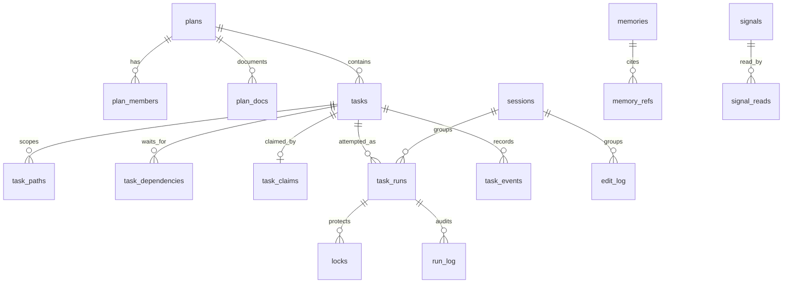

# Awareness Database

The Awareness SQLite store is shared by participating local agents. It holds plans, collaborative tasks, execution runs, file locks, verification, memory, signals, handoffs, and audit events.

- Default on macOS: `~/.octocode/memory/awareness.sqlite3`
- Override directory: `OCTOCODE_MEMORY_HOME`
- Runtime: WAL mode, foreign keys enabled, schema version `2`
- Schema source: `packages/octocode-awareness/src/db.ts`

The global DB is canonical. `<workspace>/.octocode/` contains generated repo projections and managed plan documents; it is not a second operational task store.

## The Non-Overlapping Work Model

| Entity | Meaning | Lifetime |
|---|---|---|
| `plans` | Shared objective, lead agent, lifecycle, document folder | Project/initiative |
| `tasks` | Durable unit agents can choose, with reasoning, acceptance criteria, paths, and dependencies | Until work is closed |
| `task_runs` | One attempt to execute a task, or a standalone quick-edit attempt | One claim/attempt |
| `locks` | Exact files currently protected from conflicting edits | Minutes |

Do not use `task_runs` as a backlog. Do not copy live task status into an editable Markdown checklist. SQLite owns live work state; `.octocode/plan/**` owns narrative design and decisions.

`lock acquire` does not require a plan or task. A quick edit creates a standalone run with `task_runs.task_id = NULL`. When an agent has exactly one live claimed task in the workspace, hooks attach edits to that task's existing run.

## Plan Documents

`plan create` writes:

```text
.octocode/plan/<YYYYMMDD-HHmmssZ-name>/
├── PLAN.md
├── manifest.json
└── docs/
```

`PLAN.md` holds objective and decisions, and points readers to live `task list` / `task ready` commands. `plan doc` registers supporting files under that plan folder in `plan_docs`.

## Entity Relationships



`agent_id` is a cooperative identity shared across hosts, not an authorization boundary. Plans record a lead for governance; SQLite does not implement security roles.

## Planning And Execution Tables

### `plans`

| Column | Contract |
|---|---|
| `plan_id` | Stable `plan_...` key. |
| `name`, `objective` | Human intent. Both required. |
| `lead_agent_id` | Agent allowed to transition plan status. |
| `status` | `DRAFT`, `ACTIVE`, `PAUSED`, `COMPLETED`, or `CANCELLED`. |
| `workspace_path`, `artifact` | Workspace scope. |
| `doc_dir` | Workspace-relative managed document folder. |
| `created_at`, `updated_at` | UTC timestamps. |

`plan_members` stores `(plan_id, agent_id, role, joined_at)` with role `LEAD` or `CONTRIBUTOR`. The lead is inserted automatically; claiming a task auto-joins the agent.

`plan_docs` stores `(plan_id, relative_path, title, kind, ordinal)`. `PLAN.md` is `PRIMARY`; registered files are `SUPPORTING`.

### `tasks`

| Column | Contract |
|---|---|
| `task_id` | Stable `task_...` key. |
| `plan_id` | Owning plan. |
| `title` | Short selectable work label. |
| `reasoning` | Why the task exists and the constraints/decision behind it. Required. |
| `acceptance_criteria` | Done and verification contract. |
| `status` | `OPEN`, `IN_PROGRESS`, `BLOCKED`, `VERIFY`, `DONE`, `FAILED`, or `CANCELLED`. |
| `priority` | Higher values sort first. |
| `created_by` | Authoring agent. |
| `created_at`, `updated_at`, `completed_at` | Lifecycle timestamps. |

`task_paths` stores one or more workspace-relative paths per task. Paths are planning scope, not file locks.

`task_dependencies` stores directed edges `(task_id, depends_on_task_id)`. Edges must remain inside one plan; self-dependencies and cycles are rejected.

Readiness is derived, never stored: a task is ready when it is `OPEN`, has no unfinished dependency, and has no live claim.

### `task_claims`

One live leased claim per task:

| Column | Contract |
|---|---|
| `task_id` | Primary key. |
| `run_id` | Unique active execution run. |
| `agent_id` | Claimant. |
| `claimed_at`, `heartbeat_at`, `expires_at` | Lease lifecycle. |

Claims are acquired under `BEGIN IMMEDIATE`. Expired claims return `IN_PROGRESS` tasks to `OPEN`, fail the abandoned active run, and emit `CLAIM_EXPIRED`.

### `task_runs`

| Column | Contract |
|---|---|
| `run_id` | Stable `run_...` key. Migrated v1 IDs retain their original value. |
| `task_id` | Nullable link to a durable task. `NULL` means standalone lock flow. |
| `agent_id`, `session_id` | Actor and optional session. |
| `rationale`, `test_plan`, `context_ref` | Attempt intent, verification, optional supporting reference. |
| `status` | `ACTIVE`, `PENDING`, `SUCCESS`, or `FAILED`. |
| `workspace_path`, `artifact`, `files_json` | Scope and files actually touched/claimed by the run. |
| `created_at`, `updated_at` | UTC timestamps. |

Run state:

```text
ACTIVE --task submit / standalone lock release--> PENDING --verify mark--> SUCCESS | FAILED
```

For a claimed task, post-edit hooks release individual file locks but keep the run `ACTIVE`; `task submit` moves the task to `VERIFY` and its run to `PENDING`. Successful `verify mark --run-id` moves the linked task to `DONE`.

### `locks`, `run_log`, `task_events`

`locks` stores `lock_id`, absolute `file_path`, `run_id`, holder/session, `lock_type`, and TTL timestamps. Exact file locks remain the collision authority even when agents coordinate through broader task paths.

`run_log` stores verification and abandonment events for execution runs. `task_events` stores durable planning history such as `CREATED`, `DEPENDENCY_ADDED`, `CLAIMED`, `SUBMITTED`, `VERIFIED`, `BLOCKED`, and `CLAIM_EXPIRED`.

## Knowledge And Coordination Tables

| Table | Purpose |
|---|---|
| `agents` | Stable agent id, display name, host context, last-seen scope. |
| `sessions` | Contiguous work periods. Runs/edit/harness rows may reference a session. |
| `memories` | Durable lessons, decisions, gotchas, temporal validity, salience, optional embeddings. |
| `memories_fts` | FTS5 index over memory context, observation, and tags. |
| `memory_refs` | Structured `(memory_id, reference)` provenance with `kind` and stable `ordinal`. |
| `signals` | Typed local messages/threads: claim, handoff, question, reply, blocker, request, decision, fyi. |
| `signal_reads` | Per-agent signal acknowledgement. |
| `refinements` | Handoffs and improvement/instruction-feedback proposals. |
| `edit_log` | Optional file edit audit linked by `run_id`. |
| `harness_log` | Reflection/self-improvement lifecycle events linked by optional `run_id`/`memory_id`. |

## Scope

`workspace_path` is the primary isolation key; `artifact` narrows to a package/service. Memory, refinements, and signals may also use `repo` and `ref`. Use the same workspace/artifact across attend, plans, tasks, locks, verify, and handoff commands.

Task paths are workspace-relative. Lock paths are absolute and normalized. This difference is intentional: tasks communicate ownership boundaries; locks prevent exact-file collisions.

## Query Views And Workboard

| View | Main rows |
|---|---|
| `plans` | Plan lifecycle, lead, doc folder, member/task counts. |
| `tasks` | Durable task reasoning, paths, dependencies, readiness, active claim. |
| `runs` | Execution and verification attempts. |
| `locks` | Live exact-file claims with run/task linkage. |
| `workboard` | Derived Inbox, Verify, Ready, Claimed, RecentDone, MemoryReview, DeveloperReview, ProjectionHealth lanes. |

The workboard has no table. `Ready` contains only ready tasks. `Claimed` contains task claims plus standalone locks; linked locks are not repeated as separate work items. `Verify` contains tasks awaiting verification plus standalone pending runs.

## Migration From Schema V1

Schema v1 used `tasks` for edit attempts. `initDb` migrates that table before creating v2:

- `tasks` → `task_runs`
- legacy `task_id` → `run_id`
- `plan_doc_ref` → `context_ref`
- lock/edit/harness foreign keys → `run_id`
- `task_log` → `run_log`
- migrated runs receive `task_id = NULL`

The migration is idempotent, preserves row IDs/history, and sets `PRAGMA user_version = 2`.

## Useful SQL

```sql
-- Ready collaborative work
SELECT t.task_id, t.title, t.priority
FROM tasks t
WHERE t.status = 'OPEN'
  AND NOT EXISTS (SELECT 1 FROM task_claims c WHERE c.task_id = t.task_id)
  AND NOT EXISTS (
    SELECT 1 FROM task_dependencies d
    JOIN tasks dependency ON dependency.task_id = d.depends_on_task_id
    WHERE d.task_id = t.task_id AND dependency.status <> 'DONE'
  )
ORDER BY t.priority DESC, t.created_at;

-- Active exact-file locks
SELECT l.file_path, l.lock_type, r.run_id, r.task_id, r.agent_id, l.expires_at
FROM locks l
JOIN task_runs r ON r.run_id = l.run_id
WHERE r.status = 'ACTIVE';

-- Pending verification
SELECT run_id, task_id, rationale, test_plan, files_json
FROM task_runs
WHERE agent_id = ? AND status = 'PENDING'
ORDER BY updated_at;
```

## Operations

- `maintenance init` creates/migrates the store.
- `workspace status` reports active plans, ready/in-progress/verify tasks, active/pending runs, locks, memories, and refinements.
- `maintenance digest --dry-run` previews cleanup.
- `repo inject` regenerates repo projections; it preserves `.octocode/plan/**` managed narrative documents.
