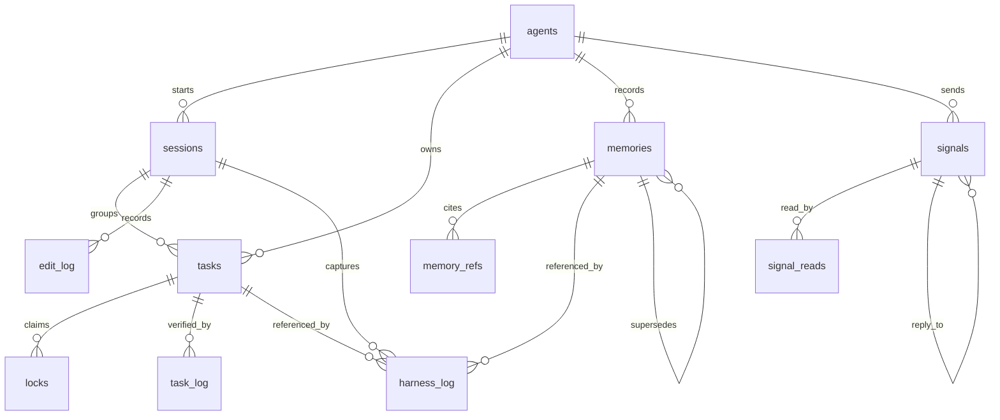

# Awareness Database

**Audience**: maintainers, tool builders, and technical users who need to know what the awareness DB stores.

The awareness database is a local SQLite file shared by every participating agent on the machine. It stores coordination state, durable memory, verification obligations, messages, handoffs, edit audit data, and harness events.

Default location on macOS: `~/.octocode/memory/awareness.sqlite3`

Override directory: `OCTOCODE_MEMORY_HOME`

The DB runs in WAL mode. The schema is created from `packages/octocode-awareness/src/db.ts`; the SQL constants under `src/sql/` mirror the entity groups used by runtime modules.

## Global Home vs Workspace `.octocode`

Two `.octocode` paths appear in Awareness docs and output:

| Path | Scope | Purpose |
|---|---|---|
| `~/.octocode/` on macOS | Global per-user Octocode home | Holds machine/user-wide Octocode config and data. Awareness stores the canonical SQLite DB at `~/.octocode/memory/awareness.sqlite3` on macOS unless `OCTOCODE_MEMORY_HOME` points elsewhere. Other Octocode packages use `OCTOCODE_HOME` for broader config/env/data. |
| `<workspace>/.octocode/` | One repo/workspace | Holds generated repo-context projections written by `repo inject`: Markdown memory indexes, gotchas, learning docs, CSV, HTML, manifest, and references. |

Canonical records live in the global DB and are scoped by `workspace_path`, `artifact`, `repo`, and `ref`. The workspace `.octocode/` folder is a generated view about that repo; regenerate it instead of treating it as the source of truth.

## Scope Model

Most rows are scoped by:

| Scope field | Meaning |
|---|---|
| `workspace_path` | Absolute project path. Primary isolation boundary. |
| `artifact` | Optional sub-project/package/service inside a workspace. |
| `repo` | Optional remote repo slug such as `owner/repo`. |
| `ref` | Optional branch, tag, or commit. |

Use the same scope across `lock`, `verify`, `memory`, `signal`, and `repo inject` commands for one task. Mixed scopes are the easiest way to make correct data look missing.

## Entity Relationship



The SQLite schema does not enforce every agent relationship with a foreign key because `agent_id` is an identity string shared across hosts. Treat `agent_id` as the join key for display and audit queries.

## Tables At A Glance

| Table | Stores | Main writers |
|---|---|---|
| `agents` | Agent identity, display name, host context, last seen scope | `agent register`, hooks, Pi bridge |
| `sessions` | Contiguous agent work periods | library session helpers; `session capture` writes handoff refinements rather than full session CRUD |
| `memories` | Durable lessons, decisions, gotchas, reflection outputs | `memory record`, `reflect record` |
| `memories_fts` | FTS5 lexical search index over memories | DB init/rebuild, memory writes |
| `memory_refs` | Structured references for a memory | `memory record`, `reflect record` |
| `tasks` | Claimed work plus declared verification plan | `lock acquire`, pre-edit hook |
| `locks` | Per-file lock rows tied to active tasks | `lock acquire`, pre-edit hook |
| `task_log` | Verification and lifecycle audit events | `verify mark`, verified lock release |
| `signals` | Agent-to-agent messages and threads | `signal publish`, `signal reply` |
| `signal_reads` | Per-agent acknowledgement cursors | `signal ack`, briefing delivery |
| `refinements` | Handoffs and repo/skill improvement proposals | `refinement set`, `reflect record`, `session capture` |
| `edit_log` | Optional file edit audit trail | Library `insertEditLog()` callers |
| `harness_log` | Self-improvement, reflection, capture, proposal events | `reflect record`, doc staleness proposals, library callers |

## Core Entities

### `agents`

Registry of agents that touched the store.

| Column | Notes |
|---|---|
| `agent_id` | Primary key, stable identity supplied by host or `OCTOCODE_AGENT_ID`. |
| `agent_name` | Human-readable display name; empty string if unknown. |
| `workspace_path`, `artifact` | Last-seen scope. |
| `context` | Host context such as `codex`, `cursor`, `claude-code`, `pi`. |
| `registered_at`, `last_seen_at` | First and latest activity timestamps. |

### `sessions`

One row per contiguous work period.

| Column | Notes |
|---|---|
| `session_id` | Primary key, usually `sess_...`. |
| `agent_id` | Owning agent. |
| `workspace_path`, `artifact`, `repo`, `ref` | Scope. |
| `started_at`, `ended_at` | Session lifecycle. |
| `summary` | Optional handoff summary. |

Sessions group `tasks`, `edit_log`, and `harness_log` rows when a host provides session identity.

### `memories`

Durable knowledge store for lessons, decisions, gotchas, architecture notes, and reflection outputs.

| Column | Notes |
|---|---|
| `memory_id` | Primary key, `mem_...`. |
| `agent_id` | Author. |
| `task_context` | What the agent was doing. |
| `observation` | The remembered lesson or finding. |
| `importance` | Integer 1-10. |
| `state` | `ACTIVE` or `SUPERSEDED`. |
| `label` | Common labels include `GOTCHA`, `DECISION`, `ARCHITECTURE`, `SECURITY`, `EXPERIENCE`, `OVERRIDE`, `OTHER`. |
| `superseded_by` | Self-reference to the replacing memory. |
| `tags_json` | JSON array of tags. |
| `workspace_path`, `artifact`, `repo`, `ref` | Scope. |
| `file_tree_fingerprint` | Optional workspace snapshot. |
| `novelty_score` | Similarity/novelty hint computed during insertion. |
| `access_count`, `last_accessed_at` | Recall usage signals. |
| `decay_half_life_days` | Salience decay hint. |
| `failure_signature` | Structured clustering key for `reflect mine-weakness`. |
| `valid_from`, `valid_to`, `expired_at` | Temporal validity window. |
| `embedding`, `embedding_model` | Optional semantic vector payload. Library callers use `storeEmbedding` / `searchByEmbedding`. The CLI stores/ranks embeddings only when `OCTOCODE_EMBED_CMD` is set (host embedder reads stdin text, prints `{"embedding":[...],"model":"..."}`). Pi recall does not generate embeddings by default. |

`memories_fts` mirrors `task_context`, `observation`, and tags for lexical recall. `memory_refs` stores file, URL, repo, and other references as normalized rows. Default CLI recall is lexical FTS plus salience. With `OCTOCODE_EMBED_CMD`, `memory record` can persist vectors and `memory recall --semantic` can rank by cosine similarity (`mode: "semantic"`); otherwise `--semantic` warns and stays lexical.

### `tasks`

Declared edit intent and verification obligation.

| Column | Notes |
|---|---|
| `task_id` | Primary key, `task_...`. |
| `agent_id` | Claiming agent. |
| `session_id` | Optional session FK. |
| `rationale` | Why the files are needed. |
| `test_plan` | Verification the agent says it will run. |
| `plan_doc_ref` | Optional reference to a plan or RFC. |
| `status` | `ACTIVE`, `PENDING`, `SUCCESS`, or `FAILED`. |
| `workspace_path`, `artifact` | Scope. |
| `files_json` | JSON array of absolute target files. |

State machine:

```text
ACTIVE -> PENDING -> SUCCESS
              \----> FAILED
```

`ACTIVE` means locks are held. `PENDING` means locks were released but verification is still owed. `SUCCESS` and `FAILED` mean verification was recorded.

### `locks`

One row per claimed file.

| Column | Notes |
|---|---|
| `lock_id` | Primary key, `lock_...`. |
| `file_path` | Absolute path. |
| `task_id` | Owning task FK. |
| `agent_id` | Holder. |
| `session_id` | Optional session identity. |
| `lock_type` | `EXCLUSIVE` or `SHARED`. |
| `acquired_at`, `expires_at` | TTL window. |

`locks` rows are deleted on release. Historical state remains in `tasks` and `task_log`.

See [LOCKS.md](https://github.com/bgauryy/octocode-mcp/blob/main/packages/octocode-awareness/docs/LOCKS.md) for behavior, conflicts, TTL, and verification semantics.

### `task_log`

Immutable task lifecycle events. The current main event is `VERIFIED`, written when verification is marked or when a lock release includes `--verified --verified-note`.

### `signals` and `signal_reads`

Local mailbox for agents.

| Table | Notes |
|---|---|
| `signals` | Message body, kind, sender, optional recipient, related files/refs, thread id, status. |
| `signal_reads` | `(signal_id, agent_id)` acknowledgement rows. |

Signal kinds include `claim`, `handoff`, `question`, `reply`, `blocker`, `request`, `decision`, and `fyi`. `reply_to` is a self-reference and `thread_id` groups related messages.

### `refinements`

Handoffs and improvement proposals.

| Column | Notes |
|---|---|
| `refinement_id` | Primary key, `ref_...`. |
| `agent_id` | Author. |
| `workspace_path`, `artifact`, `repo`, `ref` | Scope. |
| `files_json` | Related files. |
| `reasoning` | Why this should be remembered or acted on. |
| `remember` | The suggested future guidance or handoff content. |
| `quality` | `good`, `bad`, or `handoff`. |
| `state` | `open`, `ongoing`, or `done`. |

### `edit_log`

Optional audit trail of file edits.

| Column | Notes |
|---|---|
| `edit_id` | Primary key, `edit_...`. |
| `session_id`, `task_id` | Optional links back to session/task. |
| `agent_id` | Editor. |
| `file_path`, `old_file_path` | Target path and previous path for move/rename. |
| `operation` | `create`, `update`, `delete`, `move`, or `rename`. |
| `lines_added`, `lines_removed` | Diff metrics if known. |
| `content_hash` | SHA-256 of content after edit. |
| `workspace_path`, `artifact` | Scope. |

Bundled shell hooks and the Pi bridge insert best-effort `update` rows for extracted paths after releasing locks. Hosts that need richer metadata such as diff stats, create/delete/rename operations, or custom session ids should call `insertEditLog()`.

### `harness_log`

Self-improvement and harness lifecycle events.

| Column | Notes |
|---|---|
| `harness_id` | Primary key, `harness_...`. |
| `session_id`, `memory_id`, `task_id` | Optional links. |
| `agent_id` | Actor. |
| `workspace_path`, `artifact` | Scope. |
| `event_type` | `mine`, `propose`, `validate`, `apply`, `capture`, or `reflect`. |
| `payload_json` | Event-specific details. |

`reflect record` writes a `reflect` event. `docs staleness --propose` can write a `propose` event. `validate` and `apply` are available for explicit harness workflows; they are not automatic patch approval.

## Relationship Rules

| Relationship | Delete behavior |
|---|---|
| `tasks -> locks` | Deleting a task cascades locks. |
| `tasks -> task_log` | Deleting a task sets `task_log.task_id` to null. |
| `sessions -> tasks` | Deleting a session sets `tasks.session_id` to null. |
| `sessions -> edit_log`, `sessions -> harness_log` | Deleting a session sets the session id to null. |
| `memories -> memory_refs` | Deleting a memory cascades refs. |
| `memories -> harness_log` | Deleting a memory sets `harness_log.memory_id` to null. |
| `signals -> signal_reads` | Deleting a signal cascades read cursors. |

## Query Views

The CLI exposes normalized views via `octocode-awareness query <view>`:

| View | Reads primarily from |
|---|---|
| `memories`, `gotchas`, `lessons` | `memories`, `memory_refs` |
| `tasks`, `locks` | `tasks`, `locks`, `task_log` |
| `agents` | `agents` |
| `signals` | `signals`, `signal_reads` |
| `refinements` | `refinements` |
| `files`, `activity` | `edit_log`, tasks/locks where available |
| `workboard` | Derived rows from `signals`, `refinements`, `tasks`, `locks`, memories, and projection health. It is a row/column view, not a stored board table. |
| `repo-profile`, `all` | Combined summaries |

Formats: `json`, `table`, `csv`, `markdown`, and `html`.

The `workboard` view is the active context-health surface: it lets agents sort and filter Inbox, Verify, Ready, Claimed, Recent Done, Memory Review, and Projection Health rows without making another Markdown backlog canonical.

## Indexes

The DB has indexes for common access paths:

| Entity | Key indexes |
|---|---|
| Sessions | `agent_id`, `workspace_path`, `(workspace_path, artifact)` |
| Memories | `importance`, `created_at`, `state`, `label`, `failure_signature`, scope, validity, embedding model |
| Tasks | `status`, `(agent_id, status)`, scope |
| Locks | `file_path`, `agent_id`, `acquired_at`, `expires_at`, `session_id` |
| Signals | `status`, `to_agent`, scope, `created_at`, `thread_id` |
| Refinements | `state`, scope, repo, `(state, updated_at DESC)` |
| Edit log | `session_id`, `task_id`, `agent_id`, `file_path`, scope, `created_at` |
| Harness log | `session_id`, `agent_id`, scope, `event_type`, `memory_id` |

## Useful SQL Patterns

```sql
-- Active locks in a workspace
SELECT l.file_path, l.lock_type, t.agent_id, l.expires_at
FROM locks l
JOIN tasks t ON t.task_id = l.task_id
WHERE t.workspace_path = ?
  AND t.status = 'ACTIVE'
  AND (l.expires_at IS NULL OR l.expires_at > datetime('now'));

-- Pending verification for an agent
SELECT task_id, rationale, test_plan, files_json
FROM tasks
WHERE agent_id = ?
  AND status = 'PENDING'
ORDER BY updated_at DESC;

-- Recurring reflection failures
SELECT failure_signature, COUNT(*) AS count, AVG(importance) AS avg_importance
FROM memories
WHERE failure_signature IS NOT NULL
  AND state = 'ACTIVE'
GROUP BY failure_signature
ORDER BY count DESC, avg_importance DESC;

-- Unread open signals for an agent
SELECT s.signal_id, s.kind, s.subject, s.from_agent, s.created_at
FROM signals s
LEFT JOIN signal_reads sr
  ON sr.signal_id = s.signal_id AND sr.agent_id = ?
WHERE s.status = 'open'
  AND (s.to_agent IS NULL OR s.to_agent = ?)
  AND sr.signal_id IS NULL
ORDER BY s.importance DESC, s.created_at DESC;
```

## Operational Notes

- Run `maintenance init` to create the DB and `maintenance self-test` to smoke-test it.
- Run `workspace status --compact` to check DB health, locks, pending verification, and counts.
- Run `maintenance digest --dry-run` before deleting old memories, signals, refinements, or stale state.
- Generated workspace `.octocode/` files are projections; regenerate them from the DB instead of hand-editing them.
