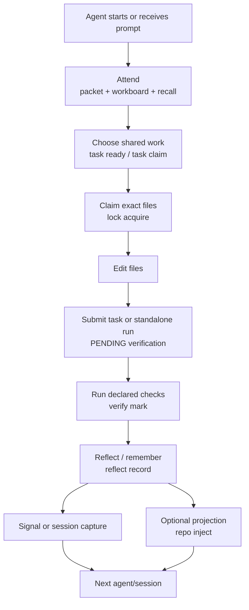

# Octocode Awareness Harness

**Audience**: maintainers, host integrators, and agents that need the full awareness flow without reading every source file.

The harness is the operating system around `@octocodeai/octocode-awareness`: a shared SQLite store in the global Octocode home, a CLI, installable Agent Skill scripts, host hooks, file locks, reflection, and generated workspace `.octocode/` repo context. The database is canonical. Hooks and generated docs are projections over it.

## Documentation Map

| Subject | Read this |
|---|---|
| How the CLI, bundled skills, hooks, DB, and repo projections fit together | [HOW_IT_WORKS.md](https://github.com/bgauryy/octocode-mcp/blob/main/packages/octocode-awareness/docs/HOW_IT_WORKS.md) |
| Feature-by-feature documentation coverage | [README.md](https://github.com/bgauryy/octocode-mcp/blob/main/packages/octocode-awareness/docs/README.md) |
| Stored entities, SQLite schema, relationships, indexes | [DB.md](https://github.com/bgauryy/octocode-mcp/blob/main/packages/octocode-awareness/docs/DB.md) |
| Attend packet, workboard, and active memory navigation | [MEMORY_NAVIGATION.md](https://github.com/bgauryy/octocode-mcp/blob/main/packages/octocode-awareness/docs/MEMORY_NAVIGATION.md) |
| File locks, execution runs, verification, stale lock cleanup | [LOCKS.md](https://github.com/bgauryy/octocode-mcp/blob/main/packages/octocode-awareness/docs/LOCKS.md) |
| Reflection, self-improvement, weakness mining, harness proposals | [REFLECTION.md](https://github.com/bgauryy/octocode-mcp/blob/main/packages/octocode-awareness/docs/REFLECTION.md) |
| Workspace `.octocode/` LLM Wiki, query views, generated files, share policy | [WIKI.md](https://github.com/bgauryy/octocode-mcp/blob/main/packages/octocode-awareness/docs/WIKI.md) |
| Host hooks, Pi bridge, smart briefings, harness guard | [HOOKS.md](https://github.com/bgauryy/octocode-mcp/blob/main/packages/octocode-awareness/docs/HOOKS.md) |
| User-facing skill workflow and CLI recipes | [SKILLS.md](https://github.com/bgauryy/octocode-mcp/blob/main/packages/octocode-awareness/docs/SKILLS.md) |

## System Surfaces

| Surface | Role |
|---|---|
| Agent Skill | Teaches agents when to attend, choose/claim tasks, lock files, verify, reflect, and hand off. |
| CLI | Canonical command surface for users, hooks, scripts, and host integrations. |
| Hooks / Pi bridge | Automates file claims, verification gates, smart briefings, and session capture. |
| SQLite store | Canonical source for plans, task state/claims/runs, locks, verification, memories, signals, refinements, and audit. |
| Workspace `.octocode/` | Generated repo context plus managed `.octocode/plan/**` narrative documents. |

Context and tokens are the circulation layer of the harness: `attend --compact` carries enough fresh state into the run, while `query workboard`, CSV, HTML, and manifest budgets keep row-heavy context from turning into overweight docs.

## Full Flow

```text
ATTEND -> CHOOSE -> CLAIM -> WORK -> SUBMIT/VERIFY -> REFLECT -> HAND OFF
```

| Step | Main command group | What is stored |
|---|---|---|
| Attend | `attend`, `query workboard`, `workspace status`, `memory recall`, `signal list` | Reads plans, ready/claimed/verify tasks, runs, locks, messages, lessons, and projection health. |
| Choose | `task ready`, `task claim` | Leases a durable task and creates one linked execution run; optional for quick edits. |
| Claim | `lock acquire`, `lock wait` | Adds exact file locks to the linked run, or creates a standalone run. |
| Work | host editor / agent tool | Optional `edit_log` entries if the host records edit audit data. |
| Verify | `task submit`, `verify mark`, `verify audit` | Updates `task_runs`, linked `tasks`, `run_log`, and `task_events`. |
| Reflect | `reflect record`, `memory record` | Writes `memories`, `memory_refs`, `harness_log`, optional `refinements`. |
| Project | `query`, `repo inject`, `docs staleness` | Reads DB views; writes generated `.octocode/` files; optional `harness_log` doc refresh proposals. |
| Hand off | `signal publish`, `session capture`, `refinement set` | Writes `signals`, `signal_reads`, `sessions`, `refinements`. |

## Lifecycle Diagram



## Improvement Loop

The self-improvement loop is advisory by design:

```text
reflect record
  -> memories + harness_log
  -> reflect mine-weakness
  -> reflect export-harness
  -> human review
  -> approved doc/skill edit
  -> future sessions recall the lesson
```

No command automatically patches `AGENTS.md`, `SKILL.md`, or package docs. `export-harness` emits candidates; a human or agent applies approved changes under normal review and verification.

## Current Improvement Direction

The current product slice is **attend + workboard**: a read-only start packet and row/column view that choose among the existing planning surfaces and return traceable evidence, gaps, verification targets, and bloat warnings.

This is deliberately smaller than a new memory architecture. It builds on the current flow:

```text
attend + query workboard + memory recall + query views + refinements/signals
  -> trace + evidence + gaps + verification targets + projection health
```

Future navigation can deepen the trace, but it should stay deterministic until fixtures prove a harder policy is needed. See [MEMORY_NAVIGATION.md](https://github.com/bgauryy/octocode-mcp/blob/main/packages/octocode-awareness/docs/MEMORY_NAVIGATION.md) for the tradeoff matrix and MVP boundary.

## Canonical Invariants

- The SQLite DB under the global Octocode home is source of truth; generated workspace `.octocode/` files are readable projections.
- `.octocode/plan/**` is managed narrative; SQLite remains the only source for live task/claim status.
- Plans, durable tasks, attempts, and exact locks are distinct entities; quick locks do not require a plan/task.
- Rows should be scoped by `workspace_path`; use `artifact`, `repo`, and `ref` when a finer scope matters.
- Agents should claim files before editing and verify before reporting success.
- `SUCCESS` requires verification. Unverified success releases are stored as `PENDING` until `verify mark`.
- Lock TTL is a safety net, not a coordination policy. Prefer release, wait, signal, or prune explicitly.
- Memories are leads. Current source, tests, user instructions, and fresh verification beat remembered context.
- Harness edits are gated: `OCTOCODE_ALLOW_HARNESS_APPLY=1` plus a non-main branch.

## Quick Command Map

| Need | Command |
|---|---|
| Compact start packet | `octocode-awareness attend --workspace "$PWD" --query "current task" --compact` |
| DB health and active state | `octocode-awareness workspace status --workspace "$PWD" --compact` |
| Active work and projection health | `octocode-awareness query workboard --workspace "$PWD" --format table --limit 20` |
| Ready collaborative work | `octocode-awareness task ready --plan-id <id> --compact` |
| Exact command contracts | `octocode-awareness schema commands --compact` |
| Claim files | `octocode-awareness lock acquire --agent-id "$OCTOCODE_AGENT_ID" --target-file <path> ...` |
| Verify pending work | `octocode-awareness verify mark --agent-id "$OCTOCODE_AGENT_ID" --all-pending --message <result>` |
| Record a lesson | `octocode-awareness reflect record --agent-id "$OCTOCODE_AGENT_ID" --task <task> --outcome worked --lesson <text>` |
| Generate repo context | `octocode-awareness repo inject --workspace "$PWD" --out .octocode --mode local --compact` |
| Install hooks | `octocode-awareness hooks install --host codex --project-dir . --dry-run --compact` |
