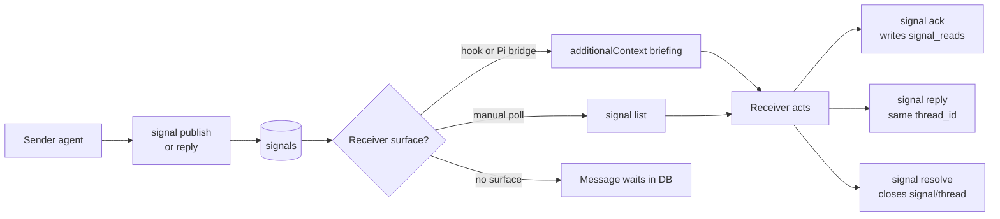
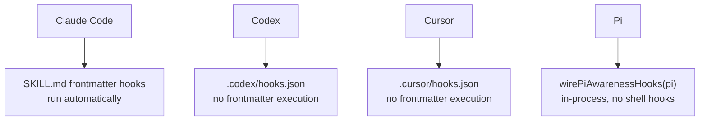
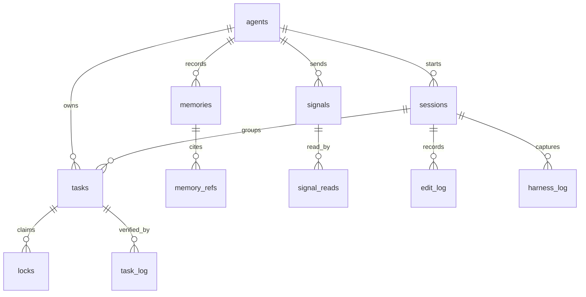

# Octocode Awareness — User Guide

The awareness package gives every AI agent on your machine a shared coordination layer: file locks, typed messages, durable lessons, verification gates, and a self-improvement loop — all backed by one local SQLite database at `~/.octocode/memory/awareness.sqlite3`.

No server. No network. Any agent that reads and writes that file participates automatically. The global DB is different from a repo's generated `.octocode/` folder: the DB is canonical storage; `<repo>/.octocode/` is an optional LLM Wiki projection for that workspace.

---

## Contents

1. [What You Get](#what-you-get)
2. [Install in 5 Minutes](#install-in-5-minutes)
3. [Core Concepts](#core-concepts)
4. [The Workflow](#the-workflow)
5. [Agent Communication (Signals)](#agent-communication-signals)
6. [Shared Memory & Lessons](#shared-memory--lessons)
7. [LLM Wiki](#llm-wiki)
8. [Self-Improvement Loop](#self-improvement-loop)
9. [Hooks](#hooks)
10. [CLI Reference](#cli-reference)
11. [Data Model](#data-model)
12. [Pi Integration](#pi-integration)
13. [Agent-Facing Reference](#agent-facing-reference)

---

## What You Get

### Supported Agents

| Agent | How it connects |
|---|---|
| **Claude Code** | `SKILL.md` frontmatter hooks run automatically (pre-edit, post-edit, stop-verify, session-end, smart briefing) |
| **Codex** | Hook config via `.codex/hooks.json`; install with `octocode-awareness hooks install --host codex` |
| **Cursor** | Hook config via `.cursor/hooks.json`; install with `octocode-awareness hooks install --host cursor` |
| **Pi** | In-process via `wirePiAwarenessHooks(pi)` in `@octocodeai/pi-extension` — no shell hooks |
| **Custom** | Import `@octocodeai/octocode-awareness` directly and call the runtime functions |

### What agents gain

- **No more clobbering**: file locks make concurrent edits visible before they conflict.
- **Continuity across sessions**: memories and refinements keep useful context out of the prompt until needed, then surface it on recall.
- **Agent-to-agent messaging**: signals give agents a local mailbox with threads, targeted delivery, broadcast, ack, and resolution.
- **Shared learning**: one agent's lesson improves every future session in the same repo, for any agent.
- **Compact context circulation**: `attend --compact` and `query workboard` move the right state into the run without making agents carry oversized docs.
- **Resource bookmarks**: `BOOKMARKS.md` keeps useful URLs, repo paths, file paths, papers, skills, and other URI leads discoverable without bloating memory docs.
- **Self-improvement under human oversight**: the harness loop surfaces patterns in failures and proposes guidance candidates for you to review and apply.
- **LLM Wiki**: `repo inject` generates workspace `.octocode/` Markdown, CSV, and HTML from the DB — a generated wiki tuned for LLM consumption and human inspection.

---

## Install in 5 Minutes

### Step 1 — Tell Your Agent To Discover Awareness

The easiest installation path is conversational: tell your agent to run this command.

```bash
npx @octocodeai/octocode-awareness
```

The CLI output shows the command map and tells the agent to install the bundled Agent Skill:

```bash
npx octocode skill --add --path {{path_to_skills_location}}/octocode-awareness --platform common
```

This combination matters:

| Piece | What it gives the agent |
|---|---|
| CLI package | The executable control plane for memory, locks, signals, verification, reflection, repo context, and hooks. |
| Agent Skill | The operating loop: why and when to attend, claim, communicate, verify, reflect, refresh wiki context, housekeep, and hand off. |
| Hooks | Optional automation so supported hosts enforce the loop at lifecycle boundaries. |

The CLI and skill are meant to work together. The CLI stores facts and performs actions; the skill tells the agent how to use those actions before, during, and after repo work. Hooks are the reliability layer that make important operations happen automatically for agents that support lifecycle hooks.

Registry/marketplace fallback:

```bash
npx octocode skill --name octocode-awareness
```

Supported agents: **Codex**, **Claude Code**, **Cursor**, and **Pi**. Custom hosts can use the CLI directly or import the library API.

Optional global CLI install:

```bash
npm install -g @octocodeai/octocode-awareness
```

### Step 2 — Initialize the database

```bash
npx @octocodeai/octocode-awareness maintenance init --compact
```

Smoke-test it:

```bash
npx @octocodeai/octocode-awareness maintenance self-test --compact
```

### Step 3 — Install hooks for your agent host

Preview what will be written, then install:

```bash
# Preview (no writes)
npx @octocodeai/octocode-awareness hooks install --host claude --dry-run --compact
npx @octocodeai/octocode-awareness hooks install --host codex --project-dir . --dry-run --compact
npx @octocodeai/octocode-awareness hooks install --host cursor --project-dir . --dry-run --compact

# Install (writes hook config)
npx @octocodeai/octocode-awareness hooks install --host claude --compact
npx @octocodeai/octocode-awareness hooks install --host codex --project-dir . --compact
npx @octocodeai/octocode-awareness hooks install --host cursor --project-dir . --compact

# Verify exact installation and detect drift
npx @octocodeai/octocode-awareness hooks check --host claude --strict --compact
npx @octocodeai/octocode-awareness hooks check --host codex --project-dir . --strict --compact
npx @octocodeai/octocode-awareness hooks check --host cursor --project-dir . --strict --compact
```

Add `--global` to install at user scope instead of project scope.

### Step 4 — Verify it's working

```bash
npx @octocodeai/octocode-awareness attend --workspace "$PWD" --query "installation smoke" --compact
npx @octocodeai/octocode-awareness workspace status --workspace "$PWD" --compact
```

You should see JSON responses with `ok: true`. `attend` returns the compact start packet; `workspace status` returns raw memory counts, lock state, and refinements.

---

## Core Concepts

### The two `.octocode` locations

| Location | Scope | Purpose |
|---|---|---|
| `~/.octocode/` on macOS | Global per-user Octocode home | Config and durable data. Awareness uses `~/.octocode/memory/awareness.sqlite3` on macOS by default; `OCTOCODE_HOME` names the broader Octocode home for packages that use the shared config loader. |
| `<repo>/.octocode/` | One workspace/repo | Generated wiki/context from `repo inject`: repo AGENTS, memory/gotcha/learning docs, CSV, HTML, manifest, references. |

Do not confuse them. Global home stores canonical awareness data; workspace `.octocode/` stores generated repo views.

### The database

One SQLite file at `~/.octocode/memory/awareness.sqlite3` (or `$OCTOCODE_MEMORY_HOME/awareness.sqlite3`) serves all agents on the machine. It runs in WAL mode — concurrent agents read and write safely.

Each record is scoped by `workspace_path` (and optionally `artifact`, `repo`, `ref`) so different projects stay isolated even in the same file.

### Agent identity

Each agent has an `agent_id`. Claude Code sets it from the session. For agents whose host doesn't provide a stable id, set `OCTOCODE_AGENT_ID` in your environment. Hooks register and touch the id in the `agents` table automatically.

### Locks

A lock is a declaration: "I am about to edit this file." Locks live in the `locks` table tied to a `task`. When another agent tries to acquire the same file, it sees the existing lock and either waits, coordinates via signals, or picks different work.

Lock TTL is 10 minutes — a safety net if a session ends without releasing. `lock prune` cleans expired locks when a holder has disappeared.

### Memories

Memories are durable lessons — facts, decisions, gotchas, architecture notes — stored in the `memories` table with FTS5 indexing for recall. Each memory has a label (`GOTCHA`, `DECISION`, `ARCHITECTURE`, `SECURITY`, `EXPERIENCE`, `OTHER`, …), importance (1–10), and decay settings. They are recalled by natural-language query, label, tag, file, or scope.

### Signals

Signals are typed messages between agents: `claim`, `handoff`, `question`, `reply`, `blocker`, `request`, `decision`, or `fyi`. They live in `signals`, grouped by `thread_id`. A recipient reads them via `signal list`, acts, then acks and resolves. Messages persist until acted on.

### Verification

Every file edit task carries a declared `test_plan`. When the agent finishes, it must run `verify mark` to record that the declared checks actually ran. The `stop-verify` hook blocks session end until all pending verification is cleared.

### Refinements

Refinements store work state for the next agent or session: unfinished tasks, repo-fix proposals, handoff notes. They complement memories (which store reusable lessons) by preserving live work state.

### Context health

Context and tokens are the circulation of an agent run. They carry goal, constraints, evidence, warnings, handoffs, and next action. Too little context starves the run; too much stale context makes it overweight. Use `attend --compact`, `query workboard`, CSV/HTML views, and projection budgets to keep docs lean while preserving row-level detail.

Signals and refinements are the social part of that circulation. They bring new ideas, questions, and perspective from other agents or humans; resolve or consolidate them when they stop being active context.

---

## The Workflow

```text
ATTEND → CLAIM → WORK → COMMUNICATE → VERIFY → REFLECT → PROJECT → HOUSEKEEP → HAND OFF
```

### 1. Attend — orient before acting

```bash
# Get one compact start packet: profile, workboard, memory evidence, gaps, and bloat warnings
octocode-awareness attend --workspace "$PWD" --query "auth lock gotcha" --compact

# See active work, verification debt, and projection health as rows
octocode-awareness query workboard --workspace "$PWD" --format table --limit 20

# Check workspace: active locks, pending verification, DB health
octocode-awareness workspace status --workspace "$PWD"

# Recall prior lessons relevant to the task
octocode-awareness memory recall --query "auth lock gotcha" --workspace "$PWD" --smart --limit 5

# Read any handoffs or unfinished state from the last session
octocode-awareness refinement get --workspace "$PWD" --limit 5

# Check for messages from other agents
octocode-awareness signal list --agent-id "$OCTOCODE_AGENT_ID" --workspace "$PWD"

# Read generated repo wiki context when present
test -f .octocode/AGENTS.md && sed -n '1,160p' .octocode/AGENTS.md
```

### 2. Claim — declare intent and lock files

```bash
octocode-awareness lock acquire \
  --agent-id "$OCTOCODE_AGENT_ID" \
  --workspace "$PWD" \
  --rationale "Refactor auth module to use new token format" \
  --test-plan "yarn test src/auth && yarn typecheck" \
  --target-file "$PWD/src/auth/router.ts" \
  --target-file "$PWD/src/auth/middleware.ts"
```

If another agent holds the file: wait for it to clear, coordinate via signals, or switch to non-overlapping work.

```bash
# Wait for a conflict to resolve
octocode-awareness lock wait \
  --target-file "$PWD/src/auth/router.ts" \
  --wait-seconds 120 --retry-interval 5 --compact
```

### 3. Work and communicate

Edit files normally. If hooks are installed, `pre-edit` claims and `post-edit` releases automatically.

Use signals during the work when another agent or a future session needs to know what changed:

```bash
octocode-awareness signal publish \
  --agent-id "$OCTOCODE_AGENT_ID" \
  --workspace "$PWD" \
  --kind decision \
  --subject "Migration order chosen" \
  --body "Schema migration must run before data backfill because backfill reads the new index"
```

### 4. Verify — record that the declared checks ran

```bash
# Run the declared test plan first, then record it
octocode-awareness verify mark \
  --agent-id "$OCTOCODE_AGENT_ID" \
  --workspace "$PWD" \
  --all-pending \
  --message "yarn test passed, no type errors"

# Check for any remaining unverified work
octocode-awareness verify audit --agent-id "$OCTOCODE_AGENT_ID" --workspace "$PWD"
```

### 5. Reflect — record durable lessons

```bash
octocode-awareness reflect record \
  --agent-id "$OCTOCODE_AGENT_ID" \
  --task "Refactor auth module" \
  --outcome worked \
  --lesson "Token format change requires updating all middleware before router — order matters" \
  --importance 8
```

Or record a memory mid-task:

```bash
octocode-awareness memory record \
  --agent-id "$OCTOCODE_AGENT_ID" \
  --task-context "Debugging session" \
  --observation "SQLite WAL mode required; journal mode breaks concurrent agent reads" \
  --label ARCHITECTURE \
  --importance 9
```

### 6. Project and housekeep

Use live queries during active work. Refresh the generated LLM Wiki only when the update helps humans or future agents:

```bash
# Live DB view
octocode-awareness query workboard --workspace "$PWD" --format table --limit 20
octocode-awareness query gotchas --workspace "$PWD" --format table --limit 20

# Publish refreshed repo context
octocode-awareness repo inject --workspace "$PWD" --out .octocode --mode local --compact
```

Preview cleanup before mutating shared state:

```bash
octocode-awareness maintenance digest --workspace "$PWD" --dry-run --compact
octocode-awareness lock prune --workspace "$PWD" --expired-only --dry-run --compact
```

### 7. Improve workflows and skills

If awareness shows repeated friction, turn it into a better workflow rather than only adding another memory. Ask the agent to use `octocode-skills` when installed, or use the Octocode CLI:

```bash
npx octocode skill --add --path <skill-folder> --platform common
npx octocode skill --name octocode-awareness
```

The user-facing Octocode guide starts at `https://octocode.ai`. `reflect export-harness` can preview guidance candidates, but a human-reviewed edit applies skill or workflow changes.

### 8. Hand off — preserve state for the next session

```bash
# Send a message to another agent or broadcast
octocode-awareness signal publish \
  --agent-id "$OCTOCODE_AGENT_ID" \
  --workspace "$PWD" \
  --kind handoff \
  --subject "Auth refactor half-done" \
  --body "Router updated, middleware still needs token validation on /api/v2 routes"

# Or capture session state automatically
octocode-awareness session capture \
  --agent-id "$OCTOCODE_AGENT_ID" \
  --workspace "$PWD"
```

---

## Agent Communication (Signals)

Signals are the local mailbox. No external broker — the DB is the message store.



### Signal kinds

| Kind | When to use |
|---|---|
| `claim` | Staking out work you're about to do |
| `handoff` | Passing incomplete work to the next agent |
| `question` | Asking another agent for input |
| `reply` | Responding in a thread |
| `blocker` | Signalling you're stuck and why |
| `request` | Asking for a specific action |
| `decision` | Recording a choice that affects others |
| `fyi` | Sharing information that doesn't need action |

### Common patterns

```bash
# Send to a specific agent
octocode-awareness signal publish \
  --agent-id "$OCTOCODE_AGENT_ID" \
  --to-agent "codex:session-abc" \
  --workspace "$PWD" \
  --kind question \
  --subject "Which migration order?" \
  --body "Should I run schema before data, or parallel?"

# Broadcast to all agents in the workspace
octocode-awareness signal publish \
  --agent-id "$OCTOCODE_AGENT_ID" \
  --workspace "$PWD" \
  --kind fyi \
  --subject "CI is broken on main" \
  --body "Test runner fails on Node 22.x — avoid main until fixed"

# Reply in a thread (keeps context together)
octocode-awareness signal reply \
  --agent-id "$OCTOCODE_AGENT_ID" \
  --signal-id ntf_abc123 \
  --body "Schema first — data migration depends on new columns"

# Acknowledge after acting
octocode-awareness signal ack \
  --agent-id "$OCTOCODE_AGENT_ID" \
  --signal-id ntf_abc123

# Close the thread when the work is done
octocode-awareness signal resolve \
  --agent-id "$OCTOCODE_AGENT_ID" \
  --signal-id ntf_abc123
```

---

## Shared Memory & Lessons

Memories persist across sessions and agents. One gotcha recorded by a Codex session is recalled by the next Claude Code session — or any other agent in the same workspace.

### Memory labels

| Label | Use for |
|---|---|
| `GOTCHA` | Traps, edge cases, things that burned you |
| `DECISION` | Why a particular approach was chosen |
| `ARCHITECTURE` | How a system is structured |
| `SECURITY` | Security constraints and findings |
| `EXPERIENCE` | Outcomes of specific tasks |
| `OVERRIDE` | Always surfaced, regardless of importance floor or decay — use for critical rules |
| `OTHER` | General observations |

### Recall with smart broadening

```bash
# Basic recall
octocode-awareness memory recall \
  --query "database migration order" \
  --workspace "$PWD" \
  --limit 5

# Smart recall — broadens automatically when strict recall under-fills
octocode-awareness memory recall \
  --query "auth token format" \
  --workspace "$PWD" \
  --smart --limit 5

# Filter by label
octocode-awareness memory recall \
  --query "concurrency" \
  --label GOTCHA --label ARCHITECTURE \
  --workspace "$PWD" --limit 10

# Point-in-time recall
octocode-awareness memory recall \
  --query "deployment steps" \
  --as-of "2026-06-01T00:00:00Z" \
  --workspace "$PWD"
```

### Supersede stale memories

```bash
# When a lesson is no longer accurate
octocode-awareness memory record \
  --agent-id "$OCTOCODE_AGENT_ID" \
  --task "Update auth docs" \
  --observation "Token format changed to JWT in v3 — old HMAC notes are stale" \
  --supersedes mem_oldid123 \
  --label ARCHITECTURE --importance 8
```

### Cleanup

```bash
# Preview what would be pruned
octocode-awareness maintenance digest --dry-run --workspace "$PWD" --compact

# Run cleanup
octocode-awareness maintenance digest --workspace "$PWD" --compact

# Forget specific memories
octocode-awareness memory forget --tag deprecated --workspace "$PWD" --dry-run
```

Use `--workspace`, `--artifact`, `--repo`, or `--ref` to keep broad forget selectors scoped; omitting scope makes the selector apply to the whole awareness DB.

---

## LLM Wiki

The LLM Wiki generates a set of Markdown, CSV, and HTML files from the awareness DB into the current workspace's `.octocode/` folder. Any agent or human can read these files without querying the DB. The SQLite DB in the global Octocode home is always the canonical source — regenerate projections rather than hand-editing them.

Use Markdown for compact summary, not bulk storage. When rows get large, use `query workboard`, CSV, HTML, and `.octocode/awareness/manifest.json` budget metadata so docs stay healthy and searchable instead of overweight.
Use `BOOKMARKS.md` for resources an agent can learn from: URLs, repos, file paths, papers, skills, and other URIs. Store those as memory references; regenerate the projection rather than editing the file.

### Generated files

| File | Contents |
|---|---|
| `.octocode/AGENTS.md` | Concise repo context for agents: active gotchas, decisions, and architecture notes |
| `.octocode/MEMORY.md` | Active memory index |
| `.octocode/GOTCHAS.md` | All gotcha-labeled memories |
| `.octocode/LEARN.md` | Decisions, architecture notes, workflows |
| `.octocode/BOOKMARKS.md` | Learnable resource leads from memory references |
| `.octocode/awareness/csv/*.csv` | Filterable/sortable data exports |
| `.octocode/awareness/index.html` | Static browser view of all awareness data |
| `.octocode/awareness/manifest.json` | Generation metadata, counts, projection budgets, and share/local policy warnings |
| `.octocode/references/*.md` | Compact reference notes generated from DB |

### Query the live DB

```bash
# JSON — best for automation
octocode-awareness query all --workspace "$PWD" --format json --limit 20 --compact

# Table — best for terminal reading
octocode-awareness query workboard --workspace "$PWD" --format table --limit 20
octocode-awareness query gotchas --workspace "$PWD" --format table

# CSV — best for spreadsheets
octocode-awareness query files --workspace "$PWD" --format csv

# HTML — best for browsers; writes under <workspace>/.octocode/ when run from repo root
octocode-awareness query all --workspace "$PWD" --format html --out .octocode/awareness/index.html
```

Available views: `memories`, `gotchas`, `lessons`, `tasks`, `locks`, `agents`, `signals`, `refinements`, `files`, `activity`, `workboard`, `repo-profile`, `all`.

### Regenerate the wiki

```bash
octocode-awareness repo inject \
  --workspace "$PWD" \
  --out .octocode \
  --mode local \
  --compact
```

When run from the workspace root, `--out .octocode` writes the generated repo view to `<workspace>/.octocode/`.

Use `--mode share` if the repo owner wants to commit the generated files. `repo inject` never edits `.gitignore`.

---

## Self-Improvement Loop

The harness closes a feedback loop: sessions produce lessons → lessons cluster into patterns → patterns generate guidance candidates → humans review and apply → next sessions benefit.

```text
reflect record
      ↓
reflect mine-weakness  ← clusters repeated failure_signature values
      ↓
reflect export-harness ← previews AGENTS.md / skill guidance candidates
      ↓
   human reviews
      ↓
   edits applied to skill / AGENTS.md
      ↓
   loop ──┘
```

### Recording outcomes

`reflect record` is richer than `memory record` — it accepts an outcome, failure signature, judgment note, and optional harness log event:

```bash
octocode-awareness reflect record \
  --agent-id "$OCTOCODE_AGENT_ID" \
  --task "Fix SQLite WAL checkpoint issue" \
  --outcome failed \
  --lesson "WAL mode requires explicit checkpoint calls after bulk writes — checkpoint-missing is a recurring pattern" \
  --failure-signature "mechanism:sqlite-wal|cause:checkpoint-missing" \
  --importance 9
```

### Finding recurring patterns

```bash
# Cluster failure signatures across all memories
octocode-awareness reflect mine-weakness \
  --workspace "$PWD" --limit 10 --compact
```

### Previewing guidance candidates

```bash
octocode-awareness reflect export-harness \
  --workspace "$PWD" --min-importance 7 --limit 10 --compact
```

The output is a preview — a human reviews it and decides what to merge into skill files or `AGENTS.md`. No automatic merging happens.

### Finding stale documentation

```bash
octocode-awareness docs staleness \
  --targets-json '[{"docFile":"packages/foo/ARCHITECTURE.md","sourceDirs":["packages/foo/src"]}]' \
  --workspace "$PWD" \
  --min-edits 5
```

> **Note:** `docs staleness` depends on `edit_log`. Bundled shell hooks and the Pi bridge insert best-effort `update` audit rows for extracted file paths; custom hosts or richer diff metrics should call `insertEditLog()` from the library API.

---

## Hooks

Hooks turn the coordination protocol from guidance into enforcement. They are optional — the CLI works identically without them — but they automate the critical lifecycle edges so agents don't have to remember to claim, verify, and capture.

### Hook table

| Hook event | Script | What it does |
|---|---|---|
| `UserPromptSubmit` / `sessionStart` | `notify-deliver.sh` | **Smart briefing** — registers the agent, injects unread signals and context before each prompt |
| `PreToolUse` (write) | `pre-edit.sh` | **Auto-claim** — locks the target file before the edit lands |
| `PreToolUse` (write) | `harness-guard.sh` | **Harness gate** — blocks skill self-edits without `OCTOCODE_ALLOW_HARNESS_APPLY=1` + non-main branch |
| `PostToolUse` (write) | `post-edit.sh` | **Auto-release** — releases lock as `PENDING` after the edit lands |
| `Stop` / `SubagentStop` | `stop-verify.sh` | **Verify gate** — blocks session end when verification is still owed |
| `SessionEnd` / `PreCompact` | `session-end.sh` | **Session capture** — writes a handoff refinement from current locks and git state |

### Host differences



Codex and Cursor **do not** execute `SKILL.md` frontmatter hooks. Install their hooks with the CLI installer.

### Install, check, remove

```bash
# Always preview first
npx @octocodeai/octocode-awareness hooks install --host codex --project-dir . --dry-run --compact

# Install (idempotent — only adds our hooks, never touches others)
npx @octocodeai/octocode-awareness hooks install --host codex --project-dir . --compact

# Verify exact installation and detect drift
npx @octocodeai/octocode-awareness hooks check --host codex --project-dir . --strict --compact

# Remove (only removes our hooks)
npx @octocodeai/octocode-awareness hooks remove --host codex --project-dir . --compact
```

Add `--global` for user-scope installation.

### Tuning

- **Disable verify gate**: set `OCTOCODE_NO_VERIFY_GATE=1`
- **Allow harness edits**: set `OCTOCODE_ALLOW_HARNESS_APPLY=1` + use a non-main branch
- **Prompt digest**: set `OCTOCODE_NOTIFY_RUN_DIGEST=1` to let prompt-time smart briefing run the periodic maintenance digest
- **Lock TTL**: default 10 minutes, hard-capped at 10 minutes in `src/intents.ts`
- **Fail-open with warning**: wrappers and non-critical hooks exit 0 with stderr warnings when infrastructure is missing or unhealthy; `pre-edit` blocks only on genuine lock conflict (exit 2)

---

## CLI Reference

Run `npx @octocodeai/octocode-awareness schema commands --compact` for the full agent command map. Use `<command> --help` for flags, `<command> --help --compact` for token-light usage, and `schema json-schema <name> --compact` for contracts.

### Attend / Status

```bash
attend --workspace <path> --query <text> [--file <path>] [--limit N] [--compact] [--explain-organ]
query workboard --workspace <path> [--format json|table|csv|markdown|html] [--limit N]
workspace status --workspace <path> [--artifact <name>] [--compact]
```

### Memory

```bash
memory record --agent-id <id> --task-context <ctx> --observation <text> [--label <L>] [--importance 1-10] [--tag <t>] [--workspace <path>]
memory recall  --query <text> [--smart] [--label <L>] [--limit N] [--workspace <path>]
memory forget  [--memory-id <id>] [--tag <t>] [--max-importance N] [--workspace <path>] [--dry-run]
```

### Locks

```bash
lock acquire --agent-id <id> --rationale <text> --test-plan <text> --target-file <path> [--workspace <path>] [--ttl-minutes N]
lock wait    --agent-id <id> --target-file <path> --wait-seconds N [--retry-interval N]
lock release --agent-id <id> [--task-id <id>] [--target-file <path>] --status SUCCESS|FAILED|PENDING [--verified]
lock prune   [--older-than-minutes N] [--expired-only] [--agent-id <id>] [--dry-run]
```

### Verification

```bash
verify audit --agent-id <id> --workspace <path> [--artifact <name>]
verify mark  --agent-id <id> --workspace <path> --all-pending --message <text>
             # or: --task-id <id> --message <text>
```

### Signals

```bash
signal publish --agent-id <id> --workspace <path> --kind <kind> --subject <text> [--body <text>] [--to-agent <id>]
signal list    --agent-id <id> --workspace <path> [--all] [--unread-only] [--limit N]
signal reply   --agent-id <id> --signal-id <id> --body <text>
signal ack     --agent-id <id> --signal-id <id>
signal resolve --agent-id <id> --signal-id <id>
signal prune   --workspace <path> [--resolved] [--older-than-days N] [--dry-run]
```

### Agent Registry

```bash
agent register --agent-id <id> [--agent-name <name>] [--context <ctx>] [--workspace <path>]
agent list     --workspace <path> [--limit N]
```

### Refinements & Handoffs

```bash
refinement set    --agent-id <id> --reasoning <text> --remember <text> [--quality good|bad|handoff] [--workspace <path>]
refinement get    --workspace <path> [--quality <q>] [--state <s>] [--include-handoffs] [--limit N]
refinement delete --refinement-id <id> [--dry-run]
session capture   --agent-id <id> --workspace <path>
```

### Reflection & Harness

```bash
reflect record        --agent-id <id> --task <ctx> --outcome worked|failed|partial --lesson <text> [--failure-signature <sig>] [--importance 1-10]
reflect mine-weakness --workspace <path> [--limit N]
reflect export-harness --workspace <path> [--min-importance N] [--limit N]
```

### LLM Wiki

```bash
query <view> --workspace <path> [--format json|table|csv|markdown|html] [--limit N] [--out <file>]
repo inject  --workspace <path> [--out <dir>] [--mode local|share] [--compact]
docs staleness --targets-json <json> --workspace <path> [--min-edits N] [--min-lines N] [--propose] [--agent-id <id>]
```

### Hooks

```bash
hooks install --host claude|codex|cursor [--project-dir <path>] [--global] [--dry-run] [--compact]
hooks check   --host claude|codex|cursor [--project-dir <path>] [--strict] [--compact]
hooks remove  --host claude|codex|cursor [--project-dir <path>] [--dry-run] [--compact]
hook run <pre-edit|post-edit|harness-guard|stop-verify|notify-deliver|session-end> < hook-payload.json
```

### Schema & Discovery

```bash
schema commands   --compact           # full agent command map
schema list                           # all schema names
schema json-schema <name> --compact   # exact JSON schema for a command
schema example    <name> --compact    # example payload
schema validate   <name> <json-file|->
```

### Maintenance

```bash
maintenance init      [--compact]
maintenance self-test [--compact]
maintenance digest    --workspace <path> [--dry-run] [--compact]
```

---

## Data Model



| Table | Purpose |
|---|---|
| `agents` | Stable agent id, display name, context, last-seen scope |
| `sessions` | One contiguous agent work period |
| `memories` | Durable lessons and observations with FTS5 indexing |
| `memory_refs` | Structured provenance (URLs, files, repos) for memories |
| `tasks` | Declared edit intent and verification plan |
| `locks` | Per-file lock rows tied to tasks (TTL: 10 min) |
| `task_log` | Immutable verification events |
| `refinements` | Live work state and handoffs for the next agent |
| `signals` | Typed live messages, replies, threads, and ack status |
| `signal_reads` | Idempotent per-agent acknowledgements |
| `edit_log` | File edit audit trail from bundled post-edit hooks plus optional richer `insertEditLog()` calls |
| `harness_log` | Self-improvement and capture events |

All rows are scoped primarily by `workspace_path`, with optional `artifact`, `repo`, and `ref`. One DB serves a whole machine while keeping projects isolated.

See [`DB.md`](https://github.com/bgauryy/octocode-mcp/blob/main/packages/octocode-awareness/docs/DB.md) for the complete entity schema, relationships, SQL patterns, and index reference. See [`LOCKS.md`](https://github.com/bgauryy/octocode-mcp/blob/main/packages/octocode-awareness/docs/LOCKS.md), [`REFLECTION.md`](https://github.com/bgauryy/octocode-mcp/blob/main/packages/octocode-awareness/docs/REFLECTION.md), [`WIKI.md`](https://github.com/bgauryy/octocode-mcp/blob/main/packages/octocode-awareness/docs/WIKI.md), and [`HOOKS.md`](https://github.com/bgauryy/octocode-mcp/blob/main/packages/octocode-awareness/docs/HOOKS.md) for subsystem-specific behavior.

---

## Pi Integration

Pi uses the library API directly via `@octocodeai/pi-extension`. The `wirePiAwarenessHooks(pi)` call wires all lifecycle events in-process. No shell hooks are needed.

Pi tool equivalents:

| Pi tool | CLI equivalent |
|---|---|
| `workspace_status` | `workspace status` |
| `memory_recall` | `memory recall` |
| `memory_record` | `memory record` |
| `memory_refine_get` | `refinement get` |
| `agent_signal` (action: publish\|list\|reply\|ack\|resolve) | `signal publish\|list\|reply\|ack\|resolve` |
| `file_lock` (type: lock) | `lock acquire` |
| `file_lock` (type: release) | `lock release` |
| `file_lock` (type: status) | `workspace status` |
| `memory_verify` | `verify mark` |
| `memory_audit_unverified` | `verify audit` |
| `memory_reflect` | `reflect record` |
| `memory_export_harness` | `reflect export-harness` |

Pi `file_lock` also supports `type:renew` for extending a lock without releasing it. Pi `memory_recall` currently uses the same Awareness recall operation as the CLI: lexical FTS plus salience, with scope, reference, file, regex, temporal, and smart-broadening filters. The package exposes library helpers for callers that already have embeddings, but Pi does not generate embeddings for recall by default.

---

## Agent-Facing Reference

### Choosing the right action

| Situation | First command |
|---|---|
| Starting or planning work | `attend --compact`, then drill into `query workboard`, `memory recall`, `refinement get`, or `signal list` |
| About to edit files | `lock acquire` before any write |
| Another agent holds the file | `lock wait` or `signal publish` (kind: question or blocker) |
| Finishing work | `verify mark`, then `reflect record` or `memory record` |
| A message appears | `signal list`, then act, then `signal ack` or `signal resolve` |
| Old memory or refinement looks stale | `memory forget` or `refinement delete` with `--dry-run` first |
| Patterns repeating | `reflect mine-weakness` |
| Skill or AGENTS.md should improve | `reflect export-harness`, then stage a proposal for human review |

### Memory judgment rules

- Zero-result recall is not proof of absence. Retry with `--smart` or drop label/tag filters.
- `judgment_required: true` in a recall result means verify against current files before relying on the memory.
- Current code, tests, and user instructions beat memory every time.
- Validate code memories against current files before acting on them.

### Active memory navigation direction

The current workflow starts with `attend --compact`, then drills into `query workboard`, `workspace status`, `memory recall`, `refinement get`, `signal list`, query views, and `reflect mine-weakness` as needed.

Future navigation may deepen the trace and routing logic, but it should stay deterministic and bounded. See [MEMORY_NAVIGATION.md](https://github.com/bgauryy/octocode-mcp/blob/main/packages/octocode-awareness/docs/MEMORY_NAVIGATION.md).

### Scope rules

- Keep all commands for one task scoped to the same `--workspace`, `--artifact`, `--repo`, and `--ref`.
- Use `verify mark --all-pending` only within the same workspace — it clears all pending tasks for this agent in that scope.
- `OCTOCODE_AGENT_ID` is the identity anchor; export it once at session start so hooks and manual calls share one id.
