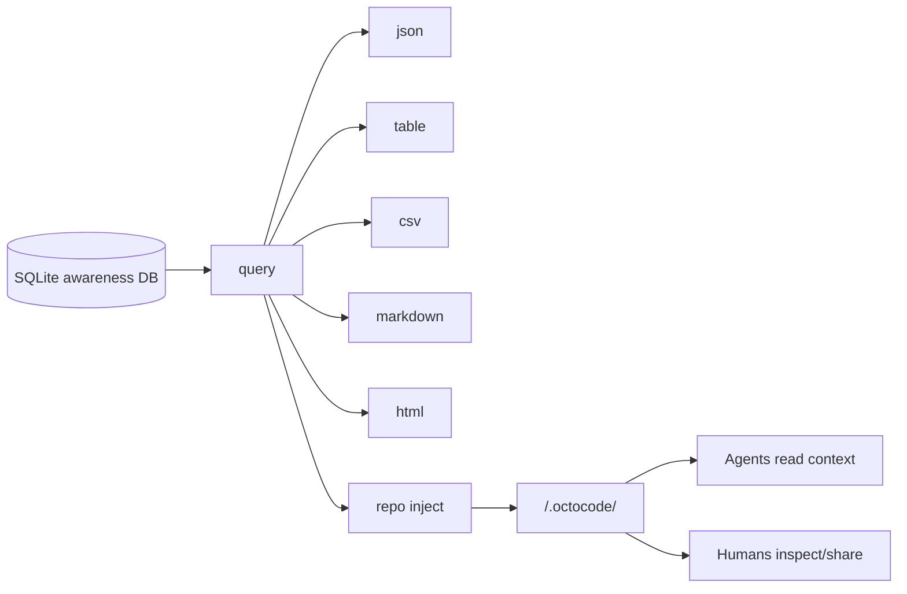

# LLM Wiki And Repo Context

**Audience**: agents, maintainers, and technical users who want readable repo context from awareness data.

The LLM Wiki is the generated part of workspace `.octocode/`. It makes selected plan, task, run, memory, signal, refinement, and activity data readable as Markdown, CSV, HTML, and JSON manifest files.

The SQLite DB in the global Octocode home remains canonical. The wiki is a repo-local projection.

## Context Health

Treat context and tokens like circulation. A generated wiki should move useful oxygen to the next agent: current goal, verified lessons, live risks, handoffs, and where to inspect deeper rows. It should not make the next agent read every historical row before it can act.

Overgrown docs are the projection version of being overweight: they carry old mass into every run, slow planning, and hide the signal inside safe-looking bulk. The healthy shape is:

- `attend --compact` for the live start packet,
- `query workboard` for active rows and columns,
- short Markdown for human-readable summaries,
- `BOOKMARKS.md` for learnable URL/repo/path/URI leads,
- `DEVELOPER_REVIEW.md` for agent feedback on the instructions themselves,
- CSV/HTML for sorting, search, and filtering,
- manifest budget metadata for freshness and size checks,
- cleanup and supersession for stale memories, signals, and refinements.

Social context is also part of the health model. Signals, refinements, handoffs, and user corrections add perspective and can generate better ideas, but only if they are concise, scoped, and eventually resolved or consolidated.

## Location Model

| Location | Role |
|---|---|
| `~/.octocode/memory/awareness.sqlite3` | Canonical global awareness DB, shared across local agents and scoped by workspace. |
| `<repo>/.octocode/` | Generated LLM Wiki plus managed `.octocode/plan/**` narrative docs. Live task state remains in SQLite. |

Use `query <view>` for live DB reads. Use `repo inject --workspace <repo> --out <repo>/.octocode` to publish a refreshed repo view.

## Why It Exists

LLMs and humans need quick repo context without querying SQLite directly. The wiki gives them:

- concise agent briefing material,
- memory and gotcha indexes,
- CSV exports for filtering,
- a static HTML browser view,
- a manifest describing generation and sharing policy,
- compact reference files for repeated context.

## Live Query First

Use `query` when you need fresh data:

```bash
octocode-awareness attend \
  --workspace "$PWD" \
  --query "current task or risk" \
  --compact

octocode-awareness query workboard \
  --workspace "$PWD" \
  --format table \
  --limit 20

octocode-awareness query all \
  --workspace "$PWD" \
  --format json \
  --limit 20 \
  --compact
```

Available views:

| View | Purpose |
|---|---|
| `all` | Combined sections for broad inspection. |
| `repo-profile` | High-level repo profile from awareness data. |
| `memories` | Active memory rows. |
| `gotchas` | `GOTCHA` memories. |
| `lessons` | Decisions, architecture, workflows, improvements, docs, tests, and related labels. |
| `plans` | Shared objectives, leads, lifecycle, and managed doc folders. |
| `tasks` | Durable plan work with reasoning, paths, dependencies, readiness, and claims. |
| `runs` | Task attempts and standalone lock/verification runs. |
| `locks` | Active lock state. |
| `agents` | Agent registry and last-seen data. |
| `signals` | Messages and handoff threads. |
| `refinements` | Open/ongoing/done proposals and handoffs. |
| `files` | File activity from `edit_log` and related data. |
| `activity` | Timeline-like activity view. |
| `workboard` | Kanban-like derived rows for Inbox, Verify, Ready, Claimed, Recent Done, Memory Review, Developer Review, and Projection Health. |
| `developer-review` | Agent feedback to the instruction author (from `reflect record --fix-instructions`), grouped Open/Resolved. |

Formats: `json`, `table`, `csv`, `markdown`, `html`.

## Generate The Wiki

```bash
octocode-awareness repo inject \
  --workspace "$PWD" \
  --out .octocode \
  --mode local \
  --compact
```

When run from the workspace root, `--out .octocode` writes to `<workspace>/.octocode/`.

Modes:

| Mode | Meaning |
|---|---|
| `local` | Generate for local agent use. Usually keep uncommitted or gitignored. |
| `share` | Generate with the intent that repo owners may commit the projection. |

`repo inject` reports gitignore/share-policy warnings but never edits `.gitignore`. The default output is `<workspace>/.octocode`; existing `.octocode/plan/**` folders are preserved.

## Generated Files

| File | Contents |
|---|---|
| `.octocode/AGENTS.md` | Concise repo briefing for agents. |
| `.octocode/MEMORY.md` | Active memory index. |
| `.octocode/GOTCHAS.md` | Gotcha-focused memory projection. |
| `.octocode/LEARN.md` | Decisions, architecture notes, workflows, and reusable lessons. |
| `.octocode/BOOKMARKS.md` | Learnable resource leads from memory references: URLs, repos, file paths, docs, papers, skills, and other URIs. |
| `.octocode/DEVELOPER_REVIEW.md` | Agent feedback to the human who authored the instructions (from `reflect record --fix-instructions`). |
| `.octocode/awareness/csv/*.csv` | CSV exports for supported views. |
| `.octocode/awareness/index.html` | Static browser view. |
| `.octocode/awareness/manifest.json` | Generation metadata, mode, warnings, file list, counts, and projection budgets. |
| `.octocode/references/*.md` | Compact reference slices for agents. |

The exact file list can evolve with `repo-context.ts`; treat the manifest as the source for a generated directory.

## Data Flow



## Editing Policy

Do not hand-edit generated workspace `.octocode/` files as the source of truth. If a wiki page is wrong:

1. Fix the underlying DB row if the memory/signal/refinement is wrong.
2. Fix the source code or docs if the remembered fact is stale.
3. Regenerate with `repo inject`.

Use `memory forget`, superseding memories, or `refinement delete` for stale DB content. Use `docs staleness` when the problem is drift between code edits and documentation.

## Size Policy

Markdown should summarize. Rows should live in query output, CSV, or HTML. If a projection grows beyond its budget, do not fix it by adding another generated Markdown page. First ask which row source should be filtered, grouped, superseded, or moved to a sortable surface.

`repo inject` writes budget metadata into `.octocode/awareness/manifest.json`. `attend --compact` also reports bloat warnings when generated docs exceed the current budget. Treat those warnings as fitness signals: refresh, prune, supersede, or narrow the projection.

`BOOKMARKS.md` is the exception for resource leads, not a dumping ground. Add URLs, repo paths, file paths, papers, and other URIs as memory references when they help future agents learn. Regenerate the projection instead of hand-editing the bookmark file.

## Relation To Reflection

Reflection feeds the wiki through memories and refinements:

```text
reflect record -> memories/refinements -> query views -> repo inject -> <repo>/.octocode/
```

`reflect export-harness` can produce guidance candidates, but those are review artifacts. The wiki is the readable projection of accepted/stored awareness data, not an autonomous patcher.

## Practical Patterns

```bash
# Inspect current gotchas before a risky edit
octocode-awareness query gotchas --workspace "$PWD" --format table --limit 20

# Export all data as HTML under <workspace>/.octocode/
octocode-awareness query all --workspace "$PWD" --format html --out .octocode/awareness/index.html

# Regenerate <workspace>/.octocode/ after recording important lessons
octocode-awareness repo inject --workspace "$PWD" --mode local --compact

# See active work and projection health as rows instead of reading all docs
octocode-awareness query workboard --workspace "$PWD" --format table --limit 20
```

## Caveats

- Projection freshness depends on when `repo inject` last ran.
- `files` and `activity` views depend on `edit_log`; bundled shell hooks and the Pi bridge populate basic update rows, while custom hosts should call `insertEditLog()` for richer audit data.
- Generated files may contain project-specific memories. Review before committing `.octocode/` output.
- Current source and tests always beat generated context.
