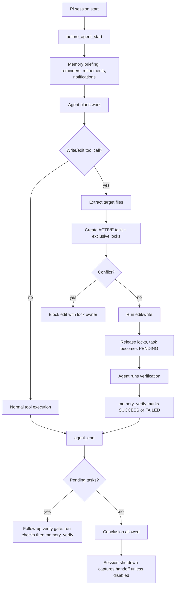

# Pi Agent Flow with Memory Tools

Guide to the Pi-extension live awareness flow, tool usage, schemas, and output quality.

See also: [REFLECT.md](https://github.com/bgauryy/octocode-mcp/blob/main/packages/octocode-pi-extension/docs/REFLECT.md) — full documentation of the Awareness learning, memory hygiene, and harness improvement loop.

## Validated surfaces

- The extension wires memory-awareness hooks for session start, write/edit calls, tool results, agent end, and session shutdown.
- The default agent tool surface includes 8 workflow `memory_*` tools.
- Memory maintenance is Awareness-owned and user-approved via `/octocode-memory-digest` and `/octocode-memory-forget` commands.
- Each memory tool has a typed schema and a dedicated runtime operation.
- Tests validate required schema fields, lean outputs, duplicate handling, scoping, audit/verify behavior, reflection output, and workspace/refinement summaries.

## Runtime flow



## Agent tool usage matrix

| Tool | Use when | Key inputs | Output shape / caveat |
|---|---|---|---|
| `memory_recall` | Before risky, unfamiliar, long, or related work. | `query`; optional `limit`, `min_importance`, `smart`, `label`, `references`, `regex`, scope. | Lean `{count, memories}`; raw observations appear because recall needs them. Carries `judgment_required` + `judgment_reason` when confidence is low (zero results or a weak top match) — treat those results as leads and verify before relying on them. |
| `memory_record` | Awareness reflection: store a verified durable root cause, decision, workaround, or gotcha after evidence exists. | `task_context`, `observation`; optional `label`, `importance`, `tags`, `references`, scope, `supersedes`, `allow_similar`, `failure_signature`. | Returns id/label/importance/novelty; duplicate skip avoids echoing long prose. |
| `memory_reflect` | Awareness reflection: after non-trivial work with a reusable lesson, repo fix, harness fix, or failure signature. | `task`; at least one lesson/failure/fix/signature field. | Returns lean learning id; includes next-action hints only when action exists. |
| `memory_workspace_status` | Before long edits or when checking locks/pending work. | Optional workspace/repo scope. | Returns counts and optional locks. |
| `memory_refine_get` | At task start when previous reflections may have left actionable repo fixes. | Optional `state`, `include_handoffs`, `limit`, scope. | Returns lean refinement id/state/fix/files/repo summary. |
| `memory_audit_unverified` | Mid-turn when unsure; final audit also runs automatically. | No params. | Returns pending tasks with test plans; non-zero exit when pending. |
| `memory_verify` | Only after running the stated verification. | One of `task_id`, `task_ids[]`, or `allPending:true`; optional `status`. | Single result or batch result; exit fails on per-id errors. |
| `memory_notify` | Real multi-agent coordination: blocker, handoff, question, decision, or fyi. | `kind`, `subject`; optional `body`, `to_agent`, `files`, `importance`, scope. | Returns signal/thread/workspace identifiers. |
| `memory_export_harness` | Before proposing AGENTS.md changes — human review required. | `harness_only`, `limit`, `min_importance`, scope. | Two-tier markdown block; never writes files. |

> Consolidation/deletion (`memory_digest`, `memory_forget`) are **user commands**, not agent tools — see "User maintenance commands" below. Weakness clustering is **not** an agent tool; recurring failure-signature clusters are surfaced automatically in the session-start briefing.

## User maintenance commands

| Command | Default | Mutation |
|---|---|---|
| `/octocode-memory-digest` | Dry-run preview of archive/prune work. | `--apply` mutates after UI confirmation; non-UI requires `--apply --yes`. |
| `/octocode-memory-forget` | Dry-run preview by `--id`, `--tag`, `--before`, or `--max-importance`. | `--apply` deletes after UI confirmation; non-UI requires `--apply --yes`. Broad selectors (tag/age without ids) never sweep importance ≥ 8 unless `--max-importance` explicitly raises the ceiling (`salience_floor` reported). |

## Schema and output quality checks

- Required fields are schema-level where simple: `memory_recall.query`, `memory_record.task_context`, and `memory_record.observation`.
- Closed domains use enums where useful: labels, recall state/sort, refinement state, notification kind, reflect outcome, and verify status.
- Some cross-field constraints stay runtime-level because the schema cannot express them cleanly: `memory_verify` selector choice, non-empty reflection content, and notify kind/subject requirement.
- Outputs are intentionally compact: ids, counts, labels, scores, files, and next-action hints.
- Tools avoid echoing long prose except `memory_recall`, where returning observations is the purpose.

## Recommended agent protocol

1. **Attend:** `memory_workspace_status` → `memory_refine_get` → targeted `memory_recall` only when prior lessons can change the plan.
2. **Act:** rely on hook-created edit tasks and locks; if blocked, inspect the conflict instead of retrying.
3. **Coordinate:** use `memory_notify` only for real multi-agent blockers, handoffs, questions, decisions, or fyi.
4. **Verify:** run the stated checks, then clear with `memory_verify({task_ids:[...]})` or `memory_verify({allPending:true})`.
5. **Reflect:** use the Awareness reflection loop for post-task lessons/fix queues/failure signatures; use `memory_record` for one specific verified finding.
6. **Maintain:** agents do not clean or delete memories; users run the maintenance commands above after preview.

## Copy-paste examples

```ts
memory_workspace_status({ workspace_path: "/repo" })
memory_refine_get({ workspace_path: "/repo", limit: 5 })
memory_recall({ query: "editing Pi memory tools", workspace_path: "/repo", min_importance: 6 })
memory_record({ task_context: "Future generated-file edits", observation: "Generated files are rebuilt from sources; edit the source and rebuild", label: "GOTCHA", importance: 7, files: ["source-file"] })
memory_reflect({ task: "fixed verify gate", outcome: "worked", lesson: "Run verification before memory_verify", fix_repo: "Add a regression test for pending tasks" })
memory_audit_unverified({})
memory_verify({ task_ids: ["task_..."], status: "SUCCESS" })
memory_notify({ kind: "blocker", subject: "File locked", files: ["source-file"], importance: 8, workspace_path: "/repo" })
```

```bash
/octocode-memory-digest --export-doc
/octocode-memory-digest --apply
/octocode-memory-forget --tag EXPERIENCE --max-importance 5
/octocode-memory-forget --tag EXPERIENCE --max-importance 5 --apply
```
