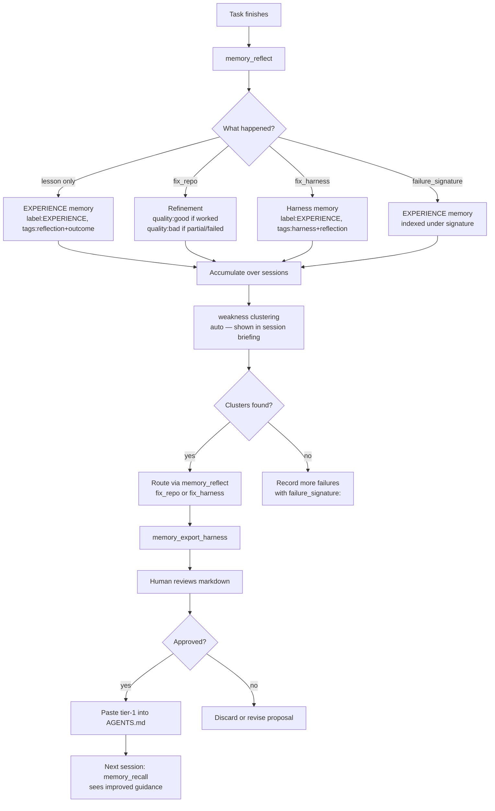

# Awareness Reflection, Self-Harness, and the Improvement Loop

`octocode-awareness` owns post-task learning, memory hygiene, skill-learning proposals, and human-reviewed harness changes. The `memory_reflect` family closes the agent learning loop:
**record a failure → cluster recurring patterns → propose a fix → human approves → AGENTS.md improves.**

Three Pi tools form the complete loop:

| Tool | Stage | What it produces |
|------|-------|-----------------|
| `memory_reflect` | After every non-trivial task | Learning memory + optional refinement + optional harness proposal |
| weakness clustering | Automatic — surfaced in the session-start briefing (not an agent-callable tool) | Ranked failure-signature clusters |
| `memory_export_harness` | Before proposing AGENTS.md changes | Two-tier markdown block for human review |

---

## Loop overview



---

## `memory_reflect` — Pi tool

**When:** After any non-trivial task — completed, partially completed, or failed.
At least one of `lesson`, `didnt_work`, `fix_repo`, `fix_harness`, or `failure_signature` must be provided.

### Parameters

| Parameter | Type | Required | Description |
|-----------|------|----------|-------------|
| `task` | string | ✅ | One-line description of the task just completed. |
| `outcome` | `worked\|partial\|failed` | — | Default `partial`. Drives importance and refinement quality. |
| `lesson` | string | — | Reusable learning for future agents. Stored as the primary observation. |
| `worked` | string | — | What succeeded. Appended to observation narrative if `lesson` is omitted. |
| `didnt_work` | string | — | What failed. Used as `lesson` if `lesson` is omitted. |
| `fix_repo` | string | — | Concrete fix needed in the codebase. Creates a **refinement** in the repo-fix queue. |
| `fix_harness` | string | — | Skill/AGENTS.md improvement. Creates a **harness-tagged memory** for `memory_export_harness`. |
| `failure_signature` | string | — | Cluster key, e.g. `mechanism:retry-loop\|cause:test-timeout`. Enables `memory_mine_weakness`. |
| `importance` | 1–10 | — | Overrides the outcome-based default (see table below). |
| `judgment_note` | string | — | Evidence checked + remaining uncertainty; folded into the reflection narrative as `judgment: …`. |
| `duo` | boolean | — | Emit an advisory `reflection_duo` packet (supporter + skeptic review prompts). Never stored, scored, or enforced. |
| `eval_failures` | `{id, dimension?, failure_signature?, suggested_lesson?}[]` | — | Structured failed eval checks; each becomes an `eval`-tagged memory, and the first signature drives weakness clustering when `failure_signature` is omitted. |
| `references` | string[] | — | Provenance: `file:/abs/path:line`, `pr:owner/repo#N`, URL, `npm:pkg@v`. |
| `file` / `files` | string / string[] | — | Files this reflection is scoped to. Paths resolved against `cwd`. |
| `folders` | string[] | — | Folders scoped to this reflection. |
| `workspace_path` / `repo` / `ref` | string | — | Applicability scope. Auto-filled from git when omitted. |
| `valid_from` / `valid_to` | ISO date | — | Bi-temporal validity window. |

### Importance defaults by outcome

| `outcome` | Default importance | Use case |
|-----------|-------------------|----------|
| `failed` | **8** | Serious failure — high recall priority |
| `partial` | **6** | Mixed result — moderate priority |
| `worked` | **5** | Success lesson — lower but still recalled |

Override with explicit `importance:` when the lesson is unusually critical (9–10) or routine (3–4).

### What each parameter creates

| Parameter | Store entry | Label | Tags |
|-----------|-------------|-------|------|
| `lesson` / `worked` / `didnt_work` | `agent_memories` row | `EXPERIENCE` | `reflection`, `outcome` |
| `failure_signature` | Same memory row | `EXPERIENCE` | + `failure_signature` indexed |
| `fix_repo` | `refinements` row | — | `quality:good` if worked, `quality:bad` if partial/failed |
| `fix_harness` | `agent_memories` row | `EXPERIENCE` | `harness`, `reflection`, `outcome` |
| `eval_failures[]` | One `agent_memories` row each | `EXPERIENCE` | `reflection`, `eval`, `outcome`; own `failure_signature` |

A single `memory_reflect` call can produce **all of these simultaneously**.

### Return shape

```typescript
{
  outcome: 'worked' | 'partial' | 'failed',
  learning_memory_id: string,         // always present
  repo_fix_refinement_id: string | null,  // present when fix_repo provided
  harness_fix: boolean,               // true when fix_harness provided
  novelty_score: number,              // 0–1; low = similar memory already exists
  similar_memory_ids: string[],       // memories close to this one (Jaccard)
  eval_failure_count: number,         // eval-tagged memories created from eval_failures[]
  eval_failure_ids: string[],
  reflection_duo?: {                  // present only with duo:true — advisory, never stored
    advisory: true,
    roles: [{ role: 'supporter', prompt: string }, { role: 'skeptic', prompt: string }],
  },
  next: string,                       // routing hints to next loop steps
}
```

### Refinement quality routing

`fix_repo` quality is driven by `outcome` — this matters because `memory_refine_get` surfaces good (improvement) and bad (fix) queues differently:

```
worked  → refinement quality: 'good'   // enhancement / clarification
partial → refinement quality: 'bad'    // something was wrong; fix it
failed  → refinement quality: 'bad'    // definitely broken
```

### Code examples

**Post-task success with a lesson:**
```typescript
memory_reflect({
  task: "Added BM25 column weights to FTS5 query",
  outcome: "worked",
  lesson: "FTS5 bm25(fts, 0, 10, 7, 2) weights task_context:10 > obs:7 > tags:2 — always set column weights explicitly or all columns rank equally.",
  failure_signature: "mechanism:fts5-default|cause:equal-weights",
  references: ["file:/packages/octocode-awareness/src/memory.ts:148"],
  importance: 7,
})
```

**Failure with a repo fix:**
```typescript
memory_reflect({
  task: "Attempted to use FTS5 delete-all command",
  outcome: "failed",
  didnt_work: "INSERT INTO memory_fts(memory_fts) VALUES('delete-all') throws on regular fts5 tables",
  lesson: "FTS5 delete-all only works on content= tables. Use DELETE FROM for standard fts5.",
  failure_signature: "mechanism:fts5-aux-command|cause:wrong-table-type",
  fix_repo: "Add a comment in rebuildFts explaining why delete-all cannot be used here.",
  importance: 8,
})
```

**Harness improvement proposal:**
```typescript
memory_reflect({
  task: "Reviewed session tooling — agents can't call mine-weakness from Pi",
  outcome: "partial",
  fix_harness: "Register memory_mine_weakness as a Pi tool so agents can cluster failure patterns without dropping to CLI.",
  fix_repo: "Add mine_weakness case to runMemoryOperation and tool definition to buildMemoryToolDefinition.",
})
```

**Multi-output in one call:**
```typescript
memory_reflect({
  task: "Fixed reference filter fallback in getMemory",
  outcome: "worked",
  lesson: "0 rows from memory_references is a correct empty result, not 'table unavailable'. Never fall back to JSON scan on empty table result.",
  failure_signature: "mechanism:reference-filter|cause:incorrect-fallback",
  fix_repo: "Update MEM-1 comment to explain the table-vs-empty distinction.",
  worked: "Changed condition from fromTable.size > 0 to always trust the table",
  references: ["file:/packages/octocode-awareness/src/memory.ts:372"],
  importance: 7,
})
```

---

## Weakness clustering — automatic (not an agent-callable tool)

**Note:** weakness clustering is **not** exposed as an agent tool. It runs internally and
recurring failure-signature clusters are surfaced in the session-start briefing; use
`workspace_status` to see current coordination/failure state. Route the surfaced
`failure_signature` values into `memory_reflect` (`fix_repo` / `fix_harness`).

Internally it clusters memories by `failure_signature` (accumulated once 3+ failures carry
one) and ranks by **count × avg_importance** with these bounds:

| Setting | Default | Description |
|---------|---------|-------------|
| min_count | 2 | Minimum memories per cluster (raise to 3–4 to reduce noise). |
| limit | 10 | Max clusters surfaced. |
| scope | cwd | `workspace_path` / `repo` / `ref` applicability scope. |

### Return shape

```typescript
{
  total_signatures: number,   // distinct signatures in scope
  total_memories: number,     // total memories with a signature
  count: number,              // clusters returned
  clusters: Array<{
    signature: string,        // e.g. "mechanism:fts5-aux|cause:wrong-table"
    count: number,            // memories in this cluster
    avg_importance: number,   // average importance score
    score: number,            // count × avg_importance (sort key)
    memory_ids: string[],     // all memory IDs in the cluster
    representative: string,   // observation from highest-importance memory
    labels: string[],         // distinct labels in the cluster
  }>,
  next: string,               // routing hint
}
```

### Example output

```json
{
  "total_signatures": 3,
  "total_memories": 8,
  "count": 2,
  "clusters": [
    {
      "signature": "mechanism:fts5-aux-command|cause:wrong-table-type",
      "count": 3,
      "avg_importance": 7.7,
      "score": 23.0,
      "representative": "FTS5 delete-all only works on content= tables...",
      "labels": ["EXPERIENCE"]
    }
  ],
  "next": "Use failure_signature values with memory_reflect to route lessons into fix_repo or fix_harness."
}
```

### Routing a cluster

After `memory_mine_weakness` surfaces a cluster, close the loop:

```typescript
// Route to repo fix
memory_reflect({
  task: "FTS5 command misuse is a recurring pattern across 3 sessions",
  outcome: "partial",
  lesson: "FTS5 auxiliary commands (delete-all, optimize) only apply to specific table types. Always verify table type before using FTS5 aux commands.",
  failure_signature: "mechanism:fts5-aux-command|cause:wrong-table-type",
  fix_repo: "Add table-type validation before any FTS5 auxiliary command",
  importance: 9,
})

// Or route to harness improvement
memory_reflect({
  task: "Surfaced pattern: agents verify gates without running actual checks",
  outcome: "failed",
  fix_harness: "Add to AGENTS.md: Never call memory_verify with SUCCESS unless the test plan command has been run and output verified. Clearing the gate with unrun tests is a hard rule violation.",
  failure_signature: "mechanism:verify-gate|cause:unrun-tests",
})
```

---

## `memory_export_harness` — Pi tool

**When:** Before proposing AGENTS.md or CLAUDE.md changes. After `memory_mine_weakness` has been routed.

Returns markdown ready to paste — **never writes files**.
Human review and explicit approval required before any file is modified.

### Parameters

| Parameter | Type | Default | Description |
|-----------|------|---------|-------------|
| `harness_only` | boolean | false | Return only tier-1 harness proposals. Excludes general lessons. |
| `limit` | integer | 10 | Max total memories. |
| `min_importance` | 1–10 | 7 | Minimum importance for tier-2 general lessons. |
| `workspace_path` / `repo` | string | cwd | Scope filter. |

### Two-tier output

| Tier | Source | Criteria |
|------|--------|----------|
| **1 — Harness proposals** | `memory_reflect fix_harness:` | `tags_text LIKE '%,harness,%'` — always first |
| **2 — General lessons** | Any `memory_record` / `memory_reflect lesson:` | `importance ≥ min_importance`, `label ≠ EXPERIENCE`, no harness tag |

Raw reflections (`label=EXPERIENCE` without harness tag) are excluded from both tiers.
They are inputs to the loop, not standing guidance.

### Return shape

```typescript
{
  count: number,
  harness_count: number,     // tier-1 only — explicit proposals
  markdown: string,          // ready to paste into AGENTS.md
  memories: Array<{
    memory_id: string,
    label: string,
    importance: number,
    tier: 'harness' | 'general',
    observation: string,     // truncated to 200 chars
  }>,
  next: string,
}
```

### Example output

```markdown
## Agent lessons (generated by octocode-awareness · memory_digest export_doc:true)

<!-- Tier 1: harness proposals from memory_reflect fix_harness: -->

- **[HARNESS:8]** Register memory_mine_weakness as a Pi tool so agents can cluster failure patterns without CLI.
- **[HARNESS:9]** Never call memory_verify with SUCCESS unless the test plan command has been run and exit=0 confirmed.

<!-- Tier 2: high-importance general lessons -->

- **[GOTCHA:8]** FTS5 delete-all only works on content= tables. Use DELETE FROM for standard fts5.
- **[BUG:9]** node:sqlite .all() returns Record<string,SQLOutputValue>[] — always cast as unknown as YourType[].
```

---

## Hook-automated vs agent-manual

The hooks in `SKILL.md` automate the **mechanical** parts of the loop. Agents handle the **semantic** parts.

| Action | Who | How |
|--------|-----|-----|
| Claim file lock before edit | **Hook** (PreToolUse) | `pre-edit.sh` → `preFlightIntent` |
| Release lock as PENDING after edit | **Hook** (PostToolUse) | `post-edit.sh` → `releaseFileLock` |
| Verify gate at session end | **Hook** (Stop) | `stop-verify.sh` → `auditUnverified` |
| Capture session handoff | **Hook** (SessionEnd) | `session-end.sh` → `sessionCapture` |
| Deliver inbox at session start | **Hook** (UserPromptSubmit) | `notify-deliver.sh` → `notifyGet` |
| Record the lesson | **Agent** | `memory_reflect(...)` |
| Cluster recurring failures | **Agent** | `memory_mine_weakness(...)` |
| Propose harness changes | **Agent** | `memory_export_harness(...)` |
| Apply changes to AGENTS.md | **Human** | After explicit review and approval |

---

## Scope and path resolution

`file:` and `dir:` references in `memory_reflect` are resolved against `cwd` (the workspace root), **not** `process.cwd()` (the shell directory). Pass explicit paths or rely on automatic git scope detection:

```typescript
// Relative paths resolve against workspace root
memory_reflect({
  task: "...",
  files: ["src/memory.ts", "tests/memory.test.ts"],
  cwd: "/Users/you/code/myproject",  // resolved here, not shell cwd
})
```

---

## Hard rules

These are enforced by the verify gate hook and must not be bypassed:

1. **Never call `memory_verify` with `status:SUCCESS` without running the stated test plan.** The intent stores the test plan — run it and confirm exit=0 before marking verified.
2. **`memory_export_harness` is read-only.** Never write its output to AGENTS.md without human review and explicit approval of the scoped change.
3. **No unattended self-modifying loop.** An agent proposes via `fix_harness:` — a human merges. One approval covers only the scoped change discussed.
4. **`failure_signature` is for clustering only.** Never use it as the sole recall path — general recall uses FTS5 + decay.
5. **`fix_repo` quality is outcome-driven.** Do not override to `bad` on a `worked` reflection — use the routing table.

---

## Full session example

```typescript
// ── During work ─────────────────────────────────────────────────────────────

// Record an unexpected finding mid-task
memory_record({
  task_context: "Debugging FTS5 index rebuild",
  observation: "FTS5 delete-all throws 'may only be used with contentless table'. Regular fts5 uses DELETE FROM.",
  label: "GOTCHA",
  importance: 8,
  failure_signature: "mechanism:fts5-aux-command|cause:wrong-table-type",
})

// ── After task ───────────────────────────────────────────────────────────────

memory_reflect({
  task: "Fixed rebuildFts to use correct FTS5 table reset",
  outcome: "worked",
  lesson: "Standard fts5 tables use DELETE FROM to clear. Content= tables use delete-all. Check table type first.",
  failure_signature: "mechanism:fts5-aux-command|cause:wrong-table-type",
  fix_repo: "Add table type comment to rebuildFts so future devs know why delete-all is not used.",
  worked: "Reverted to db.exec('DELETE FROM memory_fts') — all 214 tests passed.",
  importance: 8,
})
// → { learning_memory_id: "mem_...", repo_fix_refinement_id: "ref_...", harness_fix: false, novelty_score: 0.3 }

// ── After several sessions ───────────────────────────────────────────────────

memory_mine_weakness({ min_count: 2 })
// → clusters: [{ signature: "mechanism:fts5-aux-command|cause:wrong-table-type", count: 3, score: 24 }]

memory_reflect({
  task: "FTS5 command type mismatch is a 3x recurring pattern",
  outcome: "partial",
  fix_harness: "Add to GOTCHAS: FTS5 delete-all is contentless-only. Standard fts5 uses DELETE FROM.",
  failure_signature: "mechanism:fts5-aux-command|cause:wrong-table-type",
})

// ── Before proposing to AGENTS.md ────────────────────────────────────────────

memory_export_harness({ harness_only: true })
// → harness_count: 1, markdown: "- **[HARNESS:7]** Add to GOTCHAS: FTS5 delete-all..."
// → next: "Review the markdown block, then paste harness-tier entries into AGENTS.md after human approval."

// Human reviews → approves → pastes into AGENTS.md
// Next session: memory_recall("FTS5") returns this lesson before any FTS work
```
