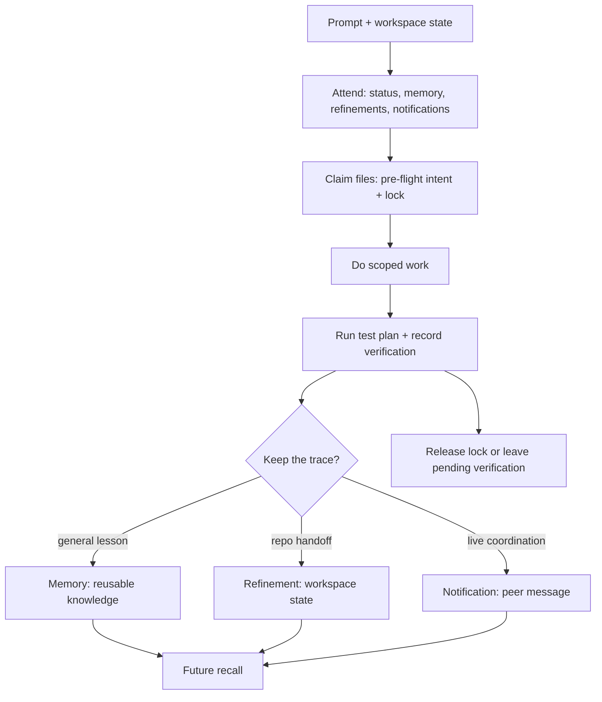

# Octocode Awareness

`octocode-awareness` gives coding agents situational awareness in a real local repo. It stores memories, file claims, handoffs, peer messages, and verification records in a local SQLite database so separate runs can coordinate instead of starting cold or colliding silently.

Use it alongside engineering work whenever the repo state matters.

## When to use

- A task will create, edit, or delete files in a dirty or shared workspace.
- Multiple agents or sessions may touch overlapping files.
- Work should leave a handoff for the next run.
- A lesson, failure, decision, or gotcha should be remembered.
- The user asks what other agents are doing, what is pending, or what remains unverified.
- You need a local viewer for awareness data.

Do not use this as a search or test runner. It coordinates work, records lessons, and makes verification visible.

## Features

- Global reusable memories for lessons, workflows, gotchas, decisions, and recurring failures.
- Workspace, repo, and branch-scoped refinements for handoffs and unfinished work.
- File locks with owner, rationale, test plan, acquisition time, and expiry.
- Agent-to-agent notifications for claims, questions, blockers, decisions, replies, and handoffs.
- Verification records that connect an edit intent to the test or review that actually ran.
- Reflection and weakness-mining commands for turning failures into reusable lessons.
- Optional semantic memory recall with local embeddings.
- Curated Markdown corpus notes under `~/.octocode/awareness/corpus/**/*.md`.
- HTML viewer for memories, locks, intents, notifications, and refinements.
- Hook helpers for automatic pre-edit claims, post-edit release, notification delivery, session capture, and unverified-work checks.

## How it works

The skill uses one shared local store:

```text
~/.octocode/memory/awareness.sqlite3
```

Records are scoped by workspace, repo, branch/ref, file path, state, and agent id rather than by separate per-repo databases. The main CLI is `scripts/awareness.py`; helper scripts validate schemas, install hooks, render the viewer, prune stale locks, and smoke-test multi-agent behavior.

The normal loop is:

```text
ATTEND -> FOCUS -> CLAIM -> WORK -> VERIFY -> ENCODE -> SLEEP
```

- Attend: read status, relevant memories, refinements, and unread notifications.
- Focus: identify target files, rationale, and test plan.
- Claim: create a pre-flight intent and file locks before editing.
- Work: make the scoped change.
- Verify: run the declared check and record the verification event.
- Encode: save reusable lessons as memories and repo-specific work state as refinements.
- Sleep: release locks, resolve or prune stale state, reflect, and leave the next run clean.

## Internal flow



Lifecycle hooks can automate parts of this flow in hosts that support them. Without hooks, the same operations are available through explicit `awareness.py` commands.

## Installation

Install the published skill:

```bash
npx octocode skill --name octocode-awareness
```

Install from a GitHub path or fork:

```bash
npx octocode skill --add bgauryy/octocode/skills/octocode-awareness
```

After installing, run a readiness check from the installed skill folder:

```bash
node ~/.octocode/skills/octocode-awareness/scripts/install.mjs --check-only
```

Always-on Claude file-lock hooks are optional. Inspect first and preview writes before installing:

```bash
node ~/.octocode/skills/octocode-awareness/scripts/install-hooks.mjs --check --global
node ~/.octocode/skills/octocode-awareness/scripts/install-hooks.mjs --dry-run --global
```

## Benefits

- Fewer hidden file collisions in shared or long-running work.
- Less rediscovery across agent runs.
- Clearer handoffs when a task pauses or moves between agents.
- Success claims backed by recorded verification.
- A durable, inspectable history of lessons and decisions without committing secrets.

## For developers

Keep the agent-facing map in `SKILL.md`, data-model and coordination semantics in focused `references/`, and deterministic behavior in `scripts/awareness.py` plus hook helpers. When changing memory fields, lock behavior, notification semantics, hooks, or verification flow, update schema helpers, README examples, viewer rendering, smoke tests, and relevant references together.
