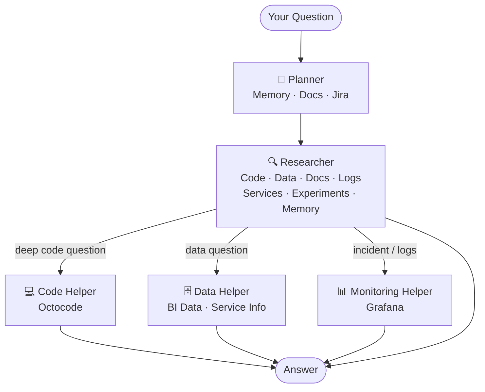

# Introducing Wix Research (a.k.a. Bilbo)
<!-- Slide 1: Title -->

> An agentic research engine that investigates complex code and system questions — powered by real tools, real data, and a multi-agent AI pipeline.

---
<!-- Slide 2: What Is It? -->

## What Is It?

Wix Research is a **multi-agent AI system** that investigates hard engineering questions across complex codebases and distributed systems — at a depth no single AI prompt or tool can reach alone.

You ask a question. It plans an investigation, runs it using real tools against real data, and comes back with a grounded, evidence-backed answer.

**Nickname:** *Bilbo* — it goes there and back again, deep into the system.

Used by developers and QA teams to detect issues, trace root causes, and validate complex workflows.

---
<!-- Slide 3: Why It Exists -->

## Why It Exists

When something breaks in a large system — or when you need to understand how something *actually* works — the investigation never stays in one place:

- You search code across many repos
- You query production data
- You look at logs, dashboards, and deploy history
- You cross-reference tickets and experiments

Doing this manually takes hours and misses things. Wix Research does it automatically — using the same tools a senior engineer would reach for, orchestrated by AI.

---
<!-- Slide 4: Pipeline Flow -->

## How It Works

---
<!-- Slide 5: Stage 1 — Planner -->

## Stage 1: Planner

Before the investigation starts, the Planner reads your question and builds a strategy.

It consults:
- **Memory** — what did we find last time on this topic?
- **Documentation** — what APIs and contracts are relevant?
- **Tickets** — is there a Jira issue with context we should start from?

Output: a research brief that tells the Researcher what to investigate and what kind of answer to return.

---
<!-- Slide 6: Stage 2 — Researcher -->

## Stage 2: Researcher

The Researcher is the main agent. It reads the plan and runs the investigation — calling tools, following evidence, and continuing across multiple turns until the answer is ready.

It has access to everything:
- **Code** — search repos, read files, trace call chains
- **Data** — query production databases
- **Services** — check what's deployed, what's healthy, what's streaming on Kafka
- **Experiments** — pull A/B test data and variant results
- **Docs, Tickets, Memory** — for context and prior findings

When a question is deep enough to need specialist focus, it calls a Helper.

---
<!-- Slide 7: Stage 3 — Helpers -->

## Stage 3: Helpers (Sub-Agents)

Helpers run in **fresh isolated sessions** — they only see what they need for their task. This keeps the researcher's context clean and focused.

**Code Helper**
Searches code across repositories, validates packages, traces root causes across multiple repos.
*Uses: Octocode*

**Data Helper**
Runs SQL queries across production data — joins, lineage, freshness checks.
*Uses: BI Data, Octocode, Service Info*

**Monitoring Helper**
Investigates incidents end-to-end: error logs → stack traces → request traces → deploy events.
*Uses: Grafana*

---
<!-- Slide 8: Context Optimization -->

## Keeping the AI Sharp

The deeper an investigation goes, the more data accumulates. A naive system floods the AI with everything — and reasoning degrades.

Wix Research stays sharp by:
- **Isolating helpers** — each one only sees its own slice of the problem
- **Compacting automatically** — when context grows too large, old reasoning is summarized; evidence is always kept
- **Returning structured findings** — helpers don't dump raw output; they return clean, focused results

The researcher always operates with a high-signal context, no matter how long the investigation runs.

---
<!-- Slide 9: Memory & Continuous Improvement -->

## Memory: Gets Smarter Over Time

After each research session, key findings are saved. The next time a related question is asked, the Planner loads those insights and the investigation starts ahead.

**The loop:**
1. Investigate → find answer → save insight
2. Next question → load prior insight → start closer to the answer

The more the system is used, the faster and more accurate each investigation becomes.

---
<!-- Slide 10: Skills — Playbooks for Your AI -->

## Skills: Playbooks for Your AI

You can give the research agent a **playbook** — a structured instruction set for how to approach a specific type of investigation.

Examples:
- "When diagnosing a Kafka lag issue, always start by checking consumer group offsets..."
- "When validating a migration plan, cross-reference the schema with all downstream consumers..."

The agent follows the playbook without you repeating it every time. QA teams and developers write playbooks for their own workflows — encoding expertise once and reusing it everywhere.

---
<!-- Slide 11: Same Tools, Human or AI -->

## Same Tools for Humans and AI

The tools the agent uses are the same tools available to developers and QA teams directly.

This matters because:
- Humans can validate what the agent found — using the exact same data source
- Teams stay in sync on investigation patterns
- Improvements made by humans feed back into agent workflows

AI-driven and human-driven research are complementary, not separate.

---
<!-- Slide 12: Who Uses It -->

## Who Uses It

| Role | How |
|---|---|
| **Developers** | Root-cause analysis, code archaeology, understanding how a system *actually* works |
| **QA Teams** | Workflow validation, regression investigation, contract checks |
| **Platform / Infra** | Incident investigation, deploy correlation, service health |
| **Product** | Experiment impacts, data queries, feature adoption |

---
<!-- Slide 13: Three Things to Remember -->

## Three Things to Remember

**Real tools, real data.** Every answer is grounded in evidence from actual systems — not guesswork.

**The AI stays sharp.** Helper isolation and context compaction mean the system reasons well even on long, complex investigations.

**It learns.** Memory means every investigation makes the next one faster.

---
<!-- Slide 14: Summary -->

## Summary

Wix Research (Bilbo) is an agentic research system that:

1. **Takes your question** — from a developer, QA engineer, or automated system
2. **Plans an investigation** — using memory, documentation, and ticket context
3. **Executes it with real tools** — across code, data, logs, monitoring, and services
4. **Returns a grounded answer** — backed by evidence, not guesses
5. **Learns from the result** — saving insights to make the next investigation faster

The same tools it uses are available to human investigators — making AI-driven and human-driven research complementary, not separate.
